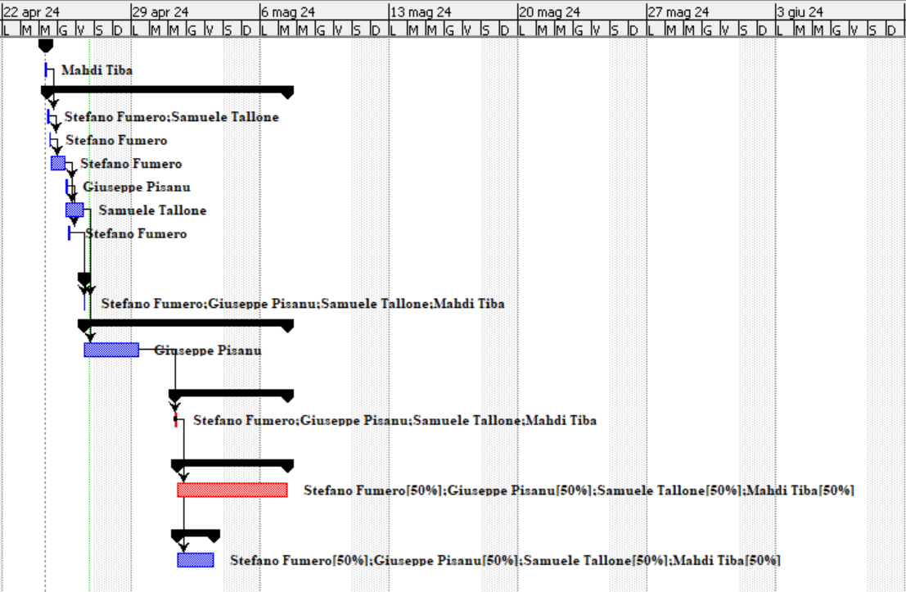
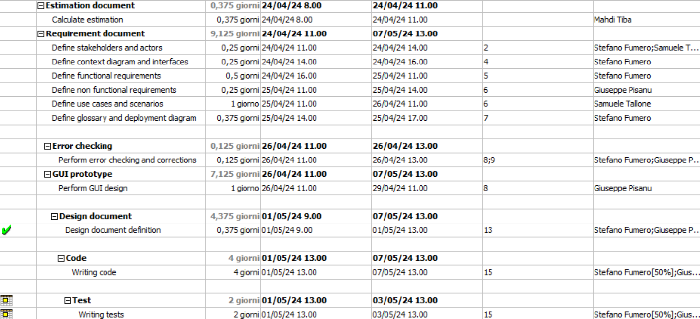

# Project Estimation - CURRENT
Date:

Version:

# Estimation approach
Consider the EZElectronics  project in CURRENT version (as given by the teachers), assume that you are going to develop the project INDEPENDENT of the deadlines of the course, and from scratch
# Estimate by size
### 
|             | Estimate                        |            
| ----------- | ------------------------------- |  
| NC =  Estimated number of classes to be developed   |   20 |            
|  A = Estimated average size per class, in LOC       |  50 |               
| S = Estimated size of project, in LOC (= NC * A)    |  1000 |               
| E = Estimated effort, in person hours (here use productivity 10 LOC per person hour)  |         100     |  
| C = Estimated cost, in euro (here use 1 person hour cost = 30 euro) |3000 eur|
| Estimated calendar time, in calendar weeks (Assume team of 4 people, 8 hours per day, 5 days per week ) |  0.625 |  
           

# Estimate by product decomposition
### 
|         component name    | Estimated effort (person hours)   |            
| ----------- | ------------------------------- |
|requirement document    | 20 |
| GUI prototype | 10 |
|design document | 8 |
|code | 50 |
| unit tests | 20 |
| api tests | 15 |
| management documents  | 5 |

# Estimate by activity decomposition
### 
|         Activity name    | Estimated effort (person hours)   |             
| ----------- | ------------------------------- | 
|**Estimation Document** | |
|Calculate estimation |3 ph |
|**Requirement Document** | |
|Define stakeholders and actors|4 ph |
|Define context diagram and interfaces |2 ph |
|Define functional requirements |4 ph |
|Define non functional requirements |2 ph |
|Define use cases and scenarios |8 ph |
|Define glossary and deployment diagram |3 ph |
|**Error checking** | |
|Perform error checking and corrections |4 ph |
|**GUI Prototype** | |
|Perform GUI design |8 ph |
|**Design Document** | |
|Perform GUI design |8 ph |
|**Code** | |
|Writing code |64 ph |
|**Test** | |
|Writing tests |32 ph |

###

# Summary

|             | Estimated effort                        |   Estimated duration |          
| ----------- | ------------------------------- | ---------------|
| estimate by size |         100 PH             |    0.625 weeks |
| estimate by product decomposition |  128 PH   |    0.8 weeks   |
| estimate by activity decomposition |  142 PH  |    2.4 weeks   |

Analysis:
The differences in estimations stem from the varying levels of granularity and detail provided by each estimation technique. While size-based estimates offer a high-level view of project scope, product and activity decomposition approaches provide deeper insights into the complexities and intricacies of project execution,resulting in higher effort and duration estimations.
the estimate by size relies on quantifying the overall size or scope of the project leading to a relatively lower effort estimate and a shorter duration due to its focus on overall project size rather than detailed activities,especially that it assumes a very rough computation considering that the team is able to work in parallel five days per week and 8 hours per day and each person may have the same delivery rate as the other in the team with a productivity 10 LOC per person hour where in reality it is not the case.
On the other hand, estimates by product decomposition and activity decomposition delve deeper into the project structure, breaking it down into its constituent parts. which may be shown by a greater effort ( 128 PH and 142 PH respectively)and duration(0.8 and 2.4 weeks respectively) compared to the estimation by size effort( 100 PH ) and duration (0.625 weeks).
The disparity between estimations by activity decomposition and product decomposition lies in their focus.Activity decomposition carefully breaks down the project into specific tasks, exposing hidden complexities and dependencies and assigning which activity each member does associated with the corresponding effort and duration estimations, thus resulting in a higher effort estimate (142 PH) and a duration (2.4 weeks).
Conversely, product decomposition primarily breaks down deliverables into manageable components, offering a detailed perspective on development complexities. This lower effort estimate(128 pH) also stems directly from the assumption that the team is working in parallel, as assumed in the estimate by size, which leads to a significantly lower duration which is (0.8 weeks).

