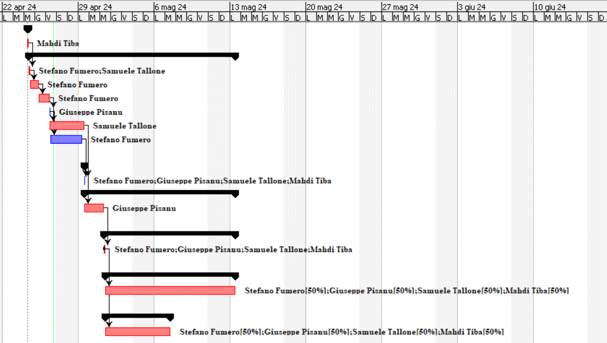
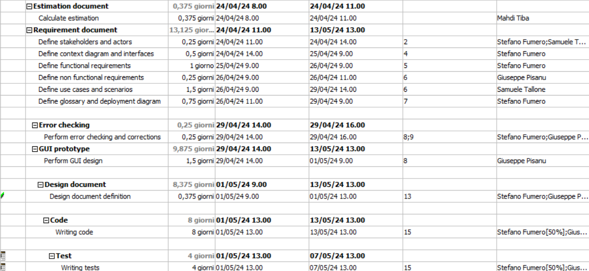

# Project Estimation - FUTURE
Date:

Version:

# Estimation approach
Consider the EZElectronics  project in FUTURE version (as proposed by your team in requirements V2), assume that you are going to develop the project INDEPENDENT of the deadlines of the course, and from scratch (not from V1)
# Estimate by size
### 
|             | Estimate                        |            
| ----------- | ------------------------------- |  
| NC =  Estimated number of classes to be developed   | 30 |            
|  A = Estimated average size per class, in LOC       | 60|                            
| S = Estimated size of project, in LOC (= NC * A) | 1800 |
| E = Estimated effort, in person hours (here use productivity 10 LOC per person hour)  | 180 PH |  
C = Estimated cost, in euro (here use 1 person hour cost = 30 euro) |5400 eur |
| Estimated calendar time, in calendar weeks (Assume team of 4 people, 8 hours per day, 5 days per week ) |1.125 weeks   |  
             

# Estimate by product decomposition
### 
|         component name    | Estimated effort (person hours)   |            
| ----------- | ------------------------------- |
|requirement document   |30 |
| GUI prototype | 10 |
|design document |10|
|code |100|
| unit tests |30|
| api tests |28|
| management documents  |7|

# Estimate by activity decomposition
### 
|         Activity name    | Estimated effort (person hours)   |             
| ----------- | ------------------------------- | 
|**Estimation Document** | |
|Calculate estimation |3 ph |
|**Requirement Document** | |
|Define stakeholders and actors|4 ph |
|Define context diagram and interfaces |4 ph |
|Define functional requirements |8 ph |
|Define non functional requirements |2 ph |
|Define use cases and scenarios |12 ph |
|Define glossary and deployment diagram |6 ph |
|**Error checking** | |
|Perform error checking and corrections |8 ph |
|**GUI Prototype** | |
|Perform GUI design |12 ph |
|**Design Document** | |
|Perform GUI design |12 ph |
|**Code** | |
|Writing code |128 ph |
|**Test** | |
|Writing tests |64 ph |
###

# Summary

|             | Estimated effort                        |   Estimated duration |          
| ----------- | ------------------------------- | ---------------|
| estimate by size |180 PH                      |   1.125  weeks |
| estimate by product decomposition |  215 PH   |  1.3 weeks     |
| estimate by activity decomposition |263 PH    | 4 weeks        |

Analysis:

Divergences in estimations arise from the varying levels of detail provided by each estimation method. While size-based estimations offer a panoramic view of project scope, product and activity decomposition techniques delve deeper into project intricacies, resulting in higher effort and duration projections.

Size-based estimates hinge on quantifying the overall project size, yielding relatively lower effort estimates of 180 PH and shorter durations of 1.125 weeks. However, these estimations rely on simplified assumptions, such as parallel work for 5 days a week and 8 hours a day with a productivity which is equal for every member of the team ( 10 LOC per person hour ), which may not accurately reflect real-world dynamics.

Conversely, product and activity decomposition methods dissect the project into its elemental components, yielding higher effort estimates of 215 PH and 263 PH, and longer durations of 1.3 weeks and 4 weeks, respectively. Activity decomposition unveils concealed complexities and dependencies within specific tasks, thereby extending project timelines considering the team is working 5 days per week in a consecutive way for specific activities that can't be done in a parallel way such as functional requirements and use cases and scenarios, which better reflects real life dynamics. Conversely, product decomposition furnishes a detailed perspective on development challenges by breaking down deliverables into manageable components.

The lower effort estimate of 215 PH in product decomposition also assumes parallel work, resembling size-based estimations, thereby contributing to a shorter duration of 1.3 weeks.

