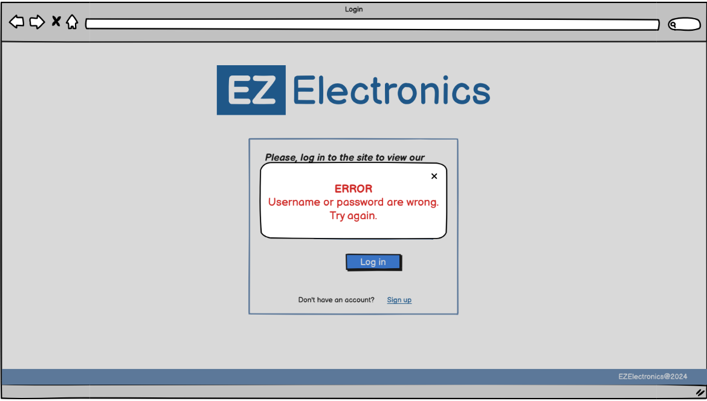
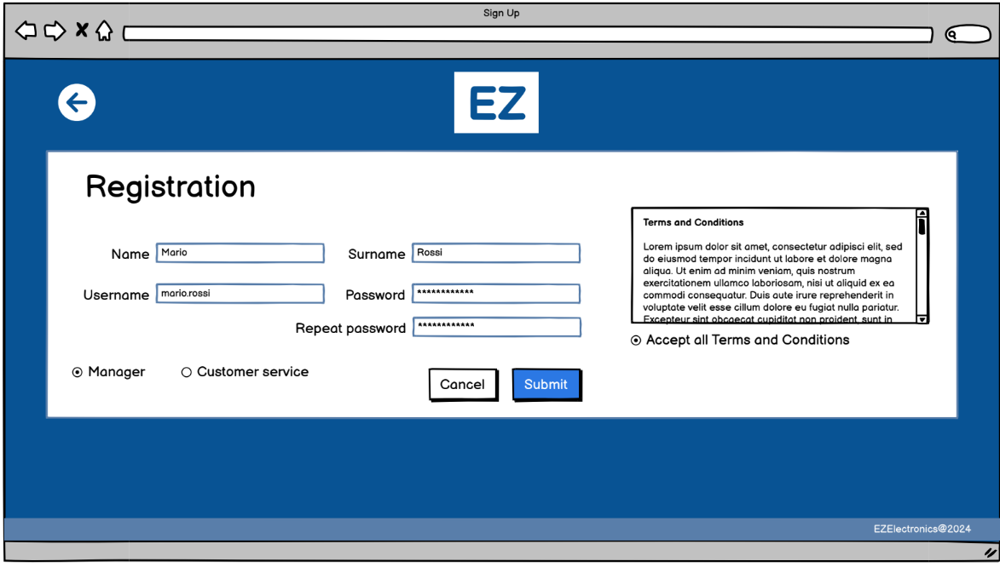
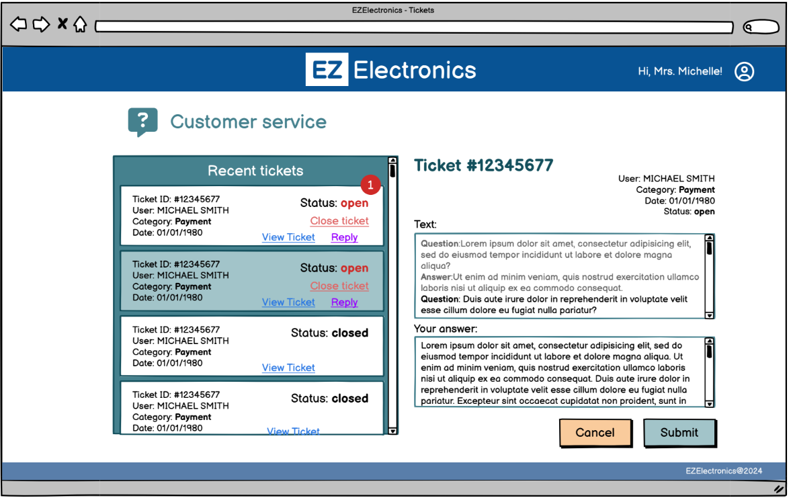

# Graphical User Interface Prototype - FUTURE

Authors: Stefano Fumero, Giuseppe Pisanu, Samuele Tallone, Mahdi Tiba

Date: 04/05/2024

Version: v1  

Homepage of the EZElectronics v2. UC3, Log in and link for the sign up page.

Exception of UC3, Scenarios 3.1.1, 3.1.2, 3.1.3.

Sign up page managed by the tech admin only to create a new account for a manager or a member of the customer service, role is required in this case. UC1, Scenario 1.4.

Sign up page for the Customer only, reachable through the Log in page if an account has not been set yet. UC1,Scenario 1.1 (Add new Customer).

Exception of UC1, Scenario 1.1.2.

Exception of UC1, Scenario 1.1.1.

Exception of UC1, Scenario 1.1.3.

Page shown to the customer after having performed log in. Filters are placed on the top-left and an overview of the cart on the top-right, with all available actions.

Pop up showing more detailed information about the discount currently proposed by managers, it can be opened by clicking on the discount written in red.

Exception of UC6, Scenario 6.1.1 (Place an order, but the cart is empty)

Exception of UC5, Scenario 5.4.1.

Customer page with more detailed information about the actions that can be performed, such as viewing the ticket area, order history and loyalty points balance.

Functionalities about filters shown more in detail, a product can be searched by code, model and category, with the additional filter 'sold' or 'not sold'.

Exception of UC4, Scenario 4.4.1 (the code does not exist)

Page dedicated to a single product, accessible by clicking on a specific product in the previous page. More actions are allowed from this view, such as viewing reviews and adding that item to the curt for a future order.

Detailed view of all the ratings and overview given by user that has purchased the product in the past. UC8, Scenario 8.2.

Exception of UC5, Scenario 5.1.1.

Checkout page for the Customer, reachable by clicking on 'checkout' on the cart actions. If the user has those information (credit card, addrress or paypal account) already saved and associated to the account, then they're showed and there's no need to insert them. UC6.

When to checkout is finished and everything worked well, if products purchased were associated with a certain quantity of loyalty points, the system calculates the new balance by showing how many points comes from this purchase. UC9, Scenario 9.1

Exception of UC7, Scenario 7.1.1.

Exception of UC7, Scenario 7.2.1

Exception of UC7, Scenario 7.2.2.

Support ticket area reachable through the actions available in the profile section of the Customer.

If the Customer clicks on the 'open ticket' button in the previous page, there's the possibility to open a new issue.

Exception of UC11, Scenario 11.1.2

Page shown to the Customer service member once the log in has been performed. Since their purpose is to answer to tickets, they have a view of all recent open/closed tickets and the possibility to manage them. Scenario 11.2 (UC11). There's also the possibility to close a ticket through the close button (Scenario 11.4).

Both Customer service representatives and customer has the possibility to reply if the ticket is open (Scenario 11.3). This first view is for the Customer.

View for the customer service representative when answering a ticket (Scenario 11.4)

When the ticket is closed, its history can be seen, but no answers can be added. This is the Customer view (Scenario 11.2):

When the ticket is closed, its history can be seen, but no answers can be added. This is the Customer service view (Scenario 11.2):

Orders history shown to the customer, accessible through the actions available on the profile section of the Customer. The status is shown and more actions are provided (delete,rate of a product and return of a product)

Possibility to return a product by providing the reason for the return. UC6, Scenario 6.4.

Return successfully submitted, now a manager has to accept the reason provided by the customer (Scenario 6.5).

If the return is submitted with no text, an exception arises (Scenario 6.4.3).

The company provide a time window of two weeks after the product has been received to return it. If that time's expired, an error is returned, Scenario 6.4.2.

When a return is required, the system checks the status of the order to which the item belongs, if it has not been delivered yet, then there's not the possibility to return it. Scenario 6.4.1.

The following to images shows notifications to the customer to update about the status of a return, if it has been accepted or not. (for the first one, Scenario 6.4.4)

If the reason for the return has been accepted, then, by clicking on 'return' in green, more details about the delivery back to the company of the product are given to the customer and the refund is performed (Scenario 6.5).

The Customer can rate and optionally review a product he/she bought. UC8 (Scenario 8.1)

The customer has the possibility to cancel an order if it has not been shipped yet by clicking on 'delete order'. Scenario 6.2.

Exception of UC6, Scenario 6.2.2.

By clicking on 'Account' among the available actions on the user profile, there's the possibility to reach the page to save an address, a credit card and/or a PayPal account for faster checkouts. This is how it looks like when nothing has been added yet. UC2 and UC2 because also the password can be updated in this section

UC1, Scenario 1.3.

Exception of UC1, Scenario 1.3.1.

Exception of UC1, Scenario 1.3.3

Exception of UC1, Scenario 1.3.2.

UC2, Scenario 2.1, a new address is associated to the account.

Exception of UC2, Scenario 2.1.2.

Exception of UC2, Scenario 2.1.1.

UC2, Scenario 2.2, a new credit card is associated to the Customer.

Exception of UC2, Scenario 2.2.1.

Exception of UC2, Scenario 2.2.2

UC2, a new PayPal account is associated to the account of the user, Scenario 2.3.

Exception of UC2, Scenario 2.3.2.

Exception of UC2, Scenario 2.3.1.

Account information stored on the account of the user.

Deletion of the account, the password is required, Scenario 1.2.

Exception of UC1, Scenario 1.2.1.

Exception of UC1, Scenario 1.2.2.

Page shown to the Manager as soon as the log in is performed. Action menu on the top-right and filters on the top-left.

Manage products page to add a new product or to register a new arrival. UC4 and UC12.

Exception of UC4, Scenario 4.2.5.

Managers mark a product as sold providing selling date, Scenario 4.2.

Exception of UC4, Scenario 4.2.1.

Exception of UC4, Scenario 4.2.4.

Exception of UC4, Scenario 4.2.3.

Deletion of an Item, Scenario 4.8.

Manager adds a new product to the database, Scenario 4.1.

Product successfully added.

Exception of UC4, Scenario 4.1.1.

Exception of UC4, Scenario 4.1.3

Exception of UC4, Scenario 4.1.2

Manager adds a new set of products to the inventory updating the quantity. UC12.

The availability of that product is automatically managed by the system, Scenario 12.2.

Exception of UC12, Scenario 12.1.1.

The Manager processes also returns, Scenario 6.5.

UC6, Scenario 6.7 and 6.5.1.

Last step of the return process managed by the manager.

UC6, Scenario 6.5.1.

The manager has the possibility to add a discount by providing expiration date, percentage of discount and loyalty points required. Scenario 7.4.

Exception of UC7, Scenario 7.4.1.
