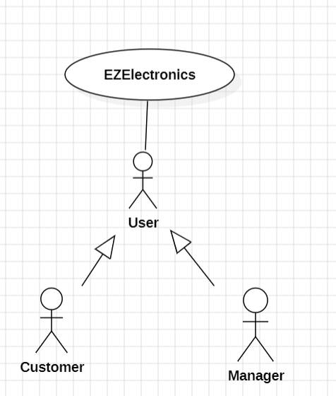
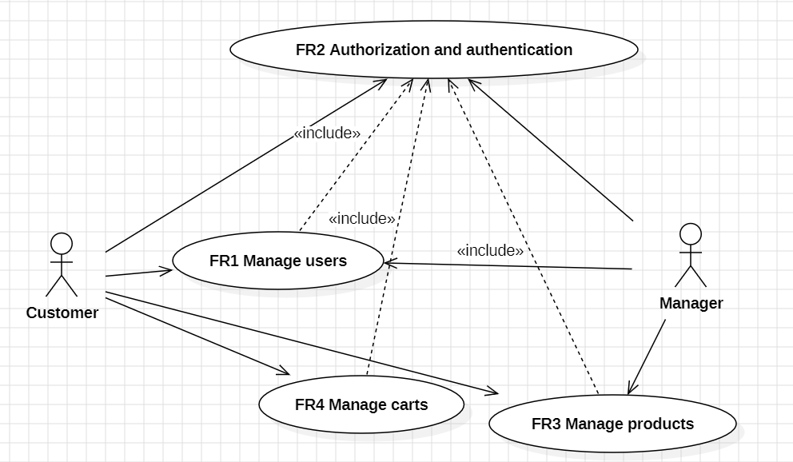
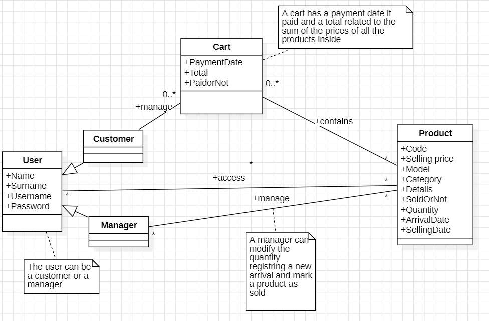
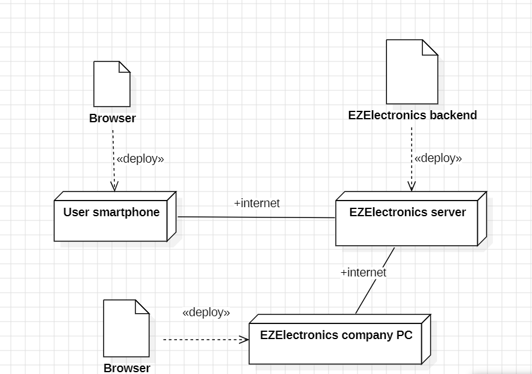

# Requirements Document - current EZElectronics

Date:

Version: V1 - description of EZElectronics in CURRENT form (as received by teachers)

| Version number | Change |
| :------------: | :----: |
|                |        |

# Contents

- [Requirements Document - current EZElectronics](#requirements-document---current-ezelectronics)
- [Contents](#contents)
- [Informal description](#informal-description)
- [Business plan](#business-plan)
- [Stakeholders](#stakeholders)
- [Context Diagram and interfaces](#context-diagram-and-interfaces)
  - [Context Diagram](#context-diagram)
  - [Interfaces](#interfaces)
- [Stories and personas](#stories-and-personas)
  - [Customer Persona 1:](#customer-persona-1)
  - [Customer Persona 2:](#customer-persona-2)
  - [Customer Persona 3:](#customer-persona-3)
  - [Customer Persona 4:](#customer-persona-4)
  - [Manager Persona:](#manager-persona)
- [Functional and non functional requirements](#functional-and-non-functional-requirements)
  - [Functional Requirements](#functional-requirements)
  - [Non Functional Requirements](#non-functional-requirements)
- [Use case diagram and use cases](#use-case-diagram-and-use-cases)
  - [Use case diagram](#use-case-diagram)
    - [(UC1) FR1 Manage Users](#uc1-fr1-manage-users)
      - [(Scenario 1.1) Add new user](#scenario-11-add-new-user)
      - [(Scenario 1.4) Delete User](#scenario-14-delete-user)
      - [(Scenario 1.1.1) Add new user missing information](#scenario-111-add-new-user-missing-information)
      - [(Scenario 1.1.2) Add new user but he already exists](#scenario-112-add-new-user-but-he-already-exists)
    - [(UC2) FR2 Authentication \& Authorization](#uc2-fr2-authentication--authorization)
      - [(Scenario 2.1) Log In](#scenario-21-log-in)
      - [(Scenario 2.1.1) Log In but password is wrong](#scenario-211-log-in-but-password-is-wrong)
      - [(Scenario 2.1.2) Log In but some data is missing](#scenario-212-log-in-but-some-data-is-missing)
      - [(Scenario 2.1.3) Log In but username does not exist](#scenario-213-log-in-but-username-does-not-exist)
      - [(Scenario 2.2) Log Out](#scenario-22-log-out)
      - [(Scenario 2.3) Retrieve Current User Session](#scenario-23-retrieve-current-user-session)
    - [(UC3) FR3 Manage Products](#uc3-fr3-manage-products)
      - [(Scenario 3.1) Add new product](#scenario-31-add-new-product)
      - [(Scenario 3.1.1) Add new product but there is already a product with the same code](#scenario-311-add-new-product-but-there-is-already-a-product-with-the-same-code)
      - [(Scenario 3.1.2) Add new product but some informations are missing](#scenario-312-add-new-product-but-some-informations-are-missing)
      - [(Scenario 3.1.3) Add new product but the arrival date is after the current date](#scenario-313-add-new-product-but-the-arrival-date-is-after-the-current-date)
      - [(Scenario 3.2) Add new set of product](#scenario-32-add-new-set-of-product)
      - [(Scenario 3.2.1) Add new set of products but the arrival date is after the current date](#scenario-321-add-new-set-of-products-but-the-arrival-date-is-after-the-current-date)
      - [(Scenario 3.2.2) Add new set of products but some informations are missing](#scenario-322-add-new-set-of-products-but-some-informations-are-missing)
      - [(Scenario 3.3) Mark Product as Sold](#scenario-33-mark-product-as-sold)
      - [(Scenario 3.3.1) Mark Product as Sold but the selling date is missing](#scenario-331-mark-product-as-sold-but-the-selling-date-is-missing)
      - [(Scenario 3.3.3) Mark Product as Sold but the selling date is not before the current date](#scenario-333-mark-product-as-sold-but-the-selling-date-is-not-before-the-current-date)
      - [(Scenario 3.3.4) Mark Product as Sold but the selling date is not after the product arrival date](#scenario-334-mark-product-as-sold-but-the-selling-date-is-not-after-the-product-arrival-date)
      - [(Scenario 3.3.5) Mark Product as Sold but it was already sold](#scenario-335-mark-product-as-sold-but-it-was-already-sold)
      - [(Scenario 3.4) Retrive All products](#scenario-34-retrive-all-products)
      - [(Scenario 3.5) Retrive product by code](#scenario-35-retrive-product-by-code)
      - [(Scenario 3.5.1) Retrive product by code, but the code does not exist](#scenario-351-retrive-product-by-code-but-the-code-does-not-exist)
      - [(Scenario 3.6) Retrive products by category](#scenario-36-retrive-products-by-category)
      - [(Scenario 3.6.1) Retrive products by category that have been sold](#scenario-361-retrive-products-by-category-that-have-been-sold)
      - [(Scenario 3.6.2) Retrive products by category that have not been sold](#scenario-362-retrive-products-by-category-that-have-not-been-sold)
      - [(Scenario 3.7) Retrive products by model](#scenario-37-retrive-products-by-model)
      - [(Scenario 3.7.1) Retrive products by model that have been sold](#scenario-371-retrive-products-by-model-that-have-been-sold)
      - [(Scenario 3.7.2) Retrive products by model that have not been sold](#scenario-372-retrive-products-by-model-that-have-not-been-sold)
      - [(Scenario 3.8) Delete a product](#scenario-38-delete-a-product)
    - [(UC4) FR4 Manage Cart](#uc4-fr4-manage-cart)
      - [(Scenario 4.1) Add Product to cart](#scenario-41-add-product-to-cart)
      - [(Scenario 4.1.1) Add Product to cart but the product has already been sold](#scenario-411-add-product-to-cart-but-the-product-has-already-been-sold)
      - [(Scenario 4.1.3) Add Product to cart, but the product is already in another cart](#scenario-413-add-product-to-cart-but-the-product-is-already-in-another-cart)
      - [(Scenario 4.2) Delete a product from the cart](#scenario-42-delete-a-product-from-the-cart)
      - [(Scenario 4.3) Pay for cart](#scenario-43-pay-for-cart)
      - [(Scenario 4.3.2) Pay for cart, but the cart is empty](#scenario-432-pay-for-cart-but-the-cart-is-empty)
      - [(Scenario 4.4) Retrive current cart](#scenario-44-retrive-current-cart)
      - [(Scenario 4.5) Retrive cart history](#scenario-45-retrive-cart-history)
      - [(Scenario 4.6) Delete current Cart](#scenario-46-delete-current-cart)
      - [(Scenario 4.6.1) Delete current Cart but the customer does not have a cart](#scenario-461-delete-current-cart-but-the-customer-does-not-have-a-cart)
- [Glossary](#glossary)
- [Deployment Diagram](#deployment-diagram)

# Informal description

EZElectronics (read EaSy Electronics) is a software application designed to help managers of electronics stores to manage their products and offer them to customers through a dedicated website. Managers can assess the available products, record new ones, and confirm purchases. Customers can see available products, add them to a cart and see the history of their past purchases.

# Business plan
EZElectronics is a software application commissioned by a leading electronics company to its IT department to enhance product sales in an online shop.

# Stakeholders

| Stakeholder               | Description                                                                                   |
|---------------------------|-----------------------------------------------------------------------------------------------|
| Customers                 | Users who can browse and purchase products.                                                   |
| Managers                  | Users who have additional privileges, such as managing products.                              |
| Developers                | Those who will implement the application and maintain the codebase.                           |
| DBAs                      | Manages the database system where user and product information is stored.                     |
| Retailer                  | The company that provides electronic products                                                 |

# Context Diagram and interfaces

## Context Diagram

## Interfaces

|      Actor       |                  Logical Interface                   |              Physical Interface              |
| :--------------: | :--------------------------------------------------: | :------------------------------------------: |
|    Customers     | WEB GUI for browsing products and making purchases.      | Internet connection and a device (smartphone, PC, etc.)       |
|    Managers      | WEB GUI for managing and browsing products and users.  | Internet connection and a device (smartphone, PC, etc.)       |

                                                 

# Stories and personas

## Customer Persona 1:
- **Name**: Michael Smith
- **Age**: 28
- **Nationality**: American
- **Occupation**: Graduate student in computer engineering
- **About**: Michael is a tech enthusiast, passionate about electronics and programming that enjoys DIY projects in his spare time. As a graduate student, he values the ability to find competitively priced products.
- **Needs**: Michael needs access to a wide range of electronic components for his projects. He also prefers a user-friendly interface where he can easily compare products, and make secure purchases. He needs a cart system where he can create multiple carts and add or remove products. He needs to be able to search a product by its category or model.
- **Frustrations**: Michael gets frustrated when he can't find specific components or when the online platform is difficult to navigate. He also dislikes long shipping times.
- **Expectation**: Michael expects the online platform to be easy to navigate and straightforward.

## Customer Persona 2:
- **Name**: Yelena Tereshkova
- **Age**: 50
- **Nationality**: Russian
- **Occupation**: Housewife
- **About**: Yelena is a simple housewife who mainly uses home appliances, she has minimal knowledge of electrical devices, she uses them for housework and no more.
- **Needs**: Yelena needs an application that is the simplest and intuitive possible, where to find home appliances that she needs without making a long search, but just writing the name of the product without any brand or model. Yelena also wants customer service to easily replace a broken piece of a product.
- **Frustrations**: Yelena gets frustrated when there are a lot of products of different brands and models under the same general name. 
- **Expectation**: Yelena expects the website to be intuitive and a place where she can purchase an item in a short time, like search the product, find the product, add to cart and purchase in less than 10 minutes.

## Customer Persona 3:
- **Name**: Giovanni Giuliani
- **Age**: 40
- **Nationality**: Italian
- **Occupation**: High-school Teacher
- **About**: Giovanni is a high school teacher in a little town, he has basic knowledge of electronic devices but he uses them everyday for his job.
- **Needs**: Giovanni needs a website where you can find reliable devices and components that last a long time without problems. He also needs availability for shipping in its little town.
- **Frustrations**: Giovanni gets frustrated when components or devices work badly, obstructing the right continuation of his lessons.
- **Expectation**: Giovanni expects the website to recommend good quality products only.

## Customer Persona 4:
- **Name**: Michelle Morales
- **Age**: 35
- **Nationality**: Mexican
- **Occupation**: Office employee and full-time mother
- **About**: Michelle is a busy woman but also a mother of a 2 years old baby which requires a lot of attention, even when she is at work. She can count on her husband too, but four eyes are better than two. She is familiar with technology. She often navigates from her company’s computers. 
- **Needs**: She needs a way to filter products by category (“devices for children” in particular) and maybe have a section dedicated to babies or a way to personalize her preferences in the website.
- **Frustrations**: She hates when a website is too complicated because it makes her waste time.
- **Expectation**: Michelle expects to find a website with a lot of filters and personalizations, where to find maybe a remote videocam to control her house and her baby from work, but also some good devices with which the baby can have fun.

## Manager Persona:
- **Name**: Mario Rossi
- **Age**: 37
- **Nationality**: Italian
- **Occupation**: Retail store manager
- **About**: Alex is an experienced manager who has more than 10 years of experience, he assesses the available products, records new ones, and confirms purchases.
- **Needs**: Alex needs an efficient application for managing inventory, users and tracking sales. For example by adding or removing products and registering new product arrivals. He also needs tools in order to get info on users that are logged on the application, like being able to sort them by role or get a specific user by his username.
- **Frustrations**: Alex is frustrated by complicated and cluttered inventory management systems. He can’t stand a slow application.
- **Expectation**: Alex expects the software application to provide useful insight on product performance and remaining stocks for each product, in addition to an easy way to restock.

# Functional and non functional requirements

## Functional Requirements

|  ID   | Description |
| :------------: | :--------------------------------------------------------------------------------------------------------------------: |
| FR1: **Manage Users**          |                              |
| FR1.1: Add New User        | Allows creating a new user with unique username, name, surname, password, and role. |
| FR1.2: Delete a User       | Allows deleting the account associated to a user. |
| FR2: **Authorization and authentication** |                      |
| FR2.1: Login               | Allow users to log in using their username and password. |
| FR2.2: Logout              | Allow logged-in users to log out. |
| FR2.3: Retrieve Current User Session | Allow logged-in users to retrieve information about their current session. |
| FR3: **Manage Products**       |                               |
| FR3.1: Add New Product     | The system allows Managers to add new products with unique codes, selling prices, models, categories, details, and optional arrival dates |
| FR3.2: Register Product Arrival | The system makes Managers able to register the arrival of a set of products with the same model. Arrival date can be provided or defaulted to the current date. |
| FR3.2: Mark Product as Sold | The system allows Managers to mark a product as sold by providing a selling date. |
| FR3.4: Retrieve All Products | Users can retrieve a list of all products present in the database. |
| FR3.5: Retrieve Product by Code | Information about a specific product can be retrieved by its code (by a user). |
| FR3.6: Retrieve Products by Category | Users can retrieve a list of products belonging to a specific category. |
| FR3.7: Retrieve Products by Model | The system allows Users to retrieve a list of products with a specific model. |
| FR3.8: Delete Product     | The system allows Managers to delete a product|
| FR4: **Manage Carts**          |                               |
| FR4.1: Add Product to Cart | The system allows Customers to add products to their current cart. |
| FR4.2: Remove Product from Cart | The system allows Customers to remove a product from their current cart. |
| FR4.3: Pay for Cart        | The system allows Customers to pay for their current cart, updating the total cost and setting the payment date as the current date. |
| FR4.4: Retrieve Current Cart | The system allows Customers to retrieve information about their current cart. |
| FR4.5: Retrieve Cart History | The system allows Customers to retrieve the history of paid carts, excluding the current cart. |
| FR4.6: Delete Current Cart | The system allows Customers to delete their current cart. |

## Non Functional Requirements

| ID    | Type (efficiency, reliability, ..) | Description | Refers to |
| :-----: | :--------------------------------: | :---------: | :-------: |
|  NFR1   |   **USABILITY**|  |    |
|  NFR1.1 |   **Usability** | The average web user should be able to learn and use the application with no training in less then 5 minutes| FR1-FR2-FR3-FR4   |
|  NFR 1.2 |  **Error prevention**| minimize the occurence of user errors by providing clear instructions and error reports|  |
|  NFR2   |   **EFFICIENCY**|  |  |
|  NFR2.1 |   **Efficiency**| All functions in the web application must be completed in less than 0.2s (excluding network and database latency)| FR1-FR2-FR3-FR4 |
|  NFR3   | **RELIABILITY** |   |  |
|  NFR3.1 | **Availability** | the system should be available and accessible to users with minimal downtime, aiming for at least 99% uptime|  |
| NFR3.2  | **Fault tolerance** | the system (and the database as well) must be continue to operate reliably in the event of hardware failures, software errors, or other unexpected events|   |
|  NFR4   | **MANTAINABILITY** |   |  |
|  NFR4.1 | **Code readability** | ensure that the code is well-organized, commented and follows consistent coding conventions|  |
| NFR4.2  | **Documentation** | provide comprehensive documentation, including API,code and architectural diagrams|   |
| NFR4.3  | **Testing** | Implement a roboust testing infrastructure|   |
| NFR5 | **SECURITY** |   |    |
| NFR5.1| **Authentication and authorization**| ensure that only authenticated and authorized users can perform certain actions| FR2-FR3|
| NFR5.2 | **Error handling** | address error handling mechanisms to provide informative error messages to user |  |
| NFR6 | **PORTABILITY** |   |    |
| NFR6.1 | **Mobile app portability** | The mobile app should be available on IOS from version 15 (90% of covergae) and on Android 10 (75% of coverage) |    |
| NFR6.2 | **Web app portability** | The web app should be available for the manager on Chrome (version 123.0.6312.122, ensuring approximately 80% of coverage)| |

# Use case diagram and use cases

## Use case diagram

### (UC1) FR1 Manage Users
|                  |                                                     |
| :--------------: | :----------------------------------------------     |
| Actors Involved  | Manager, Customer       |
|   Precondition   | User hasn't got an account  |
|  Post condition  |  |
| Nominal Scenario | 1.1 1.4|
|     Variants     | 1.1.1 |
|    Exceptions    | 1.1.2 |

#### (Scenario 1.1) Add new user
|                |                                                     |
| :------------: | :-------------------------------------------------- |
|  Precondition  | User is not registered in the application  |
| Post condition | User has a new account                   |
|     **Step#**      |                 **Description**                         |
|  1  |   User fills in name, surname, username, password, role |
|  2  |   System checks that no data is missing  |
|  3  |   System looks for a match in the database for the username and does not find any correspondance                                   |
|  4  |   User has set up a new account               |

#### (Scenario 1.4) Delete User 
| | | 
| :------------: | :-------------------------------------------------- | 
| Precondition | The user is logged in the application | 
| Post condition | The user account is deleted | 
| **Step#** | **Description** | 
| 1 | User asks the system for his account to be deleted | 
| 2 | User fills in his username | 
| 3 | System looks if the user is signed in the application and finds him |
| 4 | User's account is deleted | 

#### (Scenario 1.1.1) Add new user missing information
|                |                                                     |
| :------------: | :-------------------------------------------------- |
|  Precondition  | User is not registered in the application  |
| Post condition | User hasn't got a new account (retry) |
|     **Step#**      |                 **Description**                         |
|  1  |   User fills in name, surname, username, password, role missing one or more of those |
|  2  |   System checks that no data is missing  |
|  3  |   Data is missing: user has to insert all data  |
|  6  |  An error is generated (422)            |

#### (Scenario 1.1.2) Add new user but he already exists
|                |                                                     |
| :------------: | :-------------------------------------------------- |
|  Precondition  | User has already an account  |
| Post condition | An error is returned to the user which has the same account as before |
|     **Step#**      |                 **Description**                         |
|  1  |   User fills in name, surname, username, password, role |
|  2  |   System checks that no data is missing  |
|  3  |   System looks for a match in the database for the username and finds a correspondance  |
|  4  |   An Error is genereted (Error code: 409)             |

### (UC2) FR2 Authentication & Authorization

|                  |                                                     |
| :--------------: | :----------------------------------------------     |
| Actors Involved  | Manager, Customer                                  |
|   Precondition   | User must be registered in the database |
|  Post condition  |                |
| Nominal Scenario | 2.1 - 2.2 - 2.3      |
|     Variants     | 2.1.2 |
|    Exceptions    | 2.1.1 -  2.1.3  |

#### (Scenario 2.1) Log In
|                |                                                     |
| :------------: | :-------------------------------------------------- |
|  Precondition  | User hasn't performed Login   |
| Post condition | User is logged in to the system    |
|     **Step#**      |                 **Description**                         |
|  1  |   User enters username and password                           |
|  2  |   System checks that both username and password are present, they are both present  |
|  3  |   System looks for a match in the database for username and finds the user|
|  4  |   System checks the password and it is correct  |
|  5  |   User is authenticated and a new session is established |

#### (Scenario 2.1.1) Log In but password is wrong
|                |                                                     |
| :------------: | :-------------------------------------------------- |
|  Precondition  | User is not authenticated  |
| Post condition | User is not authenticated  |
|     **Step#**      |                 **Description**                         |
|  1  |   User enters username and password                           |
|  2  |   System checks that both username and password are present, they are both present  |
|  3  |   System looks for a match in the database for username and finds the user |
|  4  |   System checks the password but is not correct  |
|  5  |   User is not authenticated    |

#### (Scenario 2.1.2) Log In but some data is missing
|                |                                                     |
| :------------: | :-------------------------------------------------- |
|  Precondition  | User is not authenticated  |
| Post condition | User is not authenticated  |
|     **Step#**      |                 **Description**                         |
|  1  |   User enters username and password                           |
|  2  |   System checks that both username and password are present, password is missing  |
|  3  |   System returns error (422)                         |

#### (Scenario 2.1.3) Log In but username does not exist
|                |                                                     |
| :------------: | :-------------------------------------------------- |
|  Precondition  | User is not authenticated |
| Post condition | An error is generated  |
|     **Step#**      |                 **Description**                         |
|  1  |   User enters username and password                           |
|  2  |   System checks that both username and password are present, they are both present  |
|  3  |   System looks for a match in the database for username and does not find the user |
|  4  |   An error is generated (Error code: 404) |

#### (Scenario 2.2) Log Out
|                |                                                     |
| :------------: | :-------------------------------------------------- |
|  Precondition  | User must be logged in              |
| Post condition | User is no longer logged in                |
|     **Step#**      |                 **Description**                         |
|  1  |   User selects to be logged out           |
|  2  |   The system elaborates the response                              |
|  3  |   User is logged out                                  |

#### (Scenario 2.3) Retrieve Current User Session  
|                |                                                     |
| :------------: | :-------------------------------------------------- |
|  Precondition  | User must be logged in              |
| Post condition | User has got information about its current session               |
|     **Step#**      |                 **Description**                         |
|  1  |   User ask the system information about the current session          |
|  2  |   The system elaborates the response                              |
|  3  |   Information about the session are sent to the user               |

### (UC3) FR3 Manage Products

|                  |                                                     |
| :--------------: | :----------------------------------------------     |
| Actors Involved  |      Customer and Manager                           |
|   Precondition   |       User must be logged in (as a Manager if additional privileges are required)|
|  Post condition  |                                    |
| Nominal Scenario | 3.1 - 3.2 - 3.3 - 3.4 - 3.5 - 3.6 - 3.7 - 3.8    |
|     Variants     | 3.1.2 - 3.2.2 - 3.3.1 - 3.6.1 - 3.6.2 - 3.7.1 - 3.7.2  |
|    Exceptions    | 3.1.1 - 3.2.1  - 3.3.4 - 3.3.5 - 3.5.1 3.1.3  |

#### (Scenario 3.1) Add new product
|                |                                                     |
| :------------: | :-------------------------------------------------- |
|  Precondition  | User is logged in and is a manager          |
| Post condition | A new product is added to the database        |
|     **Step#**      |                 **Description**                         |
|  1  |   Manager enters details regarding the product such as: code, selling price, model, category, arrival date and details          |
|  2  |   The system checks that all necessary information has been added  |
|  3  |   The system checks that no other product with the same code exists  |
|  4  |   The new product is added to the database              |

#### (Scenario 3.1.1) Add new product but there is already a product with the same code
|                |                                                     |
| :------------: | :-------------------------------------------------- |
|  Precondition  | User is logged in and is a manager          |
| Post condition | An error in generated       |
|     **Step#**      |                 **Description**                         |
|  1  |   Manager enters details regarding the product such as: code, selling price, model, category, arrival date and details          |
|  2  |   The system checks that all necessary information has been added  |
|  3  |   The system checks that no other product with the same code exists, but finds one  |
|  4  |   An error is generated (Error code: 409)            |

#### (Scenario 3.1.2) Add new product but some informations are missing
|                |                                                     |
| :------------: | :-------------------------------------------------- |
|  Precondition  | User is logged in and is a manager          |
| Post condition | An error is returned        |
|     **Step#**      |                 **Description**                         |
|  1  |   Manager enters details regarding the product such as: code, selling price, model, category, arrival date and details          |
|  2  |   The system checks that all necessary information has been added and finds that there is something missing (error 422) |

#### (Scenario 3.1.3) Add new product but the arrival date is after the current date
|                |                                                     |
| :------------: | :-------------------------------------------------- |
|  Precondition  | User is logged in and is a manager          |
| Post condition | An error is returned        |
|     **Step#**      |                 **Description**                         |
|  1  |   Manager enters details regarding the product such as: code, selling price, model, category, arrival date and details          |
|  2  |   The system checks that all necessary information has been added and finds that the date is after the current date (error) |

#### (Scenario 3.2) Add new set of product  
|                |                                                     |
| :------------: | :-------------------------------------------------- |
|  Precondition  | User is logged in and is a manager          |
| Post condition | A new set of product (with the same model) is added to the database        |
|     **Step#**      |                 **Description**                         |
|  1  |   Manager enters details regarding the set of product such as: code, selling price, model, category, arrival date, details and quantity          |
|  2  |   The system checks that all necessary information has been added  |
|  3  |   The system checks that the arrival date is after the current date   |
|  4  |   The new product is added to the database              |

#### (Scenario 3.2.1) Add new set of products but the arrival date is after the current date
|                |                                                     |
| :------------: | :-------------------------------------------------- |
|  Precondition  | User is logged in and is a manager          |
| Post condition | An error in generated       |
|     **Step#**      |                 **Description**                         |
|  1  |   Manager enters details regarding the product such as: code, selling price, model, category, arrival date, details and quantity   |
|  2  |   The system checks that all necessary information has been added  |
|  3  |   The system checks and finds out that the arrival date is after the current date |
|  4  |   An error is generated             |

#### (Scenario 3.2.2) Add new set of products but some informations are missing
|                |                                                     |
| :------------: | :-------------------------------------------------- |
|  Precondition  | User is logged in and is a manager          |
| Post condition | An error is generated, all the informations are required        |
|     **Step#**      |                 **Description**                         |
|  1  |   Manager enters details regarding the product such as: code, selling price, model, category, arrival date, details and quantity          |
|  2  |   The system checks that all necessary information has been added and finds that there is something missing  |
|  3  |   The system ask the manager to insert all the information necessary (error 422) |

#### (Scenario 3.3) Mark Product as Sold
|                |                                                     |
| :------------: | :-------------------------------------------------- |
|  Precondition  | User is logged in and is a manager          |
| Post condition | A product is marked as sold        |
|     **Step#**      |                 **Description**                         |
|  1  |   Manager enters details regarding the code of the product and the selling date          |
|  2  |   The system checks that all necessary information has been added  |
|  3  |   The system checks that the selling date is before the current date  |
|  4  |   The system checks that the selling date is after the product arrival date |
|  5  |   The system checks that a product with that code exists  |
|  6  |   The system checks that the product has not been sold yet |
|  7  |   The product is marked as sold          |

#### (Scenario 3.3.1) Mark Product as Sold but the selling date is missing
|                |                                                     |
| :------------: | :-------------------------------------------------- |
|  Precondition  |  User is logged in and is a manager         |
| Post condition | A product is marked as sold        |
|     **Step#**      |                 **Description**                         |
|  1  |   Manager enters details regarding the code of the product and the selling date          |
|  2  |   The system checks that all necessary information has been added, but the selling date is missing  |
|  3  |   The system uses the current date as selling date  |
|  4  |   The system checks that the selling date is after the product arrival date |
|  5  |   The system checks that a product with that code exists  |
|  6  |   The system checks that the product has not been sold yet |
|  7  |   The product is marked as sold          |

#### (Scenario 3.3.3) Mark Product as Sold but the selling date is not before the current date
|                |                                                     |
| :------------: | :-------------------------------------------------- |
|  Precondition  | User is logged in and is a manager         |
| Post condition | An error is generated        |
|     **Step#**      |                 **Description**                         |
|  1  |   Manager enters details regarding the code of the product and the selling date          |
|  2  |   The system checks that all necessary information has been added  |
|  3  |   The system checks that the selling date is before the current date, it is not  |
|  4  |   An error is generated        |

#### (Scenario 3.3.4) Mark Product as Sold but the selling date is not after the product arrival date
|                |                                                     |
| :------------: | :-------------------------------------------------- |
|  Precondition  | User is logged in and is a manager          |
| Post condition | An error is generated        |
|     **Step#**      |                 **Description**                         |
|  1  |   Manager enters details regarding the code of the product and the selling date          |
|  2  |   The system checks that all necessary information has been added  |
|  3  |   The system checks that the selling date is after the product arrival date, it is not |
|  4  |   An error is generated       |

#### (Scenario 3.3.5) Mark Product as Sold but it was already sold
|                |                                                     |
| :------------: | :-------------------------------------------------- |
|  Precondition  | User is logged in and is a manager          |
| Post condition | An error is generated       |
|     **Step#**      |                 **Description**                         |
|  1  |   Manager enters details regarding the code of the product and the selling date  |
|  2  |   The system checks that all necessary information has been added  |
|  3  |   The system checks that the product has not been sold yet, but it is already sold  |
|  4  |   An error is generated (Error code: 409)          |

#### (Scenario 3.4) Retrive All products
|                |                                                     |
| :------------: | :-------------------------------------------------- |
|  Precondition  | User is logged in          |
| Post condition | A list of products is returned to the user       |
|     **Step#**      |                 **Description**                         |
|  1  |   User ask the system for a list of all products  |
|  2  |   The system elaborates the responce  |
|  3  |  The system returns the user a list of all products that are present in the database    |

#### (Scenario 3.5) Retrive product by code
|                |                                                     |
| :------------: | :-------------------------------------------------- |
|  Precondition  | User is logged in          |
| Post condition | Information about a single product are retrived      |
|     **Step#**      |                 **Description**                         |
|  1  |   User ask the system for a product with a specific code  |
|  2  |   The system checks if the product with that code exists, it does  |
|  3  |  The system returns the user information about that product    |

#### (Scenario 3.5.1) Retrive product by code, but the code does not exist
|                |                                                     |
| :------------: | :-------------------------------------------------- |
|  Precondition  | User is logged in         |
| Post condition | An error is generated     |
|     **Step#**      |                 **Description**                         |
|  1  |   User ask the system for a product with a specific code  |
|  2  |   The system checks if the product with that code exists, it does not  |
|  3  |  An error is generated (Error code: 404)   |

#### (Scenario 3.6) Retrive products by category
|                |                                                     |
| :------------: | :-------------------------------------------------- |
|  Precondition  | User is logged in          |
| Post condition | A list of products is returned to the user with the same category       |
|     **Step#**      |                 **Description**                         |
|  1  |   User ask the system for a list of products with the same category |
|  2  |   The system elaborates the responce  |
|  3  |  The system returns the user a list of all products that have the same category    |

#### (Scenario 3.6.1) Retrive products by category that have been sold
|                |                                                     |
| :------------: | :-------------------------------------------------- |
|  Precondition  | User is logged in           |
| Post condition | A list of products is returned to the user with the same category and that have been sold      |
|     **Step#**      |                 **Description**                         |
|  1  |   User ask the system for a list of products with the same category that have been sold |
|  2  |   The system elaborates the responce  |
|  3  |  The system returns the user a list of all products that have the same category that have been sold     |

#### (Scenario 3.6.2) Retrive products by category that have not been sold
|                |                                                     |
| :------------: | :-------------------------------------------------- |
|  Precondition  | User is logged in          |
| Post condition | A list of products is returned to the user with the same category and that have not been sold       |
|     **Step#**      |                 **Description**                         |
|  1  |   User ask the system for a list of products with the same category that have not been sold |
|  2  |   The system elaborates the responce  |
|  3  |  The system returns the user a list of all products that have the same category that have not been sold     |

#### (Scenario 3.7) Retrive products by model
|                |                                                     |
| :------------: | :-------------------------------------------------- |
|  Precondition  | User is logged in           |
| Post condition | A list of products is returned to the user with the same model       |
|     **Step#**      |                 **Description**                         |
|  1  |   User ask the system for a list of products with the same model |
|  2  |   The system elaborates the responce  |
|  3  |  The system returns the user a list of all products that have the same model    |

#### (Scenario 3.7.1) Retrive products by model that have been sold
|                |                                                     |
| :------------: | :-------------------------------------------------- |
|  Precondition  | User is logged in           |
| Post condition | A list of products is returned to the user with the same model and that have been sold      |
|     **Step#**      |                 **Description**                         |
|  1  |   User ask the system for a list of products with the same model that have been sold |
|  2  |   The system elaborates the responce  |
|  3  |  The system returns the user a list of all products that have the same model that have been sold     |

#### (Scenario 3.7.2) Retrive products by model that have not been sold
|                |                                                     |
| :------------: | :-------------------------------------------------- |
|  Precondition  |           |
| Post condition | A list of products is returned to the user with the same model and that have not been sold       |
|     **Step#**      |                 **Description**                         |
|  1  |   User ask the system for a list of products with the same model that have been sold |
|  2  |   The system elaborates the responce  |
|  3  |  The system returns the user a list of all products that have the same model that have not been sold     |

#### (Scenario 3.8) Delete a product
| | |
| :------------: | :-------------------------------------------------- |
| Precondition | User is logged in and is a manager |
| Post condition | A  product is deleted from the database |
| **Step#** | **Description** |
| 1 | Manager selects a product to be deleted |
| 2 | The  product is deleted from the database |

### (UC4) FR4 Manage Cart

|                  |                                                     |
| :--------------: | :----------------------------------------------     |
| Actors Involved  | Customer                           |
|   Precondition   | User must be logged in as a customer  |
|  Post condition  |                                    |
| Nominal Scenario | 4.1 - 4.2 - 4.3 - 4.4 - 4.5 - 4.6 |
|     Variants     | |
|    Exceptions    | 4.1.1 - 4.1.3  - 4.3.2 - 4.6.1 |

#### (Scenario 4.1) Add Product to cart
|                |                                                     |
| :------------: | :-------------------------------------------------- |
|  Precondition  | Customer has performed login          |
| Post condition | A new product is added to the cart of the current customer|
|     **Step#**      |                 **Description**                         |
|  1  |   User selcts a product to add to the cart |
|  2  |   User specifies Product ID |
|  3  |   The system searches for the product in the database and finds it   |
|  4  |   The system checks that the product is not in another cart, it is not|
|  5  |   The system checks that the product has not been sold yet, it has not|
|  6  |  The system adds the product to the customer's cart    |

#### (Scenario 4.1.1) Add Product to cart but the product has already been sold
|                |                                                     |
| :------------: | :-------------------------------------------------- |
|  Precondition  |Customer has performed login           |
| Post condition |An error is generated|
|     **Step#**      |                 **Description**                         |
|  1  |   User selcts a product to add to the cart |
|  2  |   User specifies Product ID |
|  3  |   The system searches for the product in the database   |
|  4  |   The system checks that the product is not in another cart   |
|  5  |   The system checks that the product has not been sold yet, it has   |
|  6  |  An error is generated (Error code: 409)    |

#### (Scenario 4.1.3) Add Product to cart, but the product is already in another cart
|                |                                                     |
| :------------: | :-------------------------------------------------- |
|  Precondition  | Customer has performed login          |
| Post condition |An error is generated|
|     **Step#**      |                 **Description**                         |
|  1  |   User selcts a product to add to the cart |
|  2  |   User specifies Product ID |
|  3  |   The system searches for the product in the database and finds it   |
|  4  |   The system checks that the product is not in another cart, and it is|
|  5  |  An error is generated (Error code: 409)    |

#### (Scenario 4.2) Delete a product from the cart
|                |                                                     |
| :------------: | :-------------------------------------------------- |
|  Precondition  | Customer has performed login          |
| Post condition | A product is removed from the customer's cart|
|     **Step#**      |                 **Description**                         |
|  1  |   User selcts a product to remove from the cart |
|  2  |   User specifies Product ID |
|  3  |   The system checks that the customer has a cart, he has it   |
|  4  |   The system searches for the product in the database and finds it   |
|  5  |   The system searches for the product in the cart and finds it   |
|  6  |   The system checks that the product has not been sold yet, it has not|
|  7  |  The system removes the product from the cart    |

#### (Scenario 4.3) Pay for cart
|                |                                                     |
| :------------: | :-------------------------------------------------- |
|  Precondition  | Customer has performed login          |
| Post condition | The cart is marked as payed |
|     **Step#**      |                 **Description**                         |
|  1  |   User selcts to pay for the current cart |
|  2  |   The system checks that the customer has a cart, he has it    |
|  3  |   The system checks that the customer cart is not empty, it isn't and the total is retrieved  |
|  4  |  The system  marks the cart as payed and the payment date is set |

#### (Scenario 4.3.2) Pay for cart, but the cart is empty
|                |                                                     |
| :------------: | :-------------------------------------------------- |
|  Precondition  | Customer has performed login but its cart is empty     |
| Post condition | An error is generated |
|     **Step#**      |                 **Description**                         |
|  1  |   User selcts to pay for the current cart |
|  2  |   The system checks that the customer has a cart, he has it   |
|  3  |   The system checks that the customer cart is not empty but it is empty   |
|  4  |  An error is generated (Error code: 404)   |

#### (Scenario 4.4) Retrive current cart
|                |                                                     |
| :------------: | :-------------------------------------------------- |
|  Precondition  | Customer has performed login and a cart is present      |
| Post condition | The user gets details about the current cart |
|     **Step#**      |                 **Description**                         |
|  1  |   The user ask the system to retrive information about the current cart |
|  2  |   The system elaborates the responce (checking for possible errors)  |
|  3  |  The system returns the user details about the current cart    |

#### (Scenario 4.5) Retrive cart history
|                |                                                     |
| :------------: | :-------------------------------------------------- |
|  Precondition  | Customer has performed login          |
| Post condition | The user gets details about the paid carts history |
|     **Step#**      |                 **Description**                         |
|  1  |   The user ask the system to retrive information about the paid cart history |
|  2  |   The system elaborates the responce  |
|  3  |  The system returns the user details about the carts that he has already paid, excluding the current one    |

#### (Scenario 4.6) Delete current Cart
|                |                                                     |
| :------------: | :-------------------------------------------------- |
|  Precondition  | Customer has performed login          |
| Post condition | The current cart of the customer is deleted|
|     **Step#**      |                 **Description**                         |
|  1  |   User selcts to delete the current cart |
|  2  |   The system checks that the customer has a cart, he has it   |
|  3  |  The system removes the current customer's cart    |

#### (Scenario 4.6.1) Delete current Cart but the customer does not have a cart
|                |                                                     |
| :------------: | :-------------------------------------------------- |
|  Precondition  | Customer has performed login          |
| Post condition | An error is generated |
|     **Step#**      |                 **Description**                         |
|  1  |   Customer selcts to delete the current cart |
|  2  |   The system checks that the customer has a cart, he does not have it   |
|  3  |  An error is generated (Error code: 404)    |

# Glossary

# Deployment Diagram

