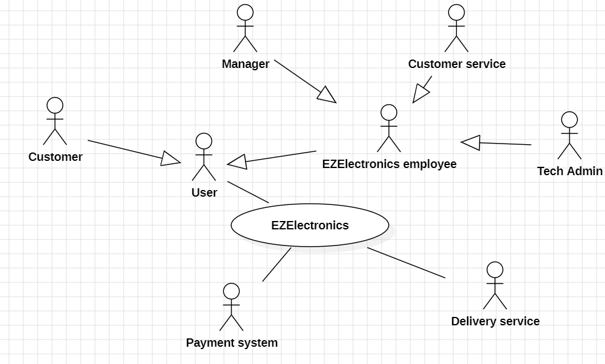

# Requirements Document - future EZElectronics

Date:

Version: V2 - description of EZElectronics in FUTURE form (as proposed by the team)

| Version number | Change |
| :------------: | :----: |
|                |        |

# Contents

- [Requirements Document - future EZElectronics](#requirements-document---future-ezelectronics)
- [Contents](#contents)
- [Informal description](#informal-description)
- [Business plan](#business-plan)
- [Stakeholders](#stakeholders)
- [Context Diagram and interfaces](#context-diagram-and-interfaces)
  - [Context Diagram](#context-diagram)
  - [Interfaces](#interfaces)
- [Stories and personas](#stories-and-personas)
  - [Customer Persona 1:](#customer-persona-1)
  - [Customer Persona 2:](#customer-persona-2)
  - [Customer Persona 3:](#customer-persona-3)
  - [Customer Persona 4:](#customer-persona-4)
  - [Manager Persona:](#manager-persona)
- [Functional and non functional requirements](#functional-and-non-functional-requirements)
  - [Functional Requirements](#functional-requirements)
  - [Non Functional Requirements](#non-functional-requirements)
- [Use case diagram and use cases](#use-case-diagram-and-use-cases)
  - [Use case diagram](#use-case-diagram)
    - [(UC1) FR1 Manage Users](#uc1-fr1-manage-users)
      - [(Scenario 1.1) Add new Customer](#scenario-11-add-new-customer)
      - [(Scenario 1.1.1) Add new Customer missing information](#scenario-111-add-new-customer-missing-information)
      - [(Scenario 1.1.2) Add new Customer but he already exists](#scenario-112-add-new-customer-but-he-already-exists)
      - [(Scenario 1.1.3) Add new Customer, but he does not accept the legal constraints](#scenario-113-add-new-customer-but-he-does-not-accept-the-legal-constraints)
      - [(Scenario 1.2) Delete a user](#scenario-12-delete-a-user)
      - [(Scenario 1.2.1) Delete a user, but the password is missing](#scenario-121-delete-a-user-but-the-password-is-missing)
      - [(Scenario 1.2.2) Delete a user, but the password is wrong](#scenario-122-delete-a-user-but-the-password-is-wrong)
      - [(Scenario 1.3) Update personal information](#scenario-13-update-personal-information)
      - [(Scenario 1.3.1) Update personal information but the old password is wrong](#scenario-131-update-personal-information-but-the-old-password-is-wrong)
      - [(Scenario 1.3.2) Update personal information but the new passwords are different](#scenario-132-update-personal-information-but-the-new-passwords-are-different)
      - [(Scenario 1.3.3) Update personal information but some data is missing](#scenario-133-update-personal-information-but-some-data-is-missing)
      - [(Scenario 1.4) Add New Manager/Customer service member](#scenario-14-add-new-managercustomer-service-member)
    - [(UC2) FR2 Manage customer information](#uc2-fr2-manage-customer-information)
      - [(Scenario 2.1) Associate address](#scenario-21-associate-address)
      - [(Scenario 2.1.1) Associate address, but some data is missing](#scenario-211-associate-address-but-some-data-is-missing)
      - [(Scenario 2.1.2) Associate address, but some data is wrong](#scenario-212-associate-address-but-some-data-is-wrong)
      - [(Scenario 2.2) Associate credit card](#scenario-22-associate-credit-card)
      - [(Scenario 2.2.1) Associate credit card, but some information are missing](#scenario-221-associate-credit-card-but-some-information-are-missing)
      - [(Scenario 2.2.2) Associate credit card, but the bank fails to verify the card validity](#scenario-222-associate-credit-card-but-the-bank-fails-to-verify-the-card-validity)
      - [(Scenario 2.3) Associate PayPal account](#scenario-23-associate-paypal-account)
      - [(Scenario 2.3.1) Associate PayPal account, but some data is missing](#scenario-231-associate-paypal-account-but-some-data-is-missing)
      - [(Scenario 2.3.2) Associate PayPal account but some information are wrong](#scenario-232-associate-paypal-account-but-some-information-are-wrong)
    - [(UC3) FR3 Authorization and authentication](#uc3-fr3-authorization-and-authentication)
      - [(Scenario 3.1) Log In](#scenario-31-log-in)
      - [(Scenario 3.1.1) Log In but password is wrong](#scenario-311-log-in-but-password-is-wrong)
      - [(Scenario 3.1.2) Log In but some data is missing](#scenario-312-log-in-but-some-data-is-missing)
      - [(Scenario 3.1.3) Log In but username does not exist](#scenario-313-log-in-but-username-does-not-exist)
      - [(Scenario 3.2) Log Out](#scenario-32-log-out)
      - [(Scenario 3.3) Retrieve Current User Session](#scenario-33-retrieve-current-user-session)
    - [(UC4) FR4 Manage Products](#uc4-fr4-manage-products)
      - [(Scenario 4.1) Add new product](#scenario-41-add-new-product)
      - [(Scenario 4.1.1) Add new product but there is already a product with the same code](#scenario-411-add-new-product-but-there-is-already-a-product-with-the-same-code)
      - [(Scenario 4.1.2) Add new product but some informations are missing](#scenario-412-add-new-product-but-some-informations-are-missing)
      - [(Scenario 4.1.3) Add new product but the arrival date is after the current date](#scenario-413-add-new-product-but-the-arrival-date-is-after-the-current-date)
      - [(Scenario 4.2) Mark Product as Sold](#scenario-42-mark-product-as-sold)
      - [(Scenario 4.2.1) Mark Product as Sold but the selling date is missing](#scenario-421-mark-product-as-sold-but-the-selling-date-is-missing)
      - [(Scenario 4.2.3) Mark Product as Sold but the selling date is not before the current date](#scenario-423-mark-product-as-sold-but-the-selling-date-is-not-before-the-current-date)
      - [(Scenario 4.2.4) Mark Product as Sold but the selling date is not after the product arrival date](#scenario-424-mark-product-as-sold-but-the-selling-date-is-not-after-the-product-arrival-date)
      - [(Scenario 4.2.5) Mark Product as Sold but it was already sold](#scenario-425-mark-product-as-sold-but-it-was-already-sold)
      - [(Scenario 4.3) Retrieve All products](#scenario-43-retrieve-all-products)
      - [(Scenario 4.4) Retrieve product by code](#scenario-44-retrieve-product-by-code)
      - [(Scenario 4.4.1) Retrieve product by code, but the code does not exist](#scenario-441-retrieve-product-by-code-but-the-code-does-not-exist)
      - [(Scenario 4.5) Retrieve products by category](#scenario-45-retrieve-products-by-category)
      - [(Scenario 4.5.1) Retrieve products by category that have been sold](#scenario-451-retrieve-products-by-category-that-have-been-sold)
      - [(Scenario 4.5.2) Retrieve products by category that have not been sold](#scenario-452-retrieve-products-by-category-that-have-not-been-sold)
      - [(Scenario 4.6) Retrieve products by model](#scenario-46-retrieve-products-by-model)
      - [(Scenario 4.6.1) Retrieve products by model that have been sold](#scenario-461-retrieve-products-by-model-that-have-been-sold)
      - [(Scenario 4.6.2) Retrieve products by model that have not been sold](#scenario-462-retrieve-products-by-model-that-have-not-been-sold)
      - [(Scenario 4.8) Delete a product](#scenario-48-delete-a-product)
    - [(UC5) FR5 Manage Cart](#uc5-fr5-manage-cart)
      - [(Scenario 5.1) Add Product to cart](#scenario-51-add-product-to-cart)
      - [(Scenario 5.1.1) Add Product to cart but the product has already been sold](#scenario-511-add-product-to-cart-but-the-product-has-already-been-sold)
      - [(Scenario 5.2) Delete a product from the cart](#scenario-52-delete-a-product-from-the-cart)
      - [(Scenario 5.3) Retrieve current cart](#scenario-53-retrieve-current-cart)
      - [(Scenario 5.4) Delete current Cart](#scenario-54-delete-current-cart)
      - [(Scenario 5.4.1) Delete current Cart but the cart is empty](#scenario-541-delete-current-cart-but-the-cart-is-empty)
    - [(UC6) FR6 Order management](#uc6-fr6-order-management)
      - [(Scenario 6.1) Place order and the user has a PayPal account or a credit card associated with his EZElectronics account](#scenario-61-place-order-and-the-user-has-a-paypal-account-or-a-credit-card-associated-with-his-ezelectronics-account)
      - [(Scenario 6.1.1) Place order, but the cart is empty](#scenario-611-place-order-but-the-cart-is-empty)
      - [(Scenario 6.2) Cancel Order](#scenario-62-cancel-order)
      - [(Scenario 6.2.2) Cancel Order but the order has already shipped](#scenario-622-cancel-order-but-the-order-has-already-shipped)
      - [(Scenario 6.3) View Order History](#scenario-63-view-order-history)
      - [(Scenario 6.4) Return Product](#scenario-64-return-product)
      - [(Scenario 6.4.1) Return Product, but the order has not been delivered yet](#scenario-641-return-product-but-the-order-has-not-been-delivered-yet)
      - [(Scenario 6.4.2) Return Product, but the order has been delivered more than 2 weeks ago](#scenario-642-return-product-but-the-order-has-been-delivered-more-than-2-weeks-ago)
      - [(Scenario 6.4.3) Return Product, but the customer did not give a reason for the return](#scenario-643-return-product-but-the-customer-did-not-give-a-reason-for-the-return)
      - [(Scenario 6.4.4) Return Product, but the manager denies the return](#scenario-644-return-product-but-the-manager-denies-the-return)
      - [(Scenario 6.5) Process Return](#scenario-65-process-return)
      - [(Scenario 6.5.1) Process Return (denied return)](#scenario-651-process-return-denied-return)
    - [(UC7) FR7 Payment management](#uc7-fr7-payment-management)
      - [(Scenario 7.1) Pay the cart and the user has a PayPal account or a credit card associated with his EZElectronics account](#scenario-71-pay-the-cart-and-the-user-has-a-paypal-account-or-a-credit-card-associated-with-his-ezelectronics-account)
      - [(Scenario 7.1.1) Pay the cart, the user has a PayPal account or a credit card associated with his EZElectronics account, but the payment does not go through](#scenario-711-pay-the-cart-the-user-has-a-paypal-account-or-a-credit-card-associated-with-his-ezelectronics-account-but-the-payment-does-not-go-through)
      - [(Scenario 7.2) Pay the cart but the user does not have a PayPal account or a credit card associated with his EZElectronics account](#scenario-72-pay-the-cart-but-the-user-does-not-have-a-paypal-account-or-a-credit-card-associated-with-his-ezelectronics-account)
      - [(Scenario 7.2.1) Pay the cart but the user does not have a PayPal account or a credit card associated with his EZElectronics account, and some informations are missing](#scenario-721-pay-the-cart-but-the-user-does-not-have-a-paypal-account-or-a-credit-card-associated-with-his-ezelectronics-account-and-some-informations-are-missing)
      - [(Scenario 7.2.2) Pay the cart but the user does not have a PayPal account or a credit card associated with his EZElectronics account, and the payment company does not validate the user credentials](#scenario-722-pay-the-cart-but-the-user-does-not-have-a-paypal-account-or-a-credit-card-associated-with-his-ezelectronics-account-and-the-payment-company-does-not-validate-the-user-credentials)
      - [(Scenario 7.3) The user selects to use his loyalty points](#scenario-73-the-user-selects-to-use-his-loyalty-points)
      - [(Scenario 7.4) Add a discount offert](#scenario-74-add-a-discount-offert)
      - [(Scenario 7.4.1) Add a discount offert but some information are missing](#scenario-741-add-a-discount-offert-but-some-information-are-missing)
    - [(UC8) FR8 Manage product reviews and ratings](#uc8-fr8-manage-product-reviews-and-ratings)
      - [(Scenario 8.1) Submit a product review](#scenario-81-submit-a-product-review)
      - [(Scenario 8.2) View product reviews](#scenario-82-view-product-reviews)
    - [(UC9) FR9 Manage Loyalty Program](#uc9-fr9-manage-loyalty-program)
      - [(Scenario 9.1) Award loyalty points](#scenario-91-award-loyalty-points)
      - [(Scenario 9.2) View loyalty points balance](#scenario-92-view-loyalty-points-balance)
      - [(Scenario 9.3) Remove loyalty points from the user](#scenario-93-remove-loyalty-points-from-the-user)
    - [(UC11) FR11 Manage Customer Service](#uc11-fr11-manage-customer-service)
      - [(Scenario 11.1) Create support ticket](#scenario-111-create-support-ticket)
      - [(Scenario 11.1.2) Create support ticket, but some data is missing](#scenario-1112-create-support-ticket-but-some-data-is-missing)
      - [(Scenario 11.2) View support ticket](#scenario-112-view-support-ticket)
      - [(Scenario 11.3) Add an answer in a support ticket](#scenario-113-add-an-answer-in-a-support-ticket)
      - [(Scenario 11.4) Close support ticket](#scenario-114-close-support-ticket)
    - [(UC12) FR12 Manage Inventory](#uc12-fr12-manage-inventory)
      - [(Scenario 12.1) Add New set of Products](#scenario-121-add-new-set-of-products)
      - [(Scenario 12.1.1) Add New set of Products, but the arrival date is before the current date](#scenario-1211-add-new-set-of-products-but-the-arrival-date-is-before-the-current-date)
      - [(Scenario 12.2) Automatically manage product quantity](#scenario-122-automatically-manage-product-quantity)
      - [(Scenario 12.2.1) Automatically manage product quantity (return)](#scenario-1221-automatically-manage-product-quantity-return)
- [Glossary](#glossary)
- [Deployment Diagram](#deployment-diagram)

# Informal description
EZElectronics (pronounced as EaSy Electronics) is a software application designed to assist managers in efficiently managing  products and offer them to customers. Managers has the possibility to efficiently manage their inventory which shows all available products and their quantity.

The available products are showcased to customers via a dedicated website. Customers can browse through the available products, add them to their cart, and review their past purchase history. The system is integrated with various payment methods and offers delivery services to users. Upon placing an order, customers can track the delivery status. They also have the option to return products if they do not meet expectations.

Customers can contribute to the platform by providing product reviews and ratings, which are visible to other users. Moreover, every product is associated with a certain number of loyalty points, which are awarded to the user upon purchase for future discounts.

If any problem happens to the Customer, there's the possibility to open a ticket with a given category and text. The ticket will be answered by a member of the customer service willing to solve the problem.

# Business plan
EZElectronics is a web application commissioned by a leading electronics company to its IT department to enhance product sales in an online shop.

# Stakeholders

| Stakeholder               | Description                                                                                   |
|---------------------------|-----------------------------------------------------------------------------------------------|
| Customers                 | Users who can browse and purchase products.                                                    |
| Managers                  | Users who have additional privileges, such as adding products and managing returns.             |
| Tech Admin                  | Employee of EZElectronics which has the possibility to create accounts with additional privileges (manager or customer service).            |
| Developers                | Those who will implement the application and maintain the codebase.                            |
| DBAs                      | Manage the database system where user and product information are stored.                       |
| Business Partners         | Companies or individuals who supply electronic products to be sold through the application.   |
| Payment service           | Service to ensure the user a secure payment method.                                            |
| Delivery service          | Third-party that takes care of product delivery.                                               |
| Customer service          | Users in charge of managing users complains and providing support to the application Customers |
| Retailer                  | The business entity (company) that sells electronic products to customers through the application. |
| Competitors               | Established e-commerce platforms such as Amazon and eBay.                                      |

# Context Diagram and interfaces

## Context Diagram

## Interfaces

|      Actor       |                  Logical Interface                   |              Physical Interface              |
| :--------------: | :--------------------------------------------------: | :------------------------------------------: |
|    Customers     | Web GUI for browsing products and making purchases.      | Internet connection and a device (smartphone, PC, etc.)       |
|    Managers      | Web GUI for managing products and settings.  | Internet connection and a device (smartphone, PC, etc.)       |
|    Tech Admin      | Web GUI accessible only by himself/herself to add a new user with additional privileges.  | Internet connection and a device (smartphone, PC, etc.)       |
| Payment system   |  APIs: https://developer.paypal.com/docs/api/payments/v2/  |  Internet link  |
| Customer Service |  GUI to see and answer customers questions           | Internet connection and a device (smartphone, PC, etc.)  |
| Delivery service | API: https://www.sendcloud.it/corrieri/gls/?utm_content=carrier_gls&utm_term=api%20gls&utm_campaign=bi_ita_search_generic_it&utm_medium=cpc&utm_source=bing&ad_group_id=1342506087477115&campaign_id=603385026=hsa_cam=603385026&hsa_grp=1342506087477115&hsa_mt=e&hsa_src=o&hsa_ad=&hsa_acc=6287359455&hsa_net=adwords&hsa_kw=api%20gls&hsa_tgt=kwd-83907666883378:loc-93&hsa_ver=3&msclkid=c3aac659e9ed15e4527ba07e86330b51 | Internet link |

                                               
# Stories and personas

## Customer Persona 1:
- **Name**: Michael Smith
- **Age**: 28
- **Nationality**: American
- **Occupation**: Graduate student in computer engineering
- **About**: Michael is a tech enthusiast, passionate about electronics and programming that enjoys DIY projects in his spare time. As a graduate student, he values the ability to find competitively priced products.
- **Needs**: Michael needs access to a wide range of electronic components for his projects. He also prefers a user-friendly interface where he can easily compare products, and make secure purchases. He needs a cart system where he can create multiple carts and add or remove products. He needs to be able to search a product by its category or model.
- **Frustrations**: Michael gets frustrated when he can't find specific components or when the online platform is difficult to navigate. He also dislikes long shipping times.
- **Expectation**: Michael expects the online platform to be easy to navigate and straightforward.

## Customer Persona 2:
- **Name**: Yelena Tereshkova
- **Age**: 50
- **Nationality**: Russian
- **Occupation**: Housewife
- **About**: Yelena is a simple housewife who mainly uses home appliances, she has minimal knowledge of electrical devices, she uses them for housework and no more.
- **Needs**: Yelena needs an application that is the simplest and intuitive possible, where to find home appliances that she needs without making a long search, but just writing the name of the product without any brand or model. Yelena also wants customer service to easily replace a broken piece of a product.
- **Frustrations**: Yelena gets frustrated when there are a lot of products of different brands and models under the same general name. 
- **Expectation**: Yelena expects the website to be intuitive and a place where she can purchase an item in a short time, like search the product, find the product, add to cart and purchase in less than 10 minutes.

## Customer Persona 3:
- **Name**: Giovanni Giuliani
- **Age**: 40
- **Nationality**: Italian
- **Occupation**: High-school Teacher
- **About**: Giovanni is a high school teacher in a little town, he has basic knowledge of electronic devices but he uses them everyday for his job.
- **Needs**: Giovanni needs a website where you can find reliable devices and components that last a long time without problems. He also needs availability for shipping in its little town.
- **Frustrations**: Giovanni gets frustrated when components or devices work badly, obstructing the right continuation of his lessons.
- **Expectation**: Giovanni expects the website to recommend good quality products only.

## Customer Persona 4:
- **Name**: Michelle Morales
- **Age**: 35
- **Nationality**: Mexican
- **Occupation**: Office employee and full-time mother
- **About**: Michelle is a busy woman but also a mother of a 2 years old baby which requires a lot of attention, even when she is at work. She can count on her husband too, but four eyes are better than two. She is familiar with technology. She often navigates from her company’s computers. 
- **Needs**: She needs a way to filter products by category (“devices for children” in particular) and maybe have a section dedicated to babies or a way to personalize her preferences in the website.
- **Frustrations**: She hates when a website is too complicated because it makes her waste time.
- **Expectation**: Michelle expects to find a website with a lot of filters and personalizations, where to find maybe a remote videocam to control her house and her baby from work, but also some good devices with which the baby can have fun.

## Manager Persona:
- **Name**: Mario Rossi
- **Age**: 37
- **Nationality**: Italian
- **Occupation**: Retail store manager
- **About**: Alex is an experienced manager who has more than 10 years of experience, he assesses the available products, records new ones, and confirms purchases.
- **Needs**: Alex needs an efficient application for managing inventory, users and tracking sales. For example by adding or removing products and registering new product arrivals. He also needs tools in order to get info on users that are logged on the application, like being able to sort them by role or get a specific user by his username.
- **Frustrations**: Alex is frustrated by complicated and cluttered inventory management systems. He can’t stand a slow application.
- **Expectation**: Alex expects the software application to provide useful insight on product performance and remaining stocks for each product, in addition to an easy way to restock.

# Functional and non functional requirements

## Functional Requirements

|  ID   | Description |
| :------------: | :--------------------------------------------------------------------------------------------------------------------: |
| FR1: **Manage Users**          |                              |
| FR1.1: Add New Customer                    | Allows creating a new user with unique username, name, surname, password. |
| FR1.2: Delete a User       | Allows deleting the account associated to a user. |
| FR1.3: Update User Information         | Allows updating user's password if necessary by inserting the previous one and the new one.         |
| FR1.4: Add New Manager/Customer service member                    | Allows the tech admin creating a new user with unique username, name, surname, password and role (manager or customer service). |
| FR2: **Manage Customer Information**          |                              |
| FR2.1: Associate address                 | A customer has the possibility to associate to its account its home address. |
| FR2.2: Associate credit card                 | A customer has the possibility to associate to its account its credit card information (number,expiration date and cvv encrypted) |
| FR2.3: Associate PayPal account       | A customer has the possibility to associate to its account its Paypol credentials to perform faster checkout |
| FR3: **Authorization and authentication** |                      |
| FR3.1: Login               | Allow users to log in using their username and password. |
| FR3.2: Logout              | Allow logged-in users to log out. |
| FR3.3: Retrieve Current User Session | Allow logged-in users to retrieve information about their current session. |
| FR4: **Manage Products**       |                               |
| FR4.1: Add New Product     | The system allows Managers to add new products with unique codes, selling prices, models, categories, details, optional arrival dates and optional loyalty points associated. |
| FR4.2: Add New Product's images     | The system allows Managers to add one or more picture associated with the product. |
| FR4.3: Mark Product as Sold | The system allows Managers to mark a product as sold by providing a selling date. |
| FR4.4: Retrieve All Products | Users can retrieve a list of all products present in the database. |
| FR4.5: Retrieve Product by Code | Information about a specific product can be retrieved by its code. |
| FR4.6: Retrieve Products by Category | Users can retrieve a list of products belonging to a specific category. |
| FR4.7: Retrieve Products by Model | The system allows users to retrieve a list of products with a specific model. |
| FR4.8: Delete Product     | The system allows Managers to delete a product|
| FR5: **Manage Carts**          |                               |
| FR5.1: Add Product to Cart | The system allows Users to add products to their cart. |
| FR5.2: Remove Product from Cart | The system allows Users to remove a product from their cart. |
| FR5.3: Retrieve Current Cart | The system allows Users to retrieve information about their cart. |
| FR5.4: Delete Current Cart | The system allows Users to delete their cart. |
| FR6: **Order Management**     |                               |
| FR6.1: Place Order          | Users can place orders for products in their cart, providing delivery details (or choosing the one already associated with the account if present). |
| FR6.3: Cancel Order         | Users can cancel an order before it's shipped, and the system updates the inventory accordingly. |
| FR6.4: Track Order Status   | Users can track the status of their order, including processing, shipped, out for delivery, and delivered. |
| FR6.5: View Order History   | Users can view their past order history, including details of products ordered, total cost, and delivery status. |
| FR6.6: Return Product       | Users can initiate a return process for products they are unsatisfied with, specifying the reason for return.|
| FR6.7: Process Return       | Managers can process return requests, refunding the customer if applicable. |
| FR7: **Payment Management** |                                                                                                                             |
| FR7.1: Select Payment Method | Users can select their preferred payment method during the checkout process, choosing between credit/debit card or PayPal. If one or both are associated with the account, the customer choose without inserting data again. |
| FR7.2: Verify Payment Data   | Upon selecting or adding a payment method, the system verifies the provided payment data (e.g., card number, expiration date, CVV, PayPal account) with the payment service for accuracy and validity. |
| FR7.3: Process Payment        | Upon completion of an order, the system processes the payment using the selected method, deducting the total cost from the user's account or card balance. |
| FR7.4: Handle Failed Payments | In case of a failed payment transaction (e.g., insufficient funds, expired card), the system notifies the user and prompts them to an alternative payment method. |
| FR7.5: View Payment History   | Users can view their payment history, including details of past transactions, payment methods used, and transaction statuses (e.g., pending, completed, failed). |
| FR7.4: Propose discount in loyalty points | Optionally a payment can be discounted of a given percentage (with respect to the total) by subtracting to the user a given amount of loyalty points (if available).|
| FR7.6: Apply Discounts| Users can select the proposed discount during the checkout process, with the system recalculating the final payment amount and subtracting loyalty points accordingly before processing the payment. |
| FR8: **Manage Product Reviews and Ratings** |                          |
| FR8.1: Submit Product Review | Users can submit reviews for products they have purchased, including a rating and optional written feedback. |
| FR8.2: View Product Reviews   | Users can view product reviews and ratings submitted by other customers to make informed purchasing decisions. |
| FR9: **Manage Loyalty Program**        |                               |
| FR9.1: Award Loyalty Points   | Customers earn loyalty points for each purchase, with the number of points awarded based on the number of loyalty points associated with each product purchased. |
| FR9.2: View Loyalty Points Balance | Customers can view their current loyalty points balance in their account. |
| FR9.3: Remove Loyalty Points  | The system decreases loyalty points when a discount is applied by the user. |
| FR10: **Privacy management**        |                               |
| FR10.1: Show legal constraints  | Advise properly the customer about legal constraints on the web site. |
| FR11: **Manage Customer Service** | | 
| FR11.1: Create Support Ticket | Allows customers to submit issues and requests, categorizing them based on predefined categories (Order,Payment,Product and Loyalty Program). | 
| FR11.2: View and Update Support Tickets | Both Customers and Customer service representatives are provided with a dashboard to view, update, and close support tickets. | 
| FR11.3: View Ticket History | Records all interactions and actions taken to resolve customer inquiries, providing customers with regular updates on ticket status and progress. | 
| FR12: **Manage Inventory** | |
| FR12.1: Add New set of Products       | Managers can add a new set of products to the inventory (with the same model) providing unique code, selling price, model, category, details,quantity and optional arrival dates|
| FR12.2: Automatically Manage Products Quantity | When an order is payed, the system automatically subtracts product to the manager's inventory and the same goes for a successful return.  |

## Non Functional Requirements

| ID    | Type (efficiency, reliability, ..) | Description | Refers to |
| :-----: | :--------------------------------: | :---------: | :-------: |
|  NFR1   |   **USABILITY**|  |    |
|  NFR1.1 |   **Usability** | The average web user should be able to learn and use the application with no training in less than 5 minutes| FR1-FR2-FR3-FR4-FR5-FR6-FR7-FR8-FR9-FR10-FR11-FR12   |
|  NFR 1.2 |  **Error prevention**| minimize the occurrence of user errors by providing clear instructions and error reports|  |
|  NFR2   | **EFFICIENCY**|  |  |
|  NFR2.1 |   **Website efficiency**| All functions in the web application must be completed in less than 0.2s (excluding network and database latency)| FR1-FR2-FR3-FR4-FR5-FR6-FR7-FR8-FR9-FR10-FR11-FR12 |
|  NFR2.2 |   **Delivery efficiency**| Processing the order should require less than one day | FR6.7 |
|  NFR2.3 |   **Customer service efficiency**| Customer service should answer a ticket in less than two working days | FR11 |
|  NFR3   | **RELIABILITY** |   |  |
|  NFR3.1 |   **Availability** | the system should be available and accessible to users with minimal downtime, aiming for at least 99% uptime|  |
| NFR3.2  |   **Fault tolerance** | the system (and the database as well) must be continue to operate reliably in the event of hardware failures, software errors, or other unexpected events|   |
|  NFR4   | **MAINTAINABILITY** |   |  |
|  NFR4.1 |   **Code readability** | ensure that the code is well-organized, commented and follows consistent coding conventions|  |
| NFR4.2  |   **Documentation** | provide comprehensive documentation, including API,code and architectural diagrams|   |
| NFR4.3  |   **Testing** | Implement a robust testing infrastructure|   |
| NFR5    | **SECURITY** |   |    |
| NFR5.1  |   **Authentication and authorization**| ensure that only authenticated and authorized users can perform certain actions| FR1-FR2-FR3-FR4-FR5-FR6-FR7-FR8-FR9-FR10-FR11-FR12 |
| NFR5.2  |   **Error handling** | address error handling mechanisms to provide informative error messages to user |  |
| NFR6    | **PORTABILITY** |   |    |
| NFR6.1  |   **Web app portability** | The web app should be available for all users on Google Chrome (from version 117.0, ensuring approximately 40% of coverage), Safari and Safari Mobile(from version 15, ensuring approximately 32% of coverage), Microsoft Edge (from version 122, ensuring approximately 6% of coverage) | |

# Use case diagram and use cases

## Use case diagram

### (UC1) FR1 Manage Users
|    			  |                                       			  |
| :--------------: | :---------------------------------------------- 	|
| Actors Involved  | Manager, Customer 	  |
|   Precondition   |  |
|  Post condition  |  |
| Nominal Scenario | 1.1 - 1.2 - 1.3 - 1.4 |
| 	Variants 	| 1.1.3 |
|	Exceptions	| 1.1.1 - 1.1.2 - 1.2.1 - 1.2.2 - 1.3.1 - 1.3.2 - 1.3.3 |

#### (Scenario 1.1) Add new Customer
|  			  |                                       			  |
| :------------: | :-------------------------------------------------- |
|  Precondition  | Customer is not registered in the application  |
| Post condition | Customer has a new account     			  |
| 	**Step#**      |   			  **Description**           			  |
|  1  |   Customer fills in name, surname, username, password |
|  2  |   The system checks that no data is missing  |
|  3  |   The system looks for a match in the database for the username and does not find any correspondance 	|
|  4  |   The system shows at the user legal constraints  |
|  4  |   The Customer accepts the legal constraints  |
|  5  |   The system saves the new account in the database	|
|  6  |   User has set up a new account 			  |

#### (Scenario 1.1.1) Add new Customer missing information
|  			  |                                       			  |
| :------------: | :-------------------------------------------------- |
|  Precondition  | Customer is not registered in the application  |
| Post condition | Customer hasn't got a new account (retry) |
| 	**Step#**      |   			  **Description**           			  |
|  1  |   Customer fills in name, surname, username, password missing one or more of those |
|  2  |   System checks that no data is missing  |
|  3  |   Data is missing: user has to insert all data  |
|  4  |  An error is generated (Error code: 422)  		  |

#### (Scenario 1.1.2) Add new Customer but he already exists
|  			  |                                       			  |
| :------------: | :-------------------------------------------------- |
|  Precondition  | Customer has already an account  |
| Post condition | An error is returned to the user  |
| 	**Step#**      |   			  **Description**  	  |
|  1  |   Customer fills in name, surname, username, password |
|  2  |   System checks that no data is missing  |
|  3  |   System looks for a match in the database for the username and finds a correspondence  |
|  4  |   An Error is generated (Error code: 409)   		  |

#### (Scenario 1.1.3) Add new Customer, but he does not accept the legal constraints
|  			  |                                       			  |
| :------------: | :-------------------------------------------------- |
|  Precondition  | Customer is not registered in the application  |
| Post condition | Customer hasn't got a new account  			  |
| 	**Step#**      |   			  **Description**           			  |
|  1  |   Customer fills in name, surname, username, password |
|  2  |   The system checks that no data is missing  |
|  3  |   The system looks for a match in the database for the username and does not find any correspondance 	|
|  4  |   The system shows at the user legal constraints  |
|  4  |   The customer does not accept the legal constraints  |
|  5  |   The system does not save user information and does not create a new account	|

#### (Scenario 1.2) Delete a user
|  			  |                                       			  |
| :------------: | :-------------------------------------------------- |
|  Precondition  | User is registered and signed in the application  |
| Post condition | User's account has been deleted     			  |
| 	**Step#**      |   			  **Description**           			  |
|  1  |   User ask the system for his account to be deleted |
|  2  |   The system asks the user for his password |
|  3  |   User fills in his password |
|  4  |   The system checks that no data is missing  |
|  5  |   The system looks that the password for said user matches, and it does|
|  6  |   The system ask again for confirmation to the user |
|  7  |   The system removes the account from the database |
|  8  |   User has deleted his account from the application   |

#### (Scenario 1.2.1) Delete a user, but the password is missing
|  			  |                                       			  |
| :------------: | :-------------------------------------------------- |
|  Precondition  | User is registered and signed in the application  |
| Post condition | An error is generated   			  |
| 	**Step#**      |   			  **Description**           			  |
|  1  |   User ask the system for his account to be deleted |
|  2  |   The system asks the user for his password |
|  3  |   User does not fill in his password |
|  4  |   The system checks that no data is missing  |
|  5  |   Data is missing: user has to insert all data  |
|  6  |   An error is generated (Error code: 422)  		  |

#### (Scenario 1.2.2) Delete a user, but the password is wrong
|  			  |                                       			  |
| :------------: | :-------------------------------------------------- |
|  Precondition  | User is registered and signed in the application  |
| Post condition | An error is generated   			  |
| 	**Step#**      |   			  **Description**           			  |
|  1  |   User ask the system for his account to be deleted |
|  2  |   The system asks the user for his password |
|  3  |   User fills in his password |
|  4  |   The system checks that no data is missing  |
|  5  |   The system looks that the password for said user matches, but it does not  |
|  6  |   An error is generated   		  |

#### (Scenario 1.3) Update personal information
|  			  |                                       			  |
| :------------: | :-------------------------------------------------- |
|  Precondition  | User is registered and signed in the application  |
| Post condition | User has updated his password	|
| 	**Step#**      |**Description**|
|  1  |   User ask the system to change password  |
|  2  |  The system asks the user the old password  |
|  3  |   User inserts the old password  |
|  4  |   The system checks that no data is missing  |
|  5  |   The system looks that the password for said user matches, and it does|
|  6  |   The system asks the user the new password two times |
|  7  |   User inserts the new password two times  |
|  8  |   The system checks that no data is missing and that the passwords are the same  |
|  9  |   The system updated the database  |
|  10  |   User has changed his password  		  |

#### (Scenario 1.3.1) Update personal information but the old password is wrong
|  			  |                                       			  |
| :------------: | :-------------------------------------------------- |
|  Precondition  | User is registered and signed in the application  |
| Post condition | An error is generated   |
| 	**Step#**      |	**Description** 	|
|  1  |   User ask the system to change password  |
|  2  |  The system asks the user the old password  |
|  3  |   User inserts the old password  |
|  4  |   The system checks that no data is missing  |
|  5  |   The system looks that the password for said user matches, and it does not |
|  6  |  An error is generated 		  |

#### (Scenario 1.3.2) Update personal information but the new passwords are different
|  			  |                                       			  |
| :------------: | :-------------------------------------------------- |
|  Precondition  | User is registered and signed in the application  |
| Post condition | An error is generated   |
| 	**Step#**      |	**Description** 	|
|  1  |   User ask the system to change password  |
|  2  |  The system asks the user the old password  |
|  3  |   User inserts the old password  |
|  4  |   The system checks that no data is missing  |
|  5  |   The system looks that the password for said user matches, and it does|
|  6  |  The system asks the user the new password two times |
|  7  |   User inserts the new password two times  |
|  8  |   The system checks that no data is missing and that the passwords are the same, they are not  |
|  9  |   An error is generated  		  |

#### (Scenario 1.3.3) Update personal information but some data is missing
|  			  |                                       			  |
| :------------: | :-------------------------------------------------- |
|  Precondition  | User is registered and signed in the application  |
| Post condition | An error is generated   |
| 	**Step#**      |	**Description** 	|
|  1  |   User ask the system to change password  |
|  2  |  The system asks the user the old password  |
|  3  |   User inserts the old password  |
|  4  |   The system checks that no data is missing, but it is  |
|  5  |   An error is generated (Error code: 422) 		  |

#### (Scenario 1.4) Add New Manager/Customer service member
|  			  |                                       			  |
| :------------: | :-------------------------------------------------- |
|  Precondition  | The tech admin wants to add a new member of the customer service or a manager |
| Post condition | The manager or the customer service's member has a new account  |
| 	**Step#**      |   			  **Description**           			  |
|  1  |   The tech admin fills in name, surname, username, password and role |
|  2  |   The system saves the new account in the database	|
|  3  |   User has set up a new account 			  |

### (UC2) FR2 Manage customer information
|    			  |                                       			  |
| :--------------: | :---------------------------------------------- 	|
| Actors Involved  | Customer, Payment system              			  |
|   Precondition   | User must be registered in the database and logged in as a customer |
|  Post condition  |  			  |
| Nominal Scenario | 2.1 - 2.2 - 2.3      |
| 	Variants 	|  |
|	Exceptions	| 2.1.1 -  2.1.2 - 2.2.1 - 2.2.2 - 2.3.1 - 2.3.2 |

#### (Scenario 2.1) Associate address
|  			  |                                       			  |
| :------------: | :-------------------------------------------------- |
|  Precondition  | User is logged in as a customer  |
| Post condition | User has associated his home address to his account |
| 	**Step#**      |   **Description**   |
|  1  | The user ask the system to associate his home address to his account|
|  2  |   The system shows at the user the legal constraints  |
|  3  |   The user accepts the legal constraints  |
|  4  |   The system ask the user his address information  |
|  5  |   The user inserts his street name, street number, city, province, zip code, country |  
|  6  |   The system checks that no data is missing, everything is present |
|  7  |   System checks data correctness, everything is correct  |
|  8  |   The system saves the new data in the database  |
|  9  |   User has associated his home address to his account |

#### (Scenario 2.1.1) Associate address, but some data is missing
|  			  |                                       			  |
| :------------: | :-------------------------------------------------- |
|  Precondition  | User is logged in as a customer  |
| Post condition | An error is generated |
| 	**Step#**      |   			  **Description**   |
|  1  |  The user ask the system to associate his home address to his account|
|  2  |  The system shows at the user the legal constraints  |
|  3  |  The user accepts the legal constraints  |
|  4  |  The system ask the user his address information  |
|  5  |  The user inserts his street name, street number, city, province, zip code, country 	  |   		  |
|  6  |   The system checks that no data is missing, some data is missing |
|  7  |   An error is generated (Error code: 422)  |

#### (Scenario 2.1.2) Associate address, but some data is wrong
|  			  |                                       			  |
| :------------: | :-------------------------------------------------- |
|  Precondition  | User is logged in as a customer  |
| Post condition | An error is generated |
| 	**Step#**      |   			  **Description** 	|
|  1  |  The user ask the system to associate his home address to his account|
|  2  |  The system shows at the user the legal constraints  |
|  3  |  The user accepts the legal constraints  |
|  4  |  The system ask the user his address information  |
|  5  |  The user inserts his street name, street number, city, province, zip code, country 	  |   		  |
|  6  |   The system checks that no data is missing, everything is present |
|  7  |   System checks data correctness, something is wrong |
|  8  |   An error is generated   |

#### (Scenario 2.2) Associate credit card
|  			  |                                       			  |
| :------------: | :-------------------------------------------------- |
|  Precondition  | User is logged in as a customer  |
| Post condition | User has associated his credit card to his account |
| 	**Step#**      |   			  **Description** |
|  1  | The user ask the system to associate his credit card to his account|
|  2  |   The system shows at the user legal constraints  |
|  3  |   The user accepts the legal constraints  |
|  4  |   The system ask the user his credit card information  |
|  5  |  The user inserts his credit card information: name, surname, card number, expiration date and cvv |
|  6  |   The system checks that no data is missing, everything is present |
|  7  |   The system encrypts and sends the data to the user's bank to check credit card validity, everything is valid |
|  8  |   System saves the new encrypted information in the database  |
|  9  |   User has associated his credit card to his account |

#### (Scenario 2.2.1) Associate credit card, but some information are missing
|  			  |                                       			  |
| :------------: | :-------------------------------------------------- |
|  Precondition  | User is logged in as a customer  |
| Post condition | An error is generated |
| 	**Step#**      |   			  **Description** |
|  1  | The user ask the system to associate his credit card to his account|
|  2  |   The system shows at the user legal constraints  |
|  3  |   The user accepts the legal constraints  |
|  4  |   The system ask the user his credit card information  |
|  5  |   The user inserts his credit card information: name, surname, card number, expiration date and cvv |
|  6  |   The system checks that no data is missing, there is something missing |
|  7  |   An error is generated (Error code: 422) |

#### (Scenario 2.2.2) Associate credit card, but the bank fails to verify the card validity
|  			  |                                       			  |
| :------------: | :-------------------------------------------------- |
|  Precondition  | User is logged in as a customer  |
| Post condition | User has associated his credit card to his account |
| 	**Step#**      |   			  **Description** |
|  1  | The user ask the system to associate his credit card to his account|
|  2  |   The system shows at the user legal constraints  |
|  3  |   The user accepts the legal constraints  |
|  4  |   The system ask the user his credit card information  |
|  5  |  The user inserts his credit card information: name, surname, card number, expiration date and cvv |
|  6  |   The system checks that no data is missing, everything is present |
|  7  |   The system encrypts and sends the data to the user's bank to check credit card validity, the bank does not validate the card |
|  8  |   An error is generated  |

#### (Scenario 2.3) Associate PayPal account
|  			  |                                       			  |
| :------------: | :-------------------------------------------------- |
|  Precondition  | User is logged in as a customer  |
| Post condition | User has associated his PayPal to his account |
| 	**Step#**      |   			  **Description** |
|  1  | The user ask the system to associate his PayPal to his account|
|  2  |   The system shows at the user legal constraints  |
|  3  |   The user accepts the legal constraints  |
|  4  |   The system ask the user his PayPal account information (username and password) |
|  5  |  The user inserts his PayPal information |
|  6  |   The system checks that no data is missing, everything is present |
|  7  |   The system encrypts and sends the data to PayPal to check information correctness, everything is valid |
|  8  |   System saves the new encrypted information in the database  |
|  9  |   User has associated his PayPal to his account |

#### (Scenario 2.3.1) Associate PayPal account, but some data is missing
|  			  |                                       			  |
| :------------: | :-------------------------------------------------- |
|  Precondition  | User is logged in as a customer  |
| Post condition | An error is generated |
| 	**Step#**      |   **Description** |
|  1  | The user ask the system to associate his PayPal to his account|
|  2  |   The system shows at the user legal constraints  |
|  3  |   The user accepts the legal constraints  |
|  4  |   The system ask the user his PayPal account information (username and password) |
|  5  |  The user inserts his PayPal information |
|  6  |   The system checks that no data is missing, something is missing |
|  7  |   An error is generated (Error code: 422) |

#### (Scenario 2.3.2) Associate PayPal account but some information are wrong
|  			  |                                       			  |
| :------------: | :-------------------------------------------------- |
|  Precondition  | User is logged in as a customer  |
| Post condition | User has associated his PayPal to his account |
| 	**Step#**      |   			  **Description** |
|  1  | The user ask the system to associate his PayPal to his account|
|  2  |   The system shows at the user legal constraints  |
|  3  |   The user accepts the legal constraints  |
|  4  |   The system ask the user his PayPal account information (username and password) |
|  5  |  The user inserts his PayPal information |
|  6  |   The system checks that no data is missing, everything is present |
|  7  |   The system encrypts and sends the data to PayPal to check information correctness, something is wrong |
|  8  |   An error is generated  |

### (UC3) FR3 Authorization and authentication
|    			  |                                       			  |
| :--------------: | :---------------------------------------------- 	|
| Actors Involved  | Customer, Manager                    			  |
|   Precondition   | User must be registered in the database |
|  Post condition  |  			  |
| Nominal Scenario | 3.1 - 3.2 - 3.3  |
| 	Variants 	|  |
|	Exceptions	| 3.1.1 - 3.1.2 -  3.1.3  |

#### (Scenario 3.1) Log In
|  			  |                                       			  |
| :------------: | :-------------------------------------------------- |
|  Precondition  | User hasn't performed Login (hasn't got a session actually)  |
| Post condition | User is logged in to the system	|
| 	**Step#**      |  **Description**	|
|  1  |   User enters username and password             			  |
|  2  |   System checks that both username and password are present, they are both present  |
|  3  |   System looks for a match in the database for username and finds the user|
|  4  |   System checks the password and it is correct  |
|  5  |   User is authenticated and a new session is established |

#### (Scenario 3.1.1) Log In but password is wrong
|  			  |                                       			  |
| :------------: | :-------------------------------------------------- |
|  Precondition  | User is not authenticated  |
| Post condition | User is not authenticated  |
| 	**Step#**      |   **Description** |
|  1  |   User enters username and password             			  |
|  2  |   System checks that both username and password are present, they are both present  |
|  3  |   System looks for a match in the database for username and finds the user |
|  4  |   System checks the password but is not correct  |
|  5  |   User is not authenticated	|

#### (Scenario 3.1.2) Log In but some data is missing
|  			  |                                       			  |
| :------------: | :-------------------------------------------------- |
|  Precondition  | User is not authenticated  |
| Post condition | An error is generated  |
| 	**Step#**      |**Description**   |
|  1  |   User enters username and password             			  |
|  2  |   System checks that both username and password are present, password is missing  |
|  3  |   An error is generated (Error code: 422)           			  |

#### (Scenario 3.1.3) Log In but username does not exist
|  			  |                                       			  |
| :------------: | :-------------------------------------------------- |
|  Precondition  | User is not authenticated |
| Post condition | An error is generated  |
| 	**Step#**      |**Description**      |
|  1  |   User enters username and password             			  |
|  2  |   System checks that both username and password are present, they are both present  |
|  3  |   System looks for a match in the database for username and does not find the user |
|  4  |   An error is generated (Error code: 404) |

#### (Scenario 3.2) Log Out
|  			  |                                       			  |
| :------------: | :-------------------------------------------------- |
|  Precondition  | User must be logged in			  |
| Post condition | User is no longer logged in  			  |
| 	**Step#**      |  **Description**	|
|  1  |   User selects to be logged out  |
|  2  |   The system elaborates the response   |
|  3  |   User is logged out  |

#### (Scenario 3.3) Retrieve Current User Session  
|  			  |                                       			  |
| :------------: | :-------------------------------------------------- |
|  Precondition  | User must be logged in			  |
| Post condition | User has got information about its current session  |
| 	**Step#**      |   			  **Description**	|
|  1  |   User ask the system information about the current session    	  |
|  2  |   The system elaborates the response                			  |
|  3  |   Information about the session are sent to the user 			  |

### (UC4) FR4 Manage Products
|    			  |                                       			  |
| :--------------: | :---------------------------------------------- 	|
| Actors Involved  |      Customer and Manager             			  |
|   Precondition   | 	  User must be logged in (as a Manager if additional privileges are required)|
|  Post condition  |                      			  |
| Nominal Scenario | 4.1 - 4.2 - 4.3 - 4.4 - 4.5 - 4.6 - 4.8	|
| 	Variants 	| |
|	Exceptions	| 4.1.1 - 4.1.2 - 4.1.3 - 4.2.1 - 4.2.3 - 4.2.4 - 4.2.5 - 4.4.1 - 4.5.1 - 4.5.2 - 4.6.1 - 4.6.2   |

#### (Scenario 4.1) Add new product
| | |
| :------------: | :-------------------------------------------------- |
| Precondition | User is logged in and is a manager |
| Post condition | A new product is added to the database |
| **Step#** | **Description** |
| 1 | Manager enters details regarding the product such as: code, pictures, selling price, model, category, arrival date and details |
| 2 | The system checks that all necessary information has been added |
| 3 | The system checks that no other product with the same code exists |
| 4 | The new product is added to the database |

#### (Scenario 4.1.1) Add new product but there is already a product with the same code
| | |
| :------------: | :-------------------------------------------------- |
| Precondition | User is logged in and is a manager |
| Post condition | An error in generated |
| **Step#** | **Description** |
| 1 | Manager enters details regarding the product such as: code, pictures, selling price, model, category, arrival date and details |
| 2 | The system checks that all necessary information has been added |
| 3 | The system checks that no other product with the same code exists, but finds one |
| 4 | An error is generated (Error code: 409) |

#### (Scenario 4.1.2) Add new product but some informations are missing
|  			  |                                       			  |
| :------------: | :-------------------------------------------------- |
|  Precondition  | User is logged in and is a manager    	  |
| Post condition | An error is returned  	  |
| 	**Step#**      |   			  **Description**           			  |
|  1  |   Manager enters details regarding the product such as: code, selling price, model, category, arrival date and details    	  |
|  2  |   The system checks that all necessary information has been added and finds that there is something missing (error 422) |

#### (Scenario 4.1.3) Add new product but the arrival date is after the current date
|                |                                                     |
| :------------: | :-------------------------------------------------- |
|  Precondition  | User is logged in and is a manager          |
| Post condition | An error is returned        |
|     **Step#**      |                 **Description**                         |
|  1  |   Manager enters details regarding the product such as: code, selling price, model, category, arrival date and details          |
|  2  |   The system checks that all necessary information has been added and finds that the date is after the current date (error) |

#### (Scenario 4.2) Mark Product as Sold
|  			  |                                       			  |
| :------------: | :-------------------------------------------------- |
|  Precondition  | User is logged in and is a manager    	  |
| Post condition | A product is marked as sold  	  |
| 	**Step#**      |   			  **Description**           			  |
|  1  |   Manager enters details regarding the code of the product and the selling date    	  |
|  2  |   The system checks that all necessary information has been added  |
|  3  |   The system checks that the selling date is before the current date  |
|  4  |   The system checks that the selling date is after the product arrival date |
|  5  |   The system checks that a product with that code exists  |
|  6  |   The system checks that the product has not been sold yet |
|  7  |   The product is marked as sold    	  |

#### (Scenario 4.2.1) Mark Product as Sold but the selling date is missing
|  			  |                                       			  |
| :------------: | :-------------------------------------------------- |
|  Precondition  |  User is logged in and is a manager   	  |
| Post condition | A product is marked as sold  	  |
| 	**Step#**      |   			  **Description**           			  |
|  1  |   Manager enters details regarding the code of the product and the selling date    	  |
|  2  |   The system checks that all necessary information has been added, but the selling date is missing  |
|  3  |   The system uses the current date as selling date  |
|  4  |   The system checks that the selling date is after the product arrival date |
|  5  |   The system checks that a product with that code exists  |
|  6  |   The system checks that the product has not been sold yet |
|  7  |   The product is marked as sold    	  |

#### (Scenario 4.2.3) Mark Product as Sold but the selling date is not before the current date
|  			  |                                       			  |
| :------------: | :-------------------------------------------------- |
|  Precondition  | User is logged in and is a manager   	  |
| Post condition | An error is generated  	  |
| 	**Step#**      |   			  **Description**           			  |
|  1  |   Manager enters details regarding the code of the product and the selling date    	  |
|  2  |   The system checks that all necessary information has been added  |
|  3  |   The system checks that the selling date is before the current date, it is not  |
|  4  |   An error is generated (Error code:  422)      |

#### (Scenario 4.2.4) Mark Product as Sold but the selling date is not after the product arrival date
|  			  |                                       			  |
| :------------: | :-------------------------------------------------- |
|  Precondition  | User is logged in and is a manager    	  |
| Post condition | An error is generated  	  |
| 	**Step#**      |   			  **Description**           			  |
|  1  |   Manager enters details regarding the code of the product and the selling date    	  |
|  2  |   The system checks that all necessary information has been added  |
|  3  |   The system checks that the selling date is after the product arrival date, it is not |
|  4  |   An error is generated (Error code: 422)      |

#### (Scenario 4.2.5) Mark Product as Sold but it was already sold
|  			  |                                       			  |
| :------------: | :-------------------------------------------------- |
|  Precondition  | User is logged in and is a manager    	  |
| Post condition | An error is generated 	  |
| 	**Step#**      |   			  **Description**           			  |
|  1  |   Manager enters details regarding the code of the product and the selling date  |
|  2  |   The system checks that all necessary information has been added  |
|  3  |   The system checks that the product has not been sold yet, but it is already sold  |
|  4  |   An error is generated (Error code: 409)    	  |

#### (Scenario 4.3) Retrieve All products
|  			  |                                       			  |
| :------------: | :-------------------------------------------------- |
|  Precondition  | User is logged in    	  |
| Post condition | A list of products is returned to the user 	  |
| 	**Step#**      |   			  **Description**           			  |
|  1  |   User ask the system for a list of all products  |
|  2  |   The system elaborates the response  |
|  3  |  The system returns the user a list of all products that are present in the database	|

#### (Scenario 4.4) Retrieve product by code
|  			  |                                       			  |
| :------------: | :-------------------------------------------------- |
|  Precondition  | User is logged in    	  |
| Post condition | Information about a single product are retrieved      |
| 	**Step#**      |   			  **Description**           			  |
|  1  |   User ask the system for a product with a specific code  |
|  2  |   The system checks if the product with that code exists, it does  |
|  3  |  The system returns the user information about that product	|

#### (Scenario 4.4.1) Retrieve product by code, but the code does not exist
|  			  |                                       			  |
| :------------: | :-------------------------------------------------- |
|  Precondition  | User is logged in   	  |
| Post condition | An error is generated 	|
| 	**Step#**      |   			  **Description**           			  |
|  1  |   User ask the system for a product with a specific code  |
|  2  |   The system checks if the product with that code exists, it does not  |
|  3  |  An error is generated (Error code: 404)   |

#### (Scenario 4.5) Retrieve products by category
|  			  |                                       			  |
| :------------: | :-------------------------------------------------- |
|  Precondition  | User is logged in    	  |
| Post condition | A list of products is returned to the user with the same category 	  |
| 	**Step#**      |   			  **Description**           			  |
|  1  |   User ask the system for a list of products with the same category |
|  2  |   The system elaborates the response  |
|  3  |  The system returns the user a list of all products that have the same category	|

#### (Scenario 4.5.1) Retrieve products by category that have been sold
|  			  |                                       			  |
| :------------: | :-------------------------------------------------- |
|  Precondition  | User is logged in 		  |
| Post condition | A list of products is returned to the user with the same category and that have been sold      |
| 	**Step#**      |   			  **Description**           			  |
|  1  |   User ask the system for a list of products with the same category that have been sold |
|  2  |   The system elaborates the response  |
|  3  |  The system returns the user a list of all products that have the same category that have been sold 	|

#### (Scenario 4.5.2) Retrieve products by category that have not been sold
|  			  |                                       			  |
| :------------: | :-------------------------------------------------- |
|  Precondition  | User is logged in    	  |
| Post condition | A list of products is returned to the user with the same category and that have not been sold 	  |
| 	**Step#**      |   			  **Description**           			  |
|  1  |   User ask the system for a list of products with the same category that have not been sold |
|  2  |   The system elaborates the response  |
|  3  |  The system returns the user a list of all products that have the same category that have not been sold 	|

#### (Scenario 4.6) Retrieve products by model
|  			  |                                       			  |
| :------------: | :-------------------------------------------------- |
|  Precondition  | User is logged in 		  |
| Post condition | A list of products is returned to the user with the same model 	  |
| 	**Step#**      |   			  **Description**           			  |
|  1  |   User ask the system for a list of products with the same model |
|  2  |   The system elaborates the response  |
|  3  |  The system returns the user a list of all products that have the same model	|

#### (Scenario 4.6.1) Retrieve products by model that have been sold
|  			  |                                       			  |
| :------------: | :-------------------------------------------------- |
|  Precondition  | User is logged in 		  |
| Post condition | A list of products is returned to the user with the same model and that have been sold      |
| 	**Step#**      |   			  **Description**           			  |
|  1  |   User ask the system for a list of products with the same model that have been sold |
|  2  |   The system elaborates the response  |
|  3  |  The system returns the user a list of all products that have the same model that have been sold 	|

#### (Scenario 4.6.2) Retrieve products by model that have not been sold
|  			  |                                       			  |
| :------------: | :-------------------------------------------------- |
|  Precondition  | 		  |
| Post condition | A list of products is returned to the user with the same model and that have not been sold 	  |
| 	**Step#**      |   			  **Description**           			  |
|  1  |   User ask the system for a list of products with the same model that have been sold |
|  2  |   The system elaborates the response  |
|  3  |  The system returns the user a list of all products that have the same model that have not been sold 	|

#### (Scenario 4.8) Delete a product
| | |
| :------------: | :-------------------------------------------------- |
| Precondition | User is logged in and is a manager |
| Post condition | A  product is deleted from the database |
| **Step#** | **Description** |
| 1 | Manager selects a product to be deleted |
| 2 | The  product is deleted from the database |

### (UC5) FR5 Manage Cart
|    			  |                                       			  |
| :--------------: | :---------------------------------------------- 	|
| Actors Involved  | Customer             			  |
|   Precondition   | User must be logged in as a customer  |
|  Post condition  |                      			  |
| Nominal Scenario | 5.1 - 5.2 - 5.3  - 5.4 |
| 	Variants 	|  |
|	Exceptions	| 5.1.1 5.4.1 |

#### (Scenario 5.1) Add Product to cart
|  			  |                                       			  |
| :------------: | :-------------------------------------------------- |
|  Precondition  | Customer has performed login    	  |
| Post condition | A new product is added to the cart of the current customer|
| 	**Step#**      |   			  **Description**           			  |
|  1  |   User selects a product to add to the cart |
|  2  |   User specifies Product ID |
|  3  |   The system searches for the product in the database and finds it   |
|  4  |   The system checks that the product has not been sold yet, it has not |
|  5  |  The system adds the product to the customer's cart	|

#### (Scenario 5.1.1) Add Product to cart but the product has already been sold
|  			  |                                       			  |
| :------------: | :-------------------------------------------------- |
|  Precondition  |Customer has performed login 		  |
| Post condition |An error is generated|
| 	**Step#**      |   			  **Description**           			  |
|  1  |   User selects a product to add to the cart |
|  2  |   User specifies Product ID |
|  3  |   The system searches for the product in the database   |
|  4  |   The system checks that the product has not been sold yet, it has   |
|  5  |   An error is generated (Error code: 409)	|

#### (Scenario 5.2) Delete a product from the cart
|  			  |                                       			  |
| :------------: | :-------------------------------------------------- |
|  Precondition  | Customer has performed login    	  |
| Post condition | A product is removed from the customer's cart|
| 	**Step#**      |   			  **Description**           			  |
|  1  |   User selects a product to remove from the cart |
|  2  |   User specifies Product ID |
|  3  |   The system searches for the product in the database and finds it   |
|  4  |   The system searches for the product in the cart and finds it   |
|  5  |   The system checks that the product has not been sold yet, it has not|
|  6  |  The system removes the product from the cart	|

#### (Scenario 5.3) Retrieve current cart
|  			  |                                       			  |
| :------------: | :-------------------------------------------------- |
|  Precondition  | Customer has performed login and a cart is present      |
| Post condition | The user gets details about the current cart |
| 	**Step#**      |   			  **Description**           			  |
|  1  |   The user ask the system to retrieve information about the current cart |
|  2  |   The system elaborates the response (checking for possible errors)  |
|  3  |  The system returns the user details about the current cart	|

#### (Scenario 5.4) Delete current Cart
|  			  |                                       			  |
| :------------: | :-------------------------------------------------- |
|  Precondition  | Customer has performed login    	  |
| Post condition | The current cart of the customer is deleted|
| 	**Step#**      |   			  **Description**           			  |
|  1  |   User selects to delete the current cart |
|  2  |   The system removes every item from the user cart	|

#### (Scenario 5.4.1) Delete current Cart but the cart is empty
|                |                                                     |
| :------------: | :-------------------------------------------------- |
|  Precondition  | Customer has performed login          |
| Post condition | An error is generated |
|     **Step#**      |                 **Description**                         |
|  1  |   Customer selcts to delete the current cart |
|  2  |   The system checks that the customer has products in the cart, he does not have it   |
|  3  |  An error is generated (Error code: 404)    |

### (UC6) FR6 Order management
|    			  |                                       			  |
| :--------------: | :---------------------------------------------- 	|
| Actors Involved  |      Customer, Manager,  delivery service 	|
|   Precondition   | User must be logged in as a customer (as a Manager if additional privileges are required)|
|  Post condition  |  |
| Nominal Scenario | 6.1 - 6.2 - 6.3 - 6.4 - 6.5 |
| 	Variants 	| 6.4.4 - 6.5.1 |
|	Exceptions	| 6.1.1 - 6.2.2 - 6.4.1 - 6.4.2 - 6.4.3 |

#### (Scenario 6.1) Place order and the user has a PayPal account or a credit card associated with his EZElectronics account
|  			  |                                       			  |
| :------------: | :-------------------------------------------------- |
|  Precondition  | Customer has performed login    	  |
| Post condition | The customer can proceed with the payment 		  |
| 	**Step#**      |**Description**|
|  1  |   User selects to pay for the current cart |
|  2  |   The system checks that the customer has a cart, he has it	|
|  3  |   The system checks that the customer cart is not empty, it isn't and the total is retrieved  |
|  4  |   The user can now proceed with the payment method selection   |

#### (Scenario 6.1.1) Place order, but the cart is empty
|  			  |                                       			  |
| :------------: | :-------------------------------------------------- |
|  Precondition  | Customer has performed login 	|
| Post condition | An error is generated |
| 	**Step#**      |**Description**|
|  1  |   User selects to pay for the current cart |
|  2  |   The system checks that the customer has a cart, he has it   |
|  3  |   The system checks that the customer cart is not empty but it is empty   |
|  4  |  An error is generated (Error code: 404)   |

#### (Scenario 6.2) Cancel Order
|  			  |                                       			  |
| :------------: | :-------------------------------------------------- |
|  Precondition  | Customer has performed login    	  |
| Post condition | The order is canceled 		  |
| 	**Step#**      |   			  **Description**           			  |
|  1  |   User selects to cancel the current order  |
|  2  |   The system checks that the customer has placed an order, he has one  |
|  3  |   The system checks that the order has not shipped yet, it has not  |
|  4  |   The system cancel the order   |
|  5  |   The system updates the inventory information |

#### (Scenario 6.2.2) Cancel Order but the order has already shipped
|  			  |                                       			  |
| :------------: | :-------------------------------------------------- |
|  Precondition  | Customer has performed login    	  |
| Post condition | An error is generated    	  |
| 	**Step#**      |   			  **Description**           			  |
|  1  |   User selects to cancel the current order  |
|  2  |   The system checks that the customer has placed an order, he has  one  |
|  3  |   The system checks that the order has not shipped yet, it has  |
|  4  |   An error is generated (Error code: 409) |

#### (Scenario 6.3) View Order History
|  			  |                                       			  |
| :------------: | :-------------------------------------------------- |
|  Precondition  | Customer has performed login    	  |
| Post condition | The customer is able to get information regarding his order history 	|
| 	**Step#**      |   			  **Description**           			  |
|  1  |   User selects to view his order history  |
|  2  |   The system shows the customer his order history including details of products ordered, total cost, and delivery status.  |

#### (Scenario 6.4) Return Product
|  			  |                                       			  |
| :------------: | :-------------------------------------------------- |
|  Precondition  | Customer has performed login    	  |
| Post condition | The customer is able to return a product	|
| 	**Step#**      |   			  **Description**           			  |
|  1  |   User selects to return a product  |
|  2  |   The system checks that the order has been delivered, it has  |
|  3  |   The user inserts the reason for the return  |
|  4  |   The system checks that the reason is present, it is  |
|  5  |   The system waits for a response from a manager, the manager accepts the return  |
|  6  |   The system shows the customer the return process instructions |
|  7  |   The system updates inventory informations |

#### (Scenario 6.4.1) Return Product, but the order has not been delivered yet
|  			  |                                       			  |
| :------------: | :-------------------------------------------------- |
|  Precondition  | Customer has performed login    	  |
| Post condition | An error is generated	|
| 	**Step#**      |   			  **Description**           			  |
|  1  |   User selects to return a product  |
|  2  |   The system checks that the order has been delivered, it has not  |
|  3  |   An error is generated |

#### (Scenario 6.4.2) Return Product, but the order has been delivered more than 2 weeks ago
|  			  |                                       			  |
| :------------: | :-------------------------------------------------- |
|  Precondition  | Customer has performed login    	  |
| Post condition | An error is generated	|
| 	**Step#**      |   			  **Description**           			  |
|  1  |   User selects to return a product  |
|  2  |   The system checks that the order has been delivered, it has  |
|  3  |   The system checks that the order has been delivered less than 2 weeks ago, it has not |
|  4  |   An error is generated  |

#### (Scenario 6.4.3) Return Product, but the customer did not give a reason for the return
|  			  |                                       			  |
| :------------: | :-------------------------------------------------- |
|  Precondition  | Customer has performed login    	  |
| Post condition | An error is generated	|
| 	**Step#**      |   			  **Description**           			  |
|  1  |   User selects to return a product  |
|  2  |   The system checks that the order has been delivered, it has  |
|  3  |   The user inserts the reason for the return  |
|  4  |   The system checks that the reason is present, it is not  |
|  5  |   An error is generated (Error code: 422) |

#### (Scenario 6.4.4) Return Product, but the manager denies the return
|  			  |                                       			  |
| :------------: | :-------------------------------------------------- |
|  Precondition  | Customer has performed login    	  |
| Post condition | The customer is unable to return a product	|
| 	**Step#**      |   			  **Description**           			  |
|  1  |   User selects to return a product  |
|  2  |   The system checks that the order has been delivered, it has  |
|  3  |   The user inserts the reason for the return  |
|  4  |   The system checks that the reason is present, it is  |
|  5  |   The system waits for a response from a manager, the manager denies the return  |
|  6  |   The customer is unable to return the product  |

#### (Scenario 6.5) Process Return
|  			  |                                       			  |
| :------------: | :-------------------------------------------------- |
|  Precondition  | User has to be logged in as a Manager 	  |
| Post condition | Product quantity is updated and the customer is refunded   |
| 	**Step#**      |   			  **Description**           			  |
|  1  |   The manager receive return request  |
|  2  |   The manager accepts the request, and updates product quantity  |
|  3  |   The manager refunds the customer  |
|  4  |   The customer can return the product  |

#### (Scenario 6.5.1) Process Return (denied return)
|  			  |                                       			  |
| :------------: | :-------------------------------------------------- |
|  Precondition  | User has to be logged in as a Manager 	  |
| Post condition | The return request is denied   |
| 	**Step#**      |   			  **Description**           			  |
|  1  |   The manager receive return request  |
|  2  |   The manager denies the request |
|  3  |   The customer is unable to return a product  |

### (UC7) FR7 Payment management
|    			  |                                       			  |
| :--------------: | :---------------------------------------------- 	|
| Actors Involved  |      Customer  and Manager           			  |
|   Precondition   | User is logged in as a customer/manager 	|
|  Post condition  |  |
| Nominal Scenario | 7.1 - 7.3 - 7.4|
| 	Variants 	| 7.1.1 - 7.2 - 7.3.1 |
|	Exceptions	| 7.1.1 - 7.2.1 - 7.2.2 - 7.4.1|

#### (Scenario 7.1) Pay the cart and the user has a PayPal account or a credit card associated with his EZElectronics account
|  			  |                                       			  |
| :------------: | :-------------------------------------------------- |
|  Precondition  | Customer has placed an order    	  |
| Post condition | The cart is marked as paid 		  |
| 	**Step#**      |**Description**|
|  1  |   The system ask the user to specify the payment method (credit card or PayPal)   |
|  2  |   The user selects the preferred payment method |
|  3  |   The system checks if the user as an account for that payment method already associated with his account, the user has it |
|  4  |   The system collects the payment from the credit card company or PayPal (depending on what the user did specify as payment methods) |
|  5  |   The system checks that the payment has been executed, it has |
|  6  |  The system  marks the cart as payed, the payment date is set and inventory informations are updated |

#### (Scenario 7.1.1) Pay the cart, the user has a PayPal account or a credit card associated with his EZElectronics account, but the payment does not go through
|  			  |                                       			  |
| :------------: | :-------------------------------------------------- |
|  Precondition  | Customer has placed an order    	  |
| Post condition | An error is generated  	  |
| 	**Step#**      |**Description**|
|  1  |   The system ask the user to specify the payment method (credit card or PayPal)   |
|  2  |   The user selects the preferred payment method |
|  3  |   The system checks if the user as  an account for that payment method already associated with his account, the user has it |
|  4  |   The system collects the payment from the credit card company or PayPal (depending on what the user did specify as payment methods) |
|  5  |   The system checks that the payment has been executed, it has not |
|  6  |  An error is generated  |

#### (Scenario 7.2) Pay the cart but the user does not have a PayPal account or a credit card associated with his EZElectronics account
|  			  |                                       			  |
| :------------: | :-------------------------------------------------- |
|  Precondition  | Customer has placed an order    	  |
| Post condition | The cart is marked as paid 		  |
| 	**Step#**      |**Description**|
|  1  |   The system ask the user to specify the payment method (credit card or PayPal)   |
|  2  |   The user selects the preferred payment method |
|  3  |   The system checks if the user as  an account for that payment method already associated with his account, the user does not have it |
|  4  |   The system ask the customer to fill in information regarding his payment method |
|  5  |   The system checks if some data is missing, it is not |
|  6  |   The system sends the data to the credit card company or to PayPal to verify correctness. Everything is correct |
|  7  |   The system collects the payment from the credit card company or PayPal (depending on what the user did specify as payment methods) |
|  8  |   The system checks that the payment has been executed, it has |
|  9  |  The system  marks the cart as payed, the payment date is set and inventory informations are updated |

#### (Scenario 7.2.1) Pay the cart but the user does not have a PayPal account or a credit card associated with his EZElectronics account, and some informations are missing
|  			  |                                       			  |
| :------------: | :-------------------------------------------------- |
|  Precondition  | Customer has placed an order    	  |
| Post condition | An error is generated    	  |
| 	**Step#**      |**Description**|
|  1  |   The system ask the user to specify the payment method (credit card or PayPal)   |
|  2  |   The user selects the preferred payment method |
|  3  |   The system checks if the user as  an account for that payment method already associated with his account, the user does not have it |
|  4  |   The system ask the customer to fill in information regarding his payment method |
|  5  |   The system checks if some data is missing, it is  |
|  6  |  An error is generated (Error code: 422) |

#### (Scenario 7.2.2) Pay the cart but the user does not have a PayPal account or a credit card associated with his EZElectronics account, and the payment company does not validate the user credentials
|  			  |                                       			  |
| :------------: | :-------------------------------------------------- |
|  Precondition  | Customer has placed an order    	  |
| Post condition | An error is generated    	  |
| 	**Step#**      |**Description**|
|  1  |   The system ask the user to specify the payment method (credit card or PayPal)   |
|  2  |   The user selects the preferred payment method |
|  3  |   The system checks if the user as  an account for that payment method already associated with his account, the user does not have it |
|  4  |   The system ask the customer to fill in information regarding his payment method |
|  5  |   The system checks if some data is missing, it is not |
|  6  |   The system sends the data to the credit card company or to PayPal to verify correctness. Something went wrong |
|  7  |   An error is generated  |

#### (Scenario 7.3) The user selects to use his loyalty points
|  			  |                                       			  |
| :------------: | :-------------------------------------------------- |
|  Precondition  | Customer has placed an order    	  |
| Post condition | The new total is computed and the customer can proceed with the payment		  |
| 	**Step#**      |**Description**|
|  1  |   The user uses his loyalty points for a discount  |
|  2  |   The system checks if the user has enough point, he has. The new total is computed |

#### (Scenario 7.4) Add a discount offert
|  			  |                                       			  |
| :------------: | :-------------------------------------------------- |
|  Precondition  | User has performed log in and is a Manager    	  |
| Post condition | A new discount is proposed in the page		  |
| 	**Step#**      |**Description**|
|  1  | The manager insert the percentage of discount, the number of loyalty points required and the dates of beginning/end  |
|  2  | The system checks that all the information has been inserted by the Manager |
|  3   | The system adds the new discount proposal to the page |

#### (Scenario 7.4.1) Add a discount offert but some information are missing
|  			  |                                       			  |
| :------------: | :-------------------------------------------------- |
|  Precondition  | User has performed log in and is a Manager    	  |
| Post condition | The discount is not added		  |
| 	**Step#**      |**Description**|
|  1  | The manager insert the percentage of discount, the number of loyalty points required and the dates of beginning/end  |
|  2  | The system checks that all the information has been inserted by the Manager, they're not |
|  3   | The discount offert is not added to the page. |

### (UC8) FR8 Manage product reviews and ratings
|    			  |                                       			  |
| :--------------: | :---------------------------------------------- 	|
| Actors Involved  |      Customer             			  |
|   Precondition   | User must be logged in as a Customer	|
|  Post condition  |  |
| Nominal Scenario | 8.1 - 8.2 |
| 	Variants 	|  |
|	Exceptions	|  |

#### (Scenario 8.1) Submit a product review
|  			  |                                       			  |
| :------------: | :-------------------------------------------------- |
|  Precondition  | User has to be logged in as a Customer 	  |
| Post condition | The product review is uploaded   |
| 	**Step#**      |   			  **Description**           			  |
|  1  |   The customer ask the system to write a review for a product he bought |
|  2  |   The system checks that the customer has bought the product, he has |
|  3  |   The customer inserts the product rating, and a written review if he pleases  |
|  4  |   The system checks that the customer has inserted the rating, he has |
|  5  |   The system adds the review to the database |

#### (Scenario 8.2) View product reviews
|  			  |                                       			  |
| :------------: | :-------------------------------------------------- |
|  Precondition  | User has to be logged in as a Customer 	  |
| Post condition | The user is able to see product reviews   |
| 	**Step#**      |   			  **Description**           			  |
|  1  |   The customer ask the system to view the reviews for a product |
|  2  |   The system checks that the product exists, it does |
|  3  |   The system shows the user the reviews  |

### (UC9) FR9 Manage Loyalty Program
|    			  |                                       			  |
| :--------------: | :---------------------------------------------- 	|
| Actors Involved  |      Customer             			  |
|   Precondition   | User must be logged in as a Customer	|
|  Post condition  |  |
| Nominal Scenario | 9.1 - 9.2 - 9.3|
| 	Variants 	| |
|	Exceptions	|   |

#### (Scenario 9.1) Award loyalty points
|  			  |                                       			  |
| :------------: | :-------------------------------------------------- |
|  Precondition  | User is logged in as a customer and has completed a purchase 	|
| Post condition | Some loyalty points are given to the customer based on their outlay	|
| 	**Step#**      |**Description**|
|  1  |   The customer has completed a purchase  |
|  2  |   The system checks the item bought by the user |
|  3  |   Each item gives the customer a number of loyalty points  |

#### (Scenario 9.2) View loyalty points balance
|  			  |                                      			  |
| :------------: | :-------------------------------------------------- |
|  Precondition  | User is logged in as a customer 	|
| Post condition | User is able to check his loyalty points balance	|
| 	**Step#**      |   			  **Description**           			  |
|  1  |   The customer ask the system to view his loyalty points  |
|  2  |   The system shows the user how many loyalty points he has |

#### (Scenario 9.3) Remove loyalty points from the user
|  			  |                                       			  |
| :------------: | :-------------------------------------------------- |
|  Precondition  | User is logged in as a customer and has completed a purchase 	|
| Post condition | Some loyalty points are taken from the customer	|
| 	**Step#**      | **Description** |
|  1  |   The customer has completed a purchase and chose a discount on a product  |
|  2  |   The system updates the customer's loyalty points balance by removing some points |

### (UC11) FR11 Manage Customer Service
|    			  |                                       			  |
| :--------------: | :---------------------------------------------- 	|
| Actors Involved  |      Customer, Customer service |
|   Precondition   | User must be logged in as a Customer	|
|  Post condition  |  |
| Nominal Scenario | 11.1 - 11.2 - 11.3 - 11.4 |
| 	Variants 	|  |
|	Exceptions	|  11.1.2 |

#### (Scenario 11.1) Create support ticket
|  			  |                                       			  |
| :------------: | :-------------------------------------------------- |
|  Precondition  | User is logged in as a customer 	|
| Post condition | User is able to create a support ticket	|
| 	**Step#**      |   			  **Description**           			  |
|  1  |   The customer ask the system to create a support ticket  |
|  2  |   The system ask the user the ticket category (Order, Payment, Product and Loyalty Program)|
|  3  |   The user specifies the category |
|  4  |   The system checks that the category exists, it does |
|  5  |   The user is able to write his problem  |
|  6  |   The system checks that the user has written something |
|  7  |   The  ticket is sent to customer service |

#### (Scenario 11.1.2) Create support ticket, but some data is missing
|  			  |                                       			  |
| :------------: | :-------------------------------------------------- |
|  Precondition  | User is logged in as a customer 	|
| Post condition | An error is generated   |
| 	**Step#**      |   			  **Description**           			  |
|  1  |   The customer ask the system to create a support ticket  |
|  2  |   The system ask the user the ticket category (Order, Payment, Product and Loyalty Program)|
|  3  |   The user specifies the category |
|  4  |   The system checks that the category exists, it does |
|  5  |   The user is able to write his problem  |
|  6  |   The system checks that the user has written something, he has not |
|  7  |  An error is generated (Error code: 422)|

#### (Scenario 11.2) View support ticket
|  			  |                                       			  |
| :------------: | :-------------------------------------------------- |
|  Precondition  | User is logged in as a customer or is a customer service representative  |
| Post condition | Customer or customer service representative are able to consult open tickets	|
| 	**Step#**      |   			  **Description**           			  |
|  1  |   The customer or customer service representative, ask the system to view their open tickets |
|  2  |   The system shows them the list of their open tickets |

#### (Scenario 11.3) Add an answer in a support ticket
|  			  |                                       			  |
| :------------: | :-------------------------------------------------- |
|  Precondition  | User is logged in as a customer or is a customer service representative  |
| Post condition | Customer or customer service representative are able to update open tickets |
| 	**Step#**      |   			  **Description**           			  |
|  1  |   The customer or customer service representative, ask the system to view their open tickets |
|  2  |   The system shows them the list of their open tickets |
|  3  |   The customer or customer service representative, ask the system to answer a specific ticket providing the text |
|  4  |   The system let's the user or customer service representative modify the ticket |
|  5  |   Changes are saved in the ticket history  |

#### (Scenario 11.4) Close support ticket
|  			  |                                       			  |
| :------------: | :-------------------------------------------------- |
|  Precondition  | User is logged in as a customer service representative  |
| Post condition | Customer service representative closed the open ticket |
| 	**Step#**      |   			  **Description**           			  |
|  3  |   The Customer service representative, ask the system to close a specific ticket |
|  4  |   Changes are saved in the ticket history  |

### (UC12) FR12 Manage Inventory
|    			  |                                       			  |
| :--------------: | :---------------------------------------------- 	|
| Actors Involved  |      Manager |
|   Precondition   | User must be logged in as a Manager	|
|  Post condition  |  |
| Nominal Scenario | 12.1 - 12.2|
| 	Variants 	| 12.2.1 |
|	Exceptions	| 12.1.1 |

#### (Scenario 12.1) Add New set of Products
| | |
| :------------: | :-------------------------------------------------- |
| Precondition | User is logged in as a manager |
| Post condition | The quantity of a product is updated |
| **Step#** | **Description** |
| 1 | The manager ask the system to update the quantity of a product |
| 2 | The manager insets a unique code, pictures, selling price, model, category, details, quantity and optional arrival dates for a product |
| 3 | The system checks that the arrival date is after the current date, it is |
| 4 | Changes are saved in the database |

#### (Scenario 12.1.1) Add New set of Products, but the arrival date is before the current date
| | |
| :------------: | :-------------------------------------------------- |
| Precondition | User is logged in as a manager |
| Post condition | An error is generated|
| **Step#** | **Description** |
| 1 | The manager ask the system to update the quantity of a product |
| 2 | The manager insets a unique code, pictures, selling price, model, category, details, quantity and optional arrival dates for a product |
| 3 | The system checks that the arrival date is after the current date, it is not |
| 4 | An error is generated |

#### (Scenario 12.2) Automatically manage product quantity
|  			  |                                       			  |
| :------------: | :-------------------------------------------------- |
|  Precondition  | A customer has succesfully bought a product  |
| Post condition | The product quantity has been updated |
| 	**Step#**      |   			  **Description**           			  |
|  1  |  The system calculates the new quantity of the product  |
|  2  |  The system updates the inventory  |

#### (Scenario 12.2.1) Automatically manage product quantity (return)
|  			  |                                       			  |
| :------------: | :-------------------------------------------------- |
|  Precondition  | A customer has succesfully returned a product  |
| Post condition | The product quantity has been updated |
| 	**Step#**      |   			  **Description**           			  |
|  1  |  The system calculates the new quantity of the product  |
|  2  |  The system updates the inventory  |

# Glossary

# Deployment Diagram

