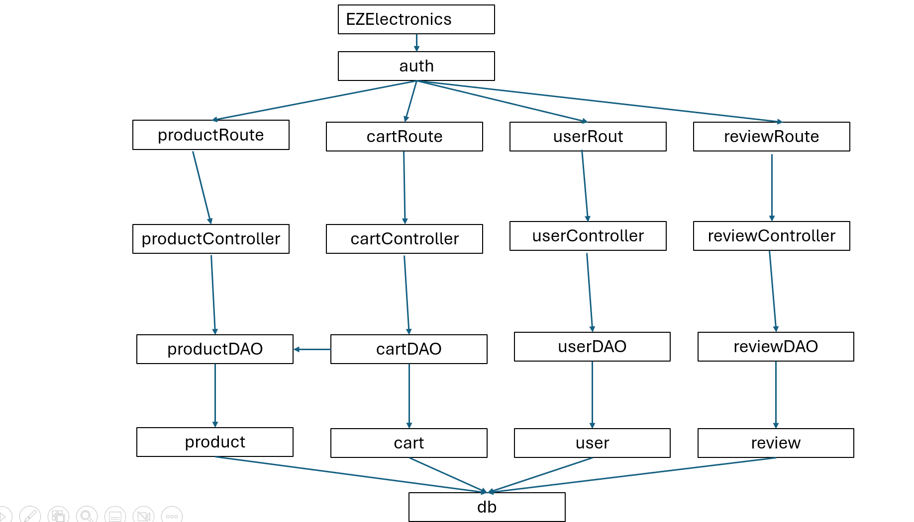
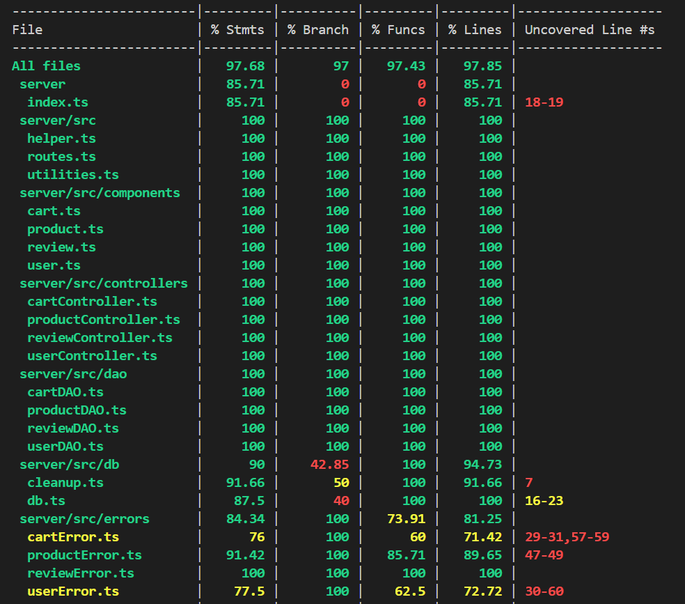
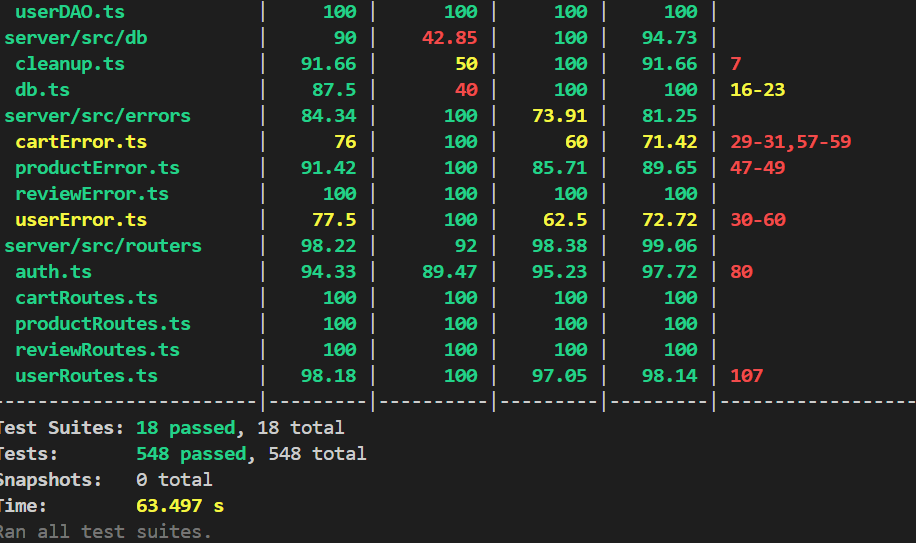

# Test Report

<The goal of this document is to explain how the application was tested, detailing how the test cases were defined and what they cover>

# Contents

- [Test Report](#test-report)
- [Contents](#contents)
- [Dependency graph](#dependency-graph)
- [Integration approach](#integration-approach)
- [Tests](#tests)
- [Coverage](#coverage)
  - [Coverage of FR](#coverage-of-fr)
  - [Coverage white box](#coverage-white-box)

# Dependency graph

# Integration approach

  For the user class, we first tested each unit independently from the others performing unit testing. Thus, the first step has been the testing of userDAO mocking values returned by the db and of userController mocking returning values of userDAO. Also for the route the approach has been similar, since in that stage there are only two operations performed (check of the parameters coming from the client and a call to the controller), it has been simple to check that all the middleware were working as expected and the correct errors were returned. Then, since userRoutes has simply this role of 'wrapper' for the controller, the integrations testing has been directly performed on the entire sequence of userRoutes-userController-userDAO with API testing which tested the integration of the three units. Indeed, once we've been sure that middleware worked as expected, we decided to simply call the API from the route instead of performing a two-step sequence testing first the integration bottom-up of controller and dao, and then mixing all together with the route. So the entire sequence has been: unit testing of A,B and C (where A,B and C stand respectively for userDAO,userController and userRoutes), then, at the end, A+B+C has been tested as step 2. There's a preliminary step which precedes this chain, which is the unit testing of the authentication performed for all of the 4 classes. We have done the same thing for the other classes, product, user and review

# Tests

| Test case name                                                                                                                | Object(s) tested   | Test level   | Technique used   |
| -------------------------------------------------------------------------------------------------                             | ------------------ | ------------ | ---------------- |
| Test reject with error if DB query fails     | userDAO            | Unit           | BB/ boundary            |
| Test resolve false if no user found          | userDAO            | Unit           | BB/ equivalence partitioning |
| Test resolve false if password mismatch      | userDAO            | Unit           | BB/ equivalence partitioning |
| Test resolve true if password matches        | userDAO            | Unit           | BB/ equivalence partitioning |
| Test reject with error if DB connection fails| userDAO            | Unit           | BB/ boundary            |
| Test resolve true on successful user creation| userDAO            | Unit           | WB/ statement coverage  |
| Test reject if username is duplicate         | userDAO            | Unit           | BB/ boundary            |
| Test reject with error on salt generation failure| userDAO        | Unit           | WB/ statement coverage  |
| Test resolve with user information if exists | userDAO            | Unit           | BB/ equivalence partitioning |
| Test reject with UserNotFoundError if not exists | userDAO        | Unit           | BB/ boundary            |
| Test reject with error if DB query fails (getUserByUsername) | userDAO | Unit | BB/ boundary |
| Test reject with error if exception in try block | userDAO     | Unit           | WB/ statement coverage  |
| Test resolve with array of users on query success | userDAO      | Unit           | BB/ equivalence partitioning |
| Test reject with error if query fails (getUsers) | userDAO       | Unit           | BB/ boundary            |
| Test reject with error if exception in try block (getUsers) | userDAO | Unit | WB/ statement coverage  |
| Test resolve with array of users by role on query success | userDAO | Unit | BB/ equivalence partitioning |
| Test reject with error if query fails (getUsersByRole) | userDAO | Unit | BB/ boundary |
| Test reject with error if exception in try block (getUsersByRole) | userDAO | Unit | WB/ statement coverage |
| Test resolve true on successful user deletion | userDAO         | Unit           | WB/ statement coverage  |
| Test reject with error if deletion query fails | userDAO        | Unit           | BB/ boundary            |
| Test reject with error if exception in try block (deleteUser) | userDAO | Unit | WB/ statement coverage  |
| Test reject with error if email format is invalid | userValidator | Unit | BB/ boundary |
| Test resolve true if email format is valid | userValidator | Unit | BB/ equivalence partitioning |
| Test reject with error if username format is invalid | userValidator | Unit | BB/ boundary |
| Test resolve true if username format is valid | userValidator | Unit | BB/ equivalence partitioning |
| Test reject with error if password does not meet criteria | userValidator | Unit | BB/ boundary |
| Test resolve true if password meets criteria | userValidator | Unit | BB/ equivalence partitioning |
| Test reject with error if required fields are missing in request body | userRoute | Integration | BB/ boundary |
| Test resolve true if all required fields are present in request body | userRoute | Integration | BB/ equivalence partitioning |
| Test reject with error if user creation fails | userController | Integration | BB/ boundary |
| Test resolve user object on successful user creation | userController | Integration | BB/ equivalence partitioning |
| Test: POST /products: It should return a 200 success code                                                                     | Product routes      | Unit          | WB/ statement coverage             |
| Test: POST /products: It should return a 422 error code if the date is wrong                                                  | Product routes      | Unit          | BB/ eq partitioning                |
| Test: POST /products: It should return a 409 error code if an error occurs during product registration                        | Product routes      | Unit          | WB/ statement coverage             |
| Test: POST /products: It should return a 401 error code if the user is not logged in                                          | Product routes      | Unit          | WB/ statement coverage             |
| Test: POST /products: It should fail if the user is not an Admin or a Manager                                                 | Product routes      | Unit          | WB/ statement coverage             |
| Test: PATCH /products/:model: It should return a 200 success code and call changeProductQuantity method                       | Product routes      | Unit          | WB/ statement coverage             |
| Test: PATCH /products/:model: It should return a 200 success code and call changeProductQuantity method with null date        | Product routes      | Unit          | WB/ statement coverage             |
| Test: PATCH /products/:model: It should return a 404 error code if an error occurs during changing product quantity           | Product routes      | Unit          | WB/ statement coverage             |
| Test: PATCH /products/:model: It should return a 401 error code if the user is not logged in                                  | Product routes      | Unit          | WB/ statement coverage             |
| Test: PATCH /products/:model: It should fail if the user is not an Admin or a Manager                                         | Product routes      | Unit          | WB/ statement coverage             |
| Test: PATCH /products/:model/sell: It should return a 200 success code and call sellProduct method                            | Product routes      | Unit          | WB/ statement coverage             |
| Test: PATCH /products/:model/sell: It should return a 200 success code and call sellProduct method with null date             | Product routes      | Unit          | WB/ statement coverage             |
| Test: PATCH /products/:model/sell: It should return a 409 error code if an error occurs during selling a product              | Product routes      | Unit          | WB/ statement coverage             |
| Test: PATCH /products/:model/sell: It should return a 401 error code if the user is not logged in                             | Product routes      | Unit          | WB/ statement coverage             |
| Test: PATCH /products/:model/sell: It should fail if the user is not an Admin or a Manager                                    | Product routes      | Unit          | WB/ statement coverage             |
| Test: GET /products: Success - Return 200 and call getProducts method with correct parameters                                 | Product Routes      | Unit          | WB/ statement coverage             |
| Test: GET /products: Error - Return 503 if an error occurs during retrieval of products                                       | Product Routes      | Unit          | WB/ statement coverage             |
| Test: GET /products: Error - Return 401 if the user is not logged in                                                          | Authenticator       | Unit          | WB/ statement coverage             |
| Test: GET /products: Error - Return 401 if the user is not an Admin or a Manager                                              | Authenticator       | Unit          | WB/ statement coverage             |
| Test: GET /products/available: Success - Return 200 and call getAvailableProducts with correct parameters                     | Product Routes      | Unit          | WB/ statement coverage             |
| Test: GET /products/available: Error - Return 404 if an error occurs during retrieval of available products                   | Product Routes      | Unit          | WB/ statement coverage             |
| Test: GET /products/available: Error - Return 401 if the user is not logged in                                                | Authenticator       | Unit          | WB/ statement coverage             |
| Test: DELETE /products: Success - Return 200 and call deleteAllProducts method                                                | Product Routes      | Unit          | WB/ statement coverage             |
| Test: DELETE /products: Error - Return 503 if an error occurs during deletion                                                 | Product Routes      | Unit          | WB/ statement coverage             |
| Test: DELETE /products: Error - Return 401 if the user is not logged in                                                       | Authenticator       | Unit          | WB/ statement coverage             |
| Test: DELETE /products: Error - Return 401 if the user is not an Admin or a Manager                                           | Authenticator       | Unit          | WB/ statement coverage             |
| Test: DELETE /products/:model: Success - Return 200 and call deleteProduct with correct parameters                            | Product Routes      | Unit          | WB/ statement coverage             |
| Test: DELETE /products/:model: Error - Return 503 if an error occurs during deletion                                          | Product Routes      | Unit          | WB/ statement coverage             |
| Test: DELETE /products/:model: Error - Return 401 if the user is not logged in                                                | Authenticator       | Unit          | WB/ statement coverage             |
| Test: DELETE /products/:model: Error - Return 401 if the user is not an Admin or a Manager                                    | Authenticator       | Unit          | WB/ statement coverage             |
| Test: Register products arrival: Register the arrival of a set of products (returns undefined)                                | ProductController   | Unit          | WB/ statement coverage             |
| Test: Register products arrival: Register products with a future arrival date (returns error)                                 | ProductController   | Unit          | BB/ boundary                       |
| Test: Register products arrival: Register the arrival of a set of products with null date (returns undefined)                 | ProductController   | Unit          | WB/ statement coverage             |
| Test: Update product quantity: Update product quantity (returns 110)                                                          | ProductController   | Unit          | WB/ statement coverage             |
| Test: Update product quantity: Update product quantity but the date is wrong (returns error)                                  | ProductController   | Unit          | BB/ boundary                       |
| Test: Sell a product: Sell a product (returns 90)                                                                             | ProductController   | Unit          | WB/ statement coverage             |
| Test: Sell a product: Sell a product with wrong date (returns error)                                                          | ProductController   | Unit          | BB/ boundary                       |
| Test: Delete ALL products: Delete ALL products (returns true)                                                                 | ProductController   | Unit          | WB/ statement coverage             |
| Test: Delete a single product: Delete a single product (returns true)                                                         | ProductController   | Unit          | WB/ statement coverage             |
| Test: Get available products: Get available product by model (returns [createProduct])                                        | ProductController   | Unit          | WB/ statement coverage             |
| Test: Get available products: Get available products by category (returns [createProduct])                                    | ProductController   | Unit          | WB/ statement coverage             |
| Test: Get available products: Get ALL available products (returns [createProduct])                                            | ProductController   | Unit          | WB/ statement coverage             |
| Test: Get available products errors: Get available product with null grouping and not null model (returns error)              | ProductController   | Unit          | BB/ eq partitioning                |
| Test: Get available products errors: Get available product with null grouping and not null category (returns error)           | ProductController   | Unit          | BB/ eq partitioning                |
| Test: Get available products errors: Get available product when grouping is category and category is null (returns error)     | ProductController   | Unit          | BB/ eq partitioning                |
| Test: Get available products errors: Get available product when grouping is model and model is null (returns error)           | ProductController   | Unit          | BB/ eq partitioning                |
| Test: Get available products errors: Get available product when grouping is category and model is not null (returns error)    | ProductController   | Unit          | BB/ eq partitioning                |
| Test: Get available products errors: Get available product when grouping is model and category is not null (returns error)    | ProductController   | Unit          | BB/ eq partitioning                |
| Test: Get products errors: Get product with null grouping and not null model (returns error)                                  | ProductController   | Unit          | BB/ eq partitioning                |
| Test: Get products errors: Get available product with null grouping and not null category (returns error)                     | ProductController   | Unit          | BB/ eq partitioning                |
| Test: Get products errors: Get available product when grouping is category and category is null (returns error)               | ProductController   | Unit          | BB/ eq partitioning                |
| Test: Get products errors: Get available product when grouping is model and model is null (returns error)                     | ProductController   | Unit          | BB/ eq partitioning                |
| Test: Get products errors: Get available product when grouping is category and model is not null (returns error)              | ProductController   | Unit          | BB/ eq partitioning                |
| Test: Get products errors: Get available product when grouping is model and category is not null (returns error)              | ProductController   | Unit          | BB/ eq partitioning                |
| Test: Register products arrival: Success - Registering a new product resolves successfully                                          | Product DAO        | Unit         | WB/ statement coverage   |
| Test: Register products arrival: Success - Registering a new product without date and details resolves successfully                 | Product DAO        | Unit         | WB/ statement coverage   |
| Test: Register products arrival: Error - Reject with ProductAlreadyExistsError if product model already exists                      | Product DAO        | Unit         | BB/ boundary              |
| Test: Register products arrival: Error - Reject with database operation error if there is a database operation error                | Product DAO        | Unit         | BB/ boundary              |
| Test: Register products arrival: Error - Reject with an error if an exception is thrown                                             | Product DAO        | Unit         | BB/ boundary              |
| Test: Change product quantity: Error - Reject with ProductNotFoundError if product does not exist                                   | Product DAO        | Unit         | BB/ boundary              |
| Test: Change product quantity: Error - Reject with database operation error if there is a database operation error during selection | Product DAO        | Unit         | BB/ boundary              |
| Test: Change product quantity: Error - Reject with ArrivalDateError if new changeDate is before the product's arrivalDate           | Product DAO        | Unit         | BB/ boundary              |
| Test: Change product quantity: Error - Reject with database operation error if there is a database operation error during update    | Product DAO        | Unit         | BB/ boundary              |
| Test: Change product quantity: Success - Update product quantity resolves successfully                                              | Product DAO        | Unit         | WB/ statement coverage   |
| Test: Change product quantity: Error - Reject with an error if an exception occurs in changeProductQuantity                         | Product DAO        | Unit         | BB/ boundary              |
| Test: Sell product: Error - Reject with ProductNotFoundError if product does not exist                                              | Product DAO        | Unit         | BB/ boundary              |
| Test: Sell product: Error - Reject with database operation error if there is a database operation error during selection            | Product DAO        | Unit         | BB/ boundary              |
| Test: Sell product: Error - Reject with EmptyProductStockError if product stock is empty                                            | Product DAO        | Unit         | BB/ boundary              |
| Test: Sell product: Error - Reject with ArrivalDateError if sellingDate is before the product's arrivalDate                         | Product DAO        | Unit         | BB/ boundary              |
| Test: Sell product: Error - Reject with LowProductStockError if stock is insufficient                                               | Product DAO        | Unit         | BB/ boundary              |
| Test: Sell product: Error - Reject with database operation error if there is a database operation error during update               | Product DAO        | Unit         | BB/ boundary              |
| Test: Sell product: Success - Selling a product resolves successfully                                                               | Product DAO        | Unit         | WB/ statement coverage   |
| Test: Sell product: Error - Reject with an error if an exception occurs in sellProduct                                              | Product DAO        | Unit         | BB/ boundary              |
| Test: Get ALL products: Error - Reject with database operation error if there is a database operation error                         | Product DAO        | Unit         | BB/ boundary              |
| Test: Get ALL products: Success - Retrieve an array of products if the query is successful                                          | Product DAO        | Unit         | WB/ statement coverage   |
| Test: Get ALL products: Error - Reject with an error if an exception occurs in getAllProducts                                       | Product DAO        | Unit         | BB/ boundary              |
| Test: Get products by category: Error - Reject with database operation error if there is a database operation error                 | Product DAO        | Unit         | BB/ boundary              |
| Test: Get products by category: Success - Retrieve an array of products if the query is successful                                  | Product DAO        | Unit         | WB/ statement coverage   |
| Test: Get products by category: Error - Reject with an error if the category is invalid                                             | Product DAO        | Unit         | BB/ boundary              |
| Test: Get products by category: Error - Reject with an error if an exception occurs in getProductsByCategory                        | Product DAO        | Unit         | BB/ boundary              |
| Test: Get product by model: Error - Reject with database operation error if there is a database operation error                     | Product DAO        | Unit         | BB/ boundary              |
| Test: Get product by model: Success - Retrieve an array containing the product if the query is successful                           | Product DAO        | Unit         | WB/ statement coverage   |
| Test: Get product by model: Error - Reject with ProductNotFoundError if the product does not exist                                  | Product DAO        | Unit         | BB/ boundary              |
| Test: Get product by model: Error - Reject with an error if unable to connect to the database                                       | Product DAO        | Unit         | BB/ boundary              |
| Test: Get product by model: Error - Reject with an error if unable to delete all products                                           | Product DAO        | Unit         | BB/ boundary              |
| Test: Get product by model: Error - Reject with an error if unable to delete a single product                                       | Product DAO        | Unit         | BB/ boundary              |
| Test: POST /products - Create a product                                                                                             | route, dao, db     | Integration  | BB/ boundary              |
| Test: POST /products - Insert every product                                                                                         | route, dao, db     | Integration  | BB/ boundary              |
| Test: POST /products - Create a product without model                                                                               | route, dao, db     | Integration  | BB/ boundary              |
| Test: POST /products - Create a product that already exists                                                                         | route, dao, db     | Integration  | BB/ boundary              |
| Test: POST /products - Create a product with wrong category                                                                         | route, dao, db     | Integration  | BB/ boundary              |
| Test: POST /products - Create a product with negative quantity                                                                      | route, dao, db     | Integration  | BB/ boundary              |
| Test: POST /products - Create a product with missing price                                                                          | route, dao, db     | Integration  | BB/ boundary              |
| Test: POST /products - Create a product with negative price                                                                         | route, dao, db     | Integration  | BB/ boundary              |
| Test: POST /products - Create a product with wrong date format                                                                      | route, dao, db     | Integration  | BB/ boundary              |
| Test: POST /products - Create a product with future date                                                                            | route, dao, db     | Integration  | BB/ boundary              |
| Test: POST /products - Create a product without being logged in                                                                     | route, dao, db     | Integration  | BB/ boundary              |
| Test: POST /products - Create a product with a customer account                                                                     | route, dao, db     | Integration  | BB/ boundary              |
| Test: PATCH /products/:model - Update a product quantity                                                                            | route, dao, db     | Integration  | BB/ boundary              |
| Test: PATCH /products/:model - Update non-existing product                                                                          | route, dao, db     | Integration  | BB/ boundary              |
| Test: PATCH /products/:model - Update product with wrong date format                                                                | route, dao, db     | Integration  | BB/ boundary              |
| Test: PATCH /products/:model - Update product with negative quantity                                                                | route, dao, db     | Integration  | BB/ boundary              |
| Test: PATCH /products/:model - Update product with future date                                                                      | route, dao, db     | Integration  | BB/ boundary              |
| Test: PATCH /products/:model - Update product with null date                                                                        | route, dao, db     | Integration  | BB/ boundary              |
| Test: PATCH /products/:model - Update product without login                                                                         | route, dao, db     | Integration  | BB/ boundary              |
| Test: PATCH /products/:model - Update product with customer account                                                                 | route, dao, db     | Integration  | BB/ boundary              |
| Test: PATCH /products/:model/sell - Sell a product                                                                                  | route, dao, db     | Integration  | BB/ boundary              |
| Test: PATCH /products/:model/sell - Sell product to zero quantity                                                                   | route, dao, db     | Integration  | BB/ boundary              |
| Test: PATCH /products/:model/sell - Sell product with null date                                                                     | route, dao, db     | Integration  | BB/ boundary              |
| Test: PATCH /products/:model/sell - Sell non-existing product                                                                       | route, dao, db     | Integration  | BB/ boundary              |
| Test: PATCH /products/:model/sell - Sell product with wrong date format                                                             | route, dao, db     | Integration  | BB/ boundary              |
| Test: PATCH /products/:model/sell - Sell product with negative quantity                                                             | route, dao, db     | Integration  | BB/ boundary              |
| Test: PATCH /products/:model/sell - Sell product with future date                                                                   | route, dao, db     | Integration  | BB/ boundary              |
| Test: PATCH /products/:model/sell - Sell product with past date                                                                     | route, dao, db     | Integration  | BB/ boundary              |
| Test: PATCH /products/:model/sell - Sell product exceeding available quantity                                                       | route, dao, db     | Integration  | BB/ boundary              |
| Test: PATCH /products/:model/sell - Sell product without login                                                                      | route, dao, db     | Integration  | BB/ boundary              |
| Test: PATCH /products/:model/sell - Sell product with customer account                                                               | route, dao, db     | Integration  | BB/ boundary              |
| Test: Get all available products                                      | route, dao, db    | Integration  | BB/ boundary         |
| Test: Get all available products with category grouping and category   | route, dao, db    | Integration  | BB/ boundary         |
| Test: Get all available products with model grouping and model         | route, dao, db    | Integration  | BB/ boundary         |
| Test: Get all available products with a model that does not exist      | route, dao, db    | Integration  | BB/ boundary         |
| Test: Get all available products with a wrong grouping                 | route, dao, db    | Integration  | BB/ boundary         |
| Test: Get all available products with a wrong category                 | route, dao, db    | Integration  | BB/ boundary         |
| Test: Get all available products with model grouping and category      | route, dao, db    | Integration  | BB/ boundary         |
| Test: Get all available products with category grouping and model      | route, dao, db    | Integration  | BB/ boundary         |
| Test: Get all available products with category grouping and null category | route, dao, db  | Integration  | BB/ boundary         |
| Test: Get all available products with model grouping and null model    | route, dao, db    | Integration  | BB/ boundary         |
| Test: Get all available products with grouping, category and model     | route, dao, db    | Integration  | BB/ boundary         |
| Test: Get all available products with null grouping, but with category | route, dao, db    | Integration  | BB/ boundary         |
| Test: Get all available products without being logged in               | route, dao, db    | Integration  | BB/ boundary         |
| Test: Get all products                                                 | route, dao, db    | Integration  | BB/ boundary         |
| Test: Get all products with category grouping and category             | route, dao, db    | Integration  | BB/ boundary         |
| Test: Get all products with model grouping and model                   | route, dao, db    | Integration  | BB/ boundary         |
| Test: Get all products with a model that does not exist                | route, dao, db    | Integration  | BB/ boundary         |
| Test: Get all products with model that is ""                           | route, dao, db    | Integration  | BB/ boundary         |
| Test: Get all products with a wrong grouping                           | route, dao, db    | Integration  | BB/ boundary         |
| Test: Get all products with a wrong category                           | route, dao, db    | Integration  | BB/ boundary         |
| Test: Get all products with model grouping and category                | route, dao, db    | Integration  | BB/ boundary         |
| Test: Get all products with category grouping and model                | route, dao, db    | Integration  | BB/ boundary         |
| Test: Get all products with category grouping and null category        | route, dao, db    | Integration  | BB/ boundary         |
| Test: Get all products with model grouping and null model              | route, dao, db    | Integration  | BB/ boundary         |
| Test: Get all products with grouping, category and model               | route, dao, db    | Integration  | BB/ boundary         |
| Test: Get all products with null grouping, but with category and model | route, dao, db    | Integration  | BB/ boundary         |
| Test: Get all products without being logged in                         | route, dao, db    | Integration  | BB/ boundary         |
| Test: Delete all products                                              | route, dao, db    | Integration  | BB/ boundary         |
| Test: Delete all products without being logged in                      | route, dao, db    | Integration  | BB/ boundary         |
| Test: Delete all products with a customer account                      | route, dao, db    | Integration  | BB/ boundary         |
| Test: Delete product by model                                          | route, dao, db    | Integration  | BB/ boundary         |
| Test: Delete product by model without being logged in                  | route, dao, db    | Integration  | BB/ boundary         |
| Test: Delete product by model with a customer account                  | route, dao, db    | Integration  | BB/ boundary         |
| Test: Delete product by model with a non existing product              | route, dao, db    | Integration  | BB/ boundary         |
| Test resolve with 200 and the cart of the logged-in user if he is Customer | GET ezelectronics/carts/ | integration | BB/ eq partitioning |
| Test rejects with 401 if the user is Admin when trying to get the current cart| GET ezelectronics/carts/ | integration | BB/ boundary |
| Test rejects with 401 if the user is not logged in when trying to get the current cart | GET ezelectronics/carts/ | integration | BB/ boundary |
| Test rejects with 404 if inserting a non-existing product in the cart| POST ezelectronics/carts/ | integration | BB/ boundary |
| Test resolve with 200 if inserting an existing product in the cart | POST ezelectronics/carts/ | integration | BB/ eq partitioning |
| Test rejects with 422 if adding a product to cart with empty model parameter | POST ezelectronics/carts/ | integration | BB/ boundary |
| Test rejects with 409 if product's stock is empty (available quantity of the product is 0) | POST ezelectronics/carts/ | integration | BB/ boundary |
| Test rejects with 401 if called by an admin or manager when adding a product to cart | POST ezelectronics/carts/ | integration | BB/ boundary |
| Test rejects with 401 if called by a non logged-in user when adding a product | POST ezelectronics/carts/ | integration | BB/ boundary |
| Test rejects with 404 if the user is a customer but he has not a cart when checking out | PATCH ezelectronics/carts/ | integration | BB/ eq partitioning |
| Test rejects with 400 if the user is a customer but his cart is empty when checking out | PATCH ezelectronics/carts/ | integration | BB/ eq partitioning |
| Test rejects with 409 if the user is a customer but there is a product which has 0 quantity in stock when checking out | PATCH ezelectronics/carts/ | integration | BB/ boundary |
| Test rejects with 409 if the user is a customer but there is a product which quantity in stock is less than quantity in the cart when checking out | PATCH ezelectronics/carts/ | integration | BB/ boundary |
| Test resolve with 200 if the user is a customer and his cart is not empty so the user successfully checks out his cart | PATCH ezelectronics/carts/ | integration | BB/ eq partitioning |
| Test rejects with 401 if the user is not logged in when checking out cart | PATCH ezelectronics/carts/ | integration | BB/ boundary |
| Test rejects with 401 if the user is not a customer when checking out cart | PATCH ezelectronics/carts/ | integration | BB/ boundary |
| Test resolve with 200 and an empty array if the user has no paid cart when getting user's carts history | GET ezelectronics/carts/history | integration | BB/ eq partitioning |
| Test resolve with 200 and a non-empty array if the user has paid carts when getting user's carts history | GET ezelectronics/carts/history | integration | BB/ eq partitioning |
| Test rejects with 401 if the user is not logged in when getting user's carts history | GET ezelectronics/carts/history | integration | BB/ boundary |
| Test rejects with 404 if a customer tries to remove a product's instance from cart but the parameter string is empty | DELETE ezelectronics/carts/products/:model | integration | BB/ boundary |
| Test rejects with 404 if a customer tries to remove a product's instance from cart but he has got no carts | DELETE ezelectronics/carts/products/:model | integration | BB/ eq partitioning |
| Test rejects with 404 if a customer tries to remove a product's instance from cart but the cart is empty | DELETE ezelectronics/carts/products/:model | integration | BB/ eq partitioning |
| Test rejects with 404 if a customer tries to remove a product's instance from cart but the model represents a product NOT in cart | DELETE ezelectronics/carts/products/:model | integration | BB/ eq partitioning |
| Test resolve with 200 if a customer removes a product's instance from cart and the model IS in the cart | DELETE ezelectronics/carts/products/:model | integration | BB/ eq partitioning |
| Test rejects with 404 if a customer tries to remove a product's instance from cart but the model represents a non-existing product | DELETE ezelectronics/carts/products/:model | integration | BB/ eq partitioning |
| Test rejects with 404 if a customer tries to delete current user's cart but there is no unpaid cart for that customer | DELETE ezelectronics/carts/current | integration | BB/ eq partitioning |
| Test resolve with 200 if a customer deletes current user's cart and there is an unpaid cart | DELETE ezelectronics/carts/current | integration | BB/ eq partitioning |
| Test rejects with 401 if a non logged-in user tries to delete current user's cart | DELETE ezelectronics/carts/current | integration | BB/ boundary |
| Test rejects with 401 if a non customer tries to delete current user's cart | DELETE ezelectronics/carts/current | integration | BB/ boundary |
| Test resolve with 200 if an admin deletes all carts of all users | DELETE ezelectronics/carts/ | integration | BB/ eq partitioning |
| Test rejects with 401 if a non logged-in user tries to delete all carts of all users | DELETE ezelectronics/carts/ | integration | BB/ boundary |
| Test rejects with 401 if a non admin nor manager tries to delete all carts of all users | DELETE ezelectronics/carts/ | integration | BB/ boundary |
| Test rejects with 401 if a non logged-in user tries to get all carts of all users | GET ezelectronics/carts/ | integration | BB/ boundary |
| Test rejects with 401 if a non admin nor manager tries to get all carts of all users | GET ezelectronics/carts/ | integration | BB/ boundary |
| Test resolve with 200 if an admin gets all carts of all users | GET ezelectronics/carts/ | integration | BB/ eq partitioning |
| Should return user cart if exists                | getCurrentUserCart | Unit       | BB/ equivalence partitioning |
| Should return empty cart if cart not exists for user | getCurrentUserCart | Unit   | BB/ equivalence partitioning |
| Should return empty cart if no unpaid cart in DB | getCurrentUserCart | Unit       | BB/ equivalence partitioning |
| Should return empty cart if unpaid cart with no products | getCurrentUserCart | Unit | BB/ equivalence partitioning |
| Should reject if there is an error in the database | getCurrentUserCart | Unit    | BB/ boundary               |
| Should reject if there is a generic error        | getCurrentUserCart | Unit       | WB/ statement coverage     |
| Should add product with quantity 1 if not in cart | addProduct       | Unit       | BB/ equivalence partitioning |
| Should increase product quantity if in cart      | addProduct       | Unit       | BB/ equivalence partitioning |
| Should create empty cart if no unpaid cart       | addProduct       | Unit       | WB/ statement coverage     |
| Should reject with 404 if model doesn't exist     | addProduct       | Unit       | BB/ boundary               |
| Should reject with 409 if model has quantity 0   | addProduct       | Unit       | BB/ boundary               |
| Should reject if there is a database error       | addProduct       | Unit       | WB/ statement coverage     |
| Should reject if unexpected error after createEmptyCart | addProduct | Unit  | WB/ statement coverage     |
| Should reject if unexpected error in updateCartTotal | addProduct    | Unit       | WB/ statement coverage     |
| Should successfully check out the cart           | checkOutCart     | Unit       | BB/ equivalence partitioning |
| Should return 404 error if no unpaid cart        | checkOutCart     | Unit       | BB/ boundary               |
| Should return 400 error if cart contains no product | checkOutCart  | Unit       | BB/ boundary               |
| Should return 409 error if product in cart with stock quantity 0 | checkOutCart | Unit | BB/ boundary |
| Should return 409 error if product in cart with stock less than required | checkOutCart | Unit | BB/ boundary |
| Should reject if there is a database error       | checkOutCart     | Unit       | WB/ statement coverage     |
| Should reject if unexpected error in getProductByModel | checkOutCart | Unit   | WB/ statement coverage     |
| Should reject if unexpected error in sellProduct | checkOutCart     | Unit       | WB/ statement coverage     |
| Should reject if unexpected error in DBRun       | checkOutCart     | Unit       | WB/ statement coverage     |
| Should reject if unexpected error in DBGet       | checkOutCart     | Unit       | WB/ statement coverage     |
| Should return array of paid carts if present     | getPaidUserCarts | Unit       | BB/ equivalence partitioning |
| Should return empty array if no paid carts       | getPaidUserCarts | Unit       | BB/ equivalence partitioning |
| Should reject if there is a database error       | getPaidUserCarts | Unit       | WB/ statement coverage     |
| Should successfully remove one unit of product when more than one unit in cart | removeProduct | Unit | BB/ equivalence partitioning |
| Should successfully remove product when only one unit in cart | removeProduct | Unit | BB/ equivalence partitioning |
| Should return 404 error if product not in cart   | removeProduct    | Unit       | BB/ boundary               |
| Should return 404 error if no unpaid cart for user | removeProduct | Unit       | BB/ boundary               |
| Should return 404 error if product does not exist | removeProduct  | Unit       | BB/ boundary               |
| Should reject if there is a database error       | removeProduct    | Unit       | WB/ statement coverage     |
| Should reject if unexpected error in getAllProductsInCart | removeProduct | Unit | WB/ statement coverage     |
| Should reject if unexpected error in getProductsInCart | removeProduct | Unit | WB/ statement coverage     |
| Should successfully clear the cart               | clearCart        | Unit       | BB/ equivalence partitioning |
| Should return 404 error if no unpaid cart for user | clearCart      | Unit       | BB/ boundary               |
| Should return error if database error when finding cart | clearCart  | Unit       | WB/ statement coverage     |
| Should return error if database error when clearing cart | clearCart | Unit   | WB/ statement coverage     |
| Should reject if unexpected error in DBAll       | clearCart        | Unit       | WB/ statement coverage     |
| Should successfully delete all carts             | deleteAllCarts   | Unit       | BB/ equivalence partitioning |
| Should return error if there is a database error | deleteAllCarts   | Unit       | WB/ statement coverage     |
| Should reject if unexpected error in DBAll       | deleteAllCarts   | Unit       | WB/ statement coverage     |
| Should return all carts                          | getAllCarts      | Unit       | BB/ equivalence partitioning |
| Should return empty array if no carts found      | getAllCarts      | Unit       | BB/ equivalence partitioning |
| Should return error if there is a database error | getAllCarts      | Unit       | WB/ statement coverage     |
| Should successfully create empty cart and return last inserted ID | createEmptyCart | Unit | BB/ equivalence partitioning |
| Should reject with error if there is a database operation error | createEmptyCart | Unit | WB/ statement coverage |
| Should reject with error if unable to connect to the database (callback) | createEmptyCart | Unit | WB/ statement coverage |
| Should reject with error if unable to connect to the database (throw) | createEmptyCart | Unit | WB/ statement coverage |
| Should successfully return all products in cart  | getAllProductsInCart | Unit  | BB/ equivalence partitioning |
| Should return empty array if no products found   | getAllProductsInCart | Unit  | BB/ equivalence partitioning |
| Should reject with error if there is a database operation error | getAllProductsInCart | Unit | WB/ statement coverage |
| Should reject with error if unable to connect to the database (callback) | getAllProductsInCart | Unit | WB/ statement coverage |
| Should reject with error if unable to connect to the database (throw) | getAllProductsInCart | Unit | WB/ statement coverage |
| Should successfully return the product in the cart | getProductInCart | Unit | BB/ equivalence partitioning |
| Should return product with quantity 0 if not in cart | getProductInCart | Unit | BB/ equivalence partitioning |
| Should reject with error ProductNotInCart if product not in cart | getProductInCart | Unit | BB/ boundary |
| Should reject with error if there is a database operation error | getProductInCart | Unit | WB/ statement coverage |
| Should reject with error if unable to connect to the database (callback) | getProductInCart | Unit | WB/ statement coverage |
| Should reject with error if unable to connect to the database (throw) | getProductInCart | Unit | WB/ statement coverage |
| Should successfully remove product from cart     | removeSingleProduct | Unit | BB/ equivalence partitioning |
| Should successfully add product to cart          | addSingleProduct | Unit       | BB/ equivalence partitioning |
| Should successfully decrease product quantity in cart | decreseSingleProduct | Unit | BB/ equivalence partitioning |
| Should successfully increase product quantity in cart | increseSingleProduct | Unit | BB/ equivalence partitioning |
| Should successfully update cart total            | updateCartTotal  | Unit       | BB/ equivalence partitioning |
| Should resolve with false if no products are found in the cart | updateCartTotal | Unit | BB/ equivalence partitioning |
| Should reject with error if there is a database operation error on getProducts | updateCartTotal | Unit | WB/ statement coverage |
| Should reject with error if there is a database operation error on updateTotal | updateCartTotal | Unit | WB/ statement coverage |
| Should reject with error if unable to connect to the database on getProducts (callback) | updateCartTotal | Unit | WB/ statement coverage |
| Should reject with error if unable to connect to the database on getProducts (throw) | updateCartTotal | Unit | WB/ statement coverage |
| Should reject with error if unable to connect to the database on updateTotal (callback) | updateCartTotal | Unit | WB/ statement coverage |
| Should reject with error if unable to connect to the database on updateTotal (throw) | updateCartTotal | Unit | WB/ statement coverage |
| should reject with ExistingReviewError if review already exists | ReviewDAO | Unit Test | White Box/boundary |
| should reject with NoExistingProductError if product does not exist | ReviewDAO | Unit Test | White Box/equivalence partitioning|
| should resolve if review is successfully inserted | ReviewDAO | Unit Test | White Box/statement coverage |
| should reject with an error if database GET query fails | ReviewDAO | Unit Test |black box/boundary |
| should reject with an error if an exception occurs in the db.run | ReviewDAO | Unit Test | white Box/ statement coverage|
| should reject with an error if an exception occurs in the try block run | ReviewDAO | Unit Test | White Box/statement coverage |
| should reject with an error if an exception occurs in the try block get | ReviewDAO | Unit Test | White Box/statement coverage |
| should resolve with an array of ProductReview objects if the query is successful | ReviewDAO | Unit Test | Black Box/equivalence partitioning |
| should resolve with an empty array if no reviews are found | ReviewDAO | Unit Test | Black Box/equivalence partitioning |
| should reject with an error if the query fails | ReviewDAO | Unit Test | Black Box/statement coverage |
| should reject with an error if an exception occurs in try block | ReviewDAO | Unit Test | white Box/statement coverage  |
| should return product reviews when db.all returns rows | ReviewDAO | Unit Test | WB/statement coverage|
| should return an empty array when db.all returns no rows | ReviewDAO | Unit Test | Black Box/statement coverage |
| should return an empty array when db.all returns null | ReviewDAO | Unit Test | WB/statement coverage |
| should reject with NoReviewProductError if the user has no review for the product | ReviewDAO | Unit Test | White Box/boundary |
| should reject with NoExistingProductError if the product does not exist | ReviewDAO | Unit Test | White Box/boundary |
| should resolve if review is successfully deleted | ReviewDAO | Unit Test | White Box/statement coverage |
| should reject with an error if the deletion query fails | ReviewDAO | Unit Test | White Box/statement coverage |
| should reject with an error if the first db.get query fails | ReviewDAO | Unit Test | White Box/statement coverage |
| should reject with an error if an exception occurs in the try block get | ReviewDAO | Unit Test | White Box/statement coverage |
| should delete all reviews for an existing product | ReviewDAO | Unit Test | White Box/statement coverage |
| should reject with NoExistingProductError for a non-existing product | ReviewDAO | Unit Test | BB/boundary |
| should reject with an error if database deletion query fails | ReviewDAO | Unit Test | BB / boundary |
| should delete all reviews | ReviewDAO | Unit Test | White Box/statement coverage |
| should reject with an error if database query fails | ReviewDAO | Unit Test | black Box/boundary|
| should reject with an error if an exception occurs in the try block | ReviewDAO | Unit Test | White Box/statement coverage|
| It should add a new review            | ReviewController       | Unit       | BB/equivalence partitioning    |
| It should get all reviews for a product | ReviewController       | Unit       | Black-box / equivalence partitioning     |
| It should delete a review by a user for a product | ReviewController | Unit       | Black-box/equivalence patitioning      |
| It should delete all reviews for a product | ReviewController | Unit       | Black-box      |
| It should delete all reviews          | ReviewController       | Unit       | Black-box / equivalence partitioning     |
| It should return a 200 success code | reviewRoute | Integration | Black-box/ equivalence partioning |
| It should return a 409 error code if an error occurs during product registration | reviewRoute | Integration | Black-box/boundary |
| It should return a 401 error code if user is not logged in | reviewRoute | Integration | Black-box / boundary|
| It should return a 422 error code for invalid score | reviewRoute | Integration | Black-box/ boundary|
| It should return a validation error if 'comment' is missing | reviewRoute | Integration | Black-box/boundary |
| It should return a 401 error code if user is not a customer | reviewRoute | Integration | Black-box/boundary |
| It should return a validation error if 'score' is missing | reviewRoute | Integration | Black-box /boundary|
| It should return a 200 success code and reviews for a valid model | reviewRoute | Integration | Black-box /equivalence partitoning|
| It should return a 503 error code if an error occurs in controller | reviewRoute | Integration | Black-box/boundary |
| It should delete the review and return a 200 success code | reviewRoute | Integration | Black-box / equivalence partitioning|
| It should return a 401 error code if user is not logged in | reviewRoute | Integration | Black-box/boundary |
| It should return a 503 error code if an error occurs during review deletion | reviewRoute | Integration | Black-box/boundary |
| It should delete reviews for a product and return a 200 success code for admin or manager | reviewRoute | Integration | Black-box/equivalence partitioning |
| It should return a 401 error code for non-admin or non-manager | reviewRoute | Integration | Black-box/boundary |
| It should delete all reviews successfully | reviewRoute | Integration | Black-box/equivalence partitioning |
| It should return a 503 error code if an error occurs during review deletion | reviewRoute | Integration | Black-box/boundary |

# Coverage

## Coverage of FR

| Functional Requirement or scenario                              | Test(s)                                                                                                                                                                                                                                 |
| :--------------------------------------------------------------- | :-------------------------------------------------------------------------------------------------------------------------------------------------------------------------------------------------------------------------------------- |
| FR2.1 Show the list of all users            | Test resolves with an array of users on query success (userDAO)                                             |
|                                              | Test rejects with an error if the query fails (getUsers)                                                     |
|                                              | Test rejects with an error if an exception occurs in the try block (getUsers)                                |
| FR2.2 Show the list of all users with a specific role | Test resolves with an array of users by role on query success (userDAO)                                     |
|                                              | Test rejects with an error if the query fails (getUsersByRole)                                               |
|                                              | Test rejects with an error if an exception occurs in the try block (getUsersByRole)                           |
| FR2.3 Show the information of a single user | Test resolves with user information if it exists (userDAO)                                                   |
|                                              | Test rejects with UserNotFoundError if it does not exist (userDAO)                                           |
|                                              | Test rejects with an error if the DB query fails (getUserByUsername)                                         |
| FR2.4 Update the information of a single user | (Specific update tests are missing, but we can include tests for data creation and validation)              |
|                                              | Test resolves true on successful user creation (userDAO)                                                     |
|                                              | Test rejects with an error on salt generation failure (userDAO)                                              |
|                                              | Test resolves true if the email format is valid (userValidator)                                              |
|                                              | Test rejects with an error if the email format is invalid (userValidator)                                    |
| FR2.5 Delete a single _non-Admin_ user      | Test resolves true on successful user deletion (userDAO)                                                     |
|                                              | Test rejects with an error if the deletion query fails (userDAO)                                             |
|                                              | Test rejects with an error if an exception occurs in the try block (deleteUser)                              |
| FR2.6 Delete all _non-Admin_ users          | (Specific tests for mass deletion are missing, but similar tests to single deletion can be used)             |
| FR3.1 - Register a new product                                   | Test POST /products - Create a product Test POST /products - Insert every product Test POST /products - Create a product without model Test POST /products - Create a product that already exists Test POST /products - Create a product with wrong category |
| FR3.2 - Register a set of new products                           | Test Register products arrival: Register the arrival of a set of products Test Register products arrival: Register products with a future arrival date Test Register products arrival: Register the arrival of a set of products with null date    |
| FR3.3 - Mark a product as sold                                   | Test Sell a product: Sell a product Test Sell a product: Sell a product with wrong date                                                                                                                                                       |
| FR3.4 - Show the list of all products                            | Test GET /products                                                                                                                                                                                                                          |
| FR3.5 - Show the information of a single product                 | Test GET /products/:model                                                                                                                                                                                                                   |
| FR3.6 - Show the list of all products with the same category      | Test Get all products with category grouping and category                                                                                                                                                                                   |
| FR3.7 - Show the list of all products with the same model         | Test Get all products with model grouping and model                                                                                                                                                                                         |
| FR3.8 - Delete a single product                                  | Test DELETE /products/:model                                                                                                                                                                                                                |
| FR5.1 Show the information of the current cart | Test resolve with 200 and the cart of the logged-in user if he is Customer (GET ezelectronics/carts/)     |
|                                               | Test rejects with 401 if the user is Admin when trying to get the current cart (GET ezelectronics/carts/) |
|                                               | Test rejects with 401 if the user is not logged in when trying to get the current cart (GET ezelectronics/carts/)|
|                                               | Should return user cart if exists (getCurrentUserCart)                                                    |
|                                               | Should return empty cart if cart not exists for user (getCurrentUserCart)                                  |
|                                               | Should return empty cart if no unpaid cart in DB (getCurrentUserCart)                                      |
|                                               | Should return empty cart if unpaid cart with no products (getCurrentUserCart)                              |
|                                               | Should reject if there is an error in the database (getCurrentUserCart)                                    |
| FR5.2 Add a product to the current cart       | Test resolve with 200 if inserting an existing product in the cart (POST ezelectronics/carts/)              |
|                                               | Test rejects with 404 if inserting a non-existing product in the cart (POST ezelectronics/carts/)          |
|                                               | Test rejects with 422 if adding a product to cart with empty model parameter (POST ezelectronics/carts/)   |
|                                               | Test rejects with 409 if product's stock is empty (available quantity of the product is 0) (POST ezelectronics/carts/)|
|                                               | Test rejects with 401 if called by an admin or manager when adding a product to cart (POST ezelectronics/carts/)|
|                                               | Test rejects with 401 if called by a non logged-in user when adding a product (POST ezelectronics/carts/)   |
|                                               | Should add product with quantity 1 if not in cart (addProduct)                                              |
|                                               | Should increase product quantity if in cart (addProduct)                                                    |
|                                               | Should create empty cart if no unpaid cart (addProduct)                                                     |
|                                               | Should reject with 404 if model doesn't exist (addProduct)                                                  |
|                                               | Should reject with 409 if model has quantity 0 (addProduct)                                                 |
|                                               | Should reject if there is a database error (addProduct)                                                     |
|                                               | Should reject if unexpected error after createEmptyCart (addProduct)                                        |
|                                               | Should reject if unexpected error in updateCartTotal (addProduct)                                           |
| FR5.3 Checkout the current cart               | Test rejects with 404 if the user is a customer but he has not a cart when checking out (PATCH ezelectronics/carts/)|
|                                               | Test rejects with 400 if the user is a customer but his cart is empty when checking out (PATCH ezelectronics/carts/)|
|                                               | Test rejects with 409 if the user is a customer but there is a product which has 0 quantity in stock when checking out (PATCH ezelectronics/carts/)|
|                                               | Test rejects with 409 if the user is a customer but there is a product which quantity in stock is less than quantity in the cart when checking out (PATCH ezelectronics/carts/)|
|                                               | Test resolve with 200 if the user is a customer and his cart is not empty so the user successfully checks out his cart (PATCH ezelectronics/carts/)|
|                                               | Test rejects with 401 if the user is not logged in when checking out cart (PATCH ezelectronics/carts/)     |
|                                               | Test rejects with 401 if the user is not a customer when checking out cart (PATCH ezelectronics/carts/)    |
|                                               | Should successfully check out the cart (checkOutCart)                                                      |
|                                               | Should return 404 error if no unpaid cart (checkOutCart)                                                   |
|                                               | Should return 400 error if cart contains no product (checkOutCart)                                          |
|                                               | Should return 409 error if product in cart with stock quantity 0 (checkOutCart)                             |
|                                               | Should return 409 error if product in cart with stock less than required (checkOutCart)                     |
|                                               | Should reject if there is a database error (checkOutCart)                                                   |
|                                               | Should reject if unexpected error in getProductByModel (checkOutCart)                                       |
|                                               | Should reject if unexpected error in sellProduct (checkOutCart)                                             |
|                                               | Should reject if unexpected error in DBRun (checkOutCart)                                                   |
|                                               | Should reject if unexpected error in DBGet (checkOutCart)                                                   |
| FR5.4 Show the history of the paid carts      | Test resolve with 200 and an empty array if the user has no paid cart when getting user's carts history (GET ezelectronics/carts/history)|
|                                               | Test resolve with 200 and a non-empty array if the user has paid carts when getting user's carts history (GET ezelectronics/carts/history)|
|                                               | Test rejects with 401 if the user is not logged in when getting user's carts history (GET ezelectronics/carts/history)|
|                                               | Should return array of paid carts if present (getPaidUserCarts)                                             |
|                                               | Should return empty array if no paid carts (getPaidUserCarts)                                               |
|                                               | Should reject if there is a database error (getPaidUserCarts)                                               |
| FR5.5 Remove a product from the current cart  | Test rejects with 404 if a customer tries to remove a product's instance from cart but the parameter string is empty (DELETE ezelectronics/carts/products/:model)|
|                                               | Test rejects with 404 if a customer tries to remove a product's instance from cart but he has got no carts (DELETE ezelectronics/carts/products/:model)|
|                                               | Test rejects with 404 if a customer tries to remove a product's instance from cart but the cart is empty (DELETE ezelectronics/carts/products/:model)|
|                                               | Test rejects with 404 if a customer tries to remove a product's instance from cart but the model represents a product NOT in cart (DELETE ezelectronics/carts/products/:model)|
|                                               | Test resolve with 200 if a customer removes a product's instance from cart and the model IS in the cart (DELETE ezelectronics/carts/products/:model)|
|                                               | Test rejects with 404 if a customer tries to remove a product's instance from cart but the model represents a non-existing product (DELETE ezelectronics/carts/products/:model)|
|                                               | Should successfully remove one unit of product when more than one unit in cart (removeProduct)               |
|                                               | Should successfully remove product when only one unit in cart (removeProduct)                                |
|                                               | Should return 404 error if product not in cart (removeProduct)                                               |
|                                               | Should return 404 error if no unpaid cart for user (removeProduct)                                           |
|                                               | Should return 404 error if product does not exist (removeProduct)                                            |
|                                               | Should reject if there is a database error (removeProduct)                                                   |
|                                               | Should reject if unexpected error in getAllProductsInCart (removeProduct)                                    |
|                                               | Should reject if unexpected error in getProductsInCart (removeProduct)                                       |
| FR5.6 Delete the current cart                 | Test rejects with 404 if a customer tries to delete current user's cart but there is no unpaid cart for that customer (DELETE ezelectronics/carts/current)|
|                                               | Test resolve with 200 if a customer deletes current user's cart and there is an unpaid cart (DELETE ezelectronics/carts/current)|
|                                               | Test rejects with 401 if a non logged-in user tries to delete current user's cart (DELETE ezelectronics/carts/current)|
|                                               | Test rejects with 401 if a non customer tries to delete current user's cart (DELETE ezelectronics/carts/current)|
|                                               | Should successfully clear the cart (clearCart)                                                              |
|                                               | Should return 404 error if no unpaid cart for user (clearCart)                                               |
|                                               | Should return error if database error when finding cart (clearCart)                                          |
|                                               | Should return error if database error when clearing cart (clearCart)                                         |
|                                               | Should reject if unexpected error in DBAll (clearCart)                                                       |
|                                               | Should successfully delete all carts (deleteAllCarts)                                                        |
| FR5.7 See the list of all carts of all users  | Test rejects with 401 if a non logged-in user tries to get all carts of all users (GET ezelectronics/carts/)|
|                                               | Test rejects with 401 if a non admin nor manager tries to get all carts of all users (GET ezelectronics/carts/)|
|                                               | Test resolve with 200 if an admin gets all carts of all users (GET ezelectronics/carts/)|
|                                               | Should return all carts (getAllCarts)                                                                        |
|                                               | Should return empty array if no carts found (getAllCarts)                                                    |
|                                               | Should return error if there is a database error (getAllCarts)                                               |
| FR5.8 Delete all carts                        | Test resolve with 200 if an admin deletes all carts of all users (DELETE ezelectronics/carts/)|
|                                               | Test rejects with 401 if a non logged-in user tries to delete all carts of all users (DELETE ezelectronics/carts/)|
|                                               | Test rejects with 401 if a non admin nor manager tries to delete all carts of all users (DELETE ezelectronics/carts/)|
|                                               | Should successfully delete all carts (deleteAllCarts)                                                        |
|                                               | Should return error if there is a database error (deleteAllCarts)                                             |
|                                               | Should reject if unexpected error in DBAll (deleteAllCarts)                                                  |
| Scenario 10.1 View information of the current cart (not paid yet) | Test resolve with 200 and the cart of the logged-in user if he is Customer (GET ezelectronics/carts/)        |
|                                               | Test rejects with 401 if the user is Admin when trying to get the current cart (GET ezelectronics/carts/)    |
|                                               | Test rejects with 401 if the user is not logged in when trying to get the current cart (GET ezelectronics/carts/)|
|                                               | Should return user cart if exists (getCurrentUserCart)                                                       |
|                                               | Should return empty cart if cart not exists for user (getCurrentUserCart)                                     |
|                                               | Should return empty cart if no unpaid cart in DB (getCurrentUserCart)                                         |
|                                               | Should return empty cart if unpaid cart with no products (getCurrentUserCart)                                 |
| Scenario 10.2 View the history of already paid carts | Test resolve with 200 and an empty array if the user has no paid cart when getting user's carts history (GET ezelectronics/carts/history)|
|                                               | Test resolve with 200 and a non-empty array if the user has paid carts when getting user's carts history (GET ezelectronics/carts/history)|
|                                               | Test rejects with 401 if the user is not logged in when getting user's carts history (GET ezelectronics/carts/history)|
|                                               | Should return array of paid carts if present (getPaidUserCarts)                                              |
|                                               | Should return empty array if no paid carts (getPaidUserCarts)                                                |
|                                               | Should reject if there is a database error (getPaidUserCarts)                                                |
| Scenario 10.3 Add a product to the current cart | Test resolve with 200 if inserting an existing product in the cart (POST ezelectronics/carts/)               |
|                                               | Test rejects with 404 if inserting a non-existing product in the cart (POST ezelectronics/carts/)            |
|                                               | Test rejects with 422 if adding a product to cart with empty model parameter (POST ezelectronics/carts/)     |
|                                               | Test rejects with 409 if product's stock is empty (available quantity of the product is 0) (POST ezelectronics/carts/)|
|                                               | Test rejects with 401 if called by an admin or manager when adding a product to cart (POST ezelectronics/carts/)|
|                                               | Test rejects with 401 if called by a non logged-in user when adding a product (POST ezelectronics/carts/)    |
|                                               | Should add product with quantity 1 if not in cart (addProduct)                                               |
|                                               | Should increase product quantity if in cart (addProduct)                                                     |
|                                               | Should create empty cart if no unpaid cart (addProduct)                                                      |
|                                               | Should reject with 404 if model doesn't exist (addProduct)                                                   |
|                                               | Should reject with 409 if model has quantity 0 (addProduct)                                                  |
|                                               | Should reject if there is a database error (addProduct)                                                      |
|                                               | Should reject if unexpected error after createEmptyCart (addProduct)                                         |
|                                               | Should reject if unexpected error in updateCartTotal (addProduct)                                            |
| Scenario 10.4 Try to add a product that does not exist to the current cart | Test rejects with 404 if inserting a non-existing product in the cart (POST ezelectronics/carts/)            |
|                                               | Should reject with 404 if model doesn't exist (addProduct)                                                   |
| Scenario 10.5 Try to add a product that is not available to the current cart | Test rejects with 409 if product's stock is empty (available quantity of the product is 0) (POST ezelectronics/carts/)|
|                                               | Should reject with 409 if model has quantity 0 (addProduct)                                                  |
| Scenario 10.6 Pay for the current cart         | Test resolve with 200 if the user is a customer and his cart is not empty so the user successfully checks out his cart (PATCH ezelectronics/carts/)|
|                                               | Should successfully check out the cart (checkOutCart)                                                       |
| Scenario 10.7 Try to pay for an empty cart     | Test rejects with 400 if the user is a customer but his cart is empty when checking out (PATCH ezelectronics/carts/)|
|                                               | Should return 400 error if cart contains no product (checkOutCart)                                           |
| Scenario 10.8 Try to pay for a cart that does not exist | Test rejects with 404 if the user is a customer but he has not a cart when checking out (PATCH ezelectronics/carts/)|
|                                               | Should return 404 error if no unpaid cart (checkOutCart)                                                    |
| Scenario 10.9 Remove one product instance from the current cart | Test resolve with 200 if a customer removes a product's instance from cart and the model IS in the cart (DELETE ezelectronics/carts/products/:model)|
|                                               | Should successfully remove one unit of product when more than one unit in cart (removeProduct)                |
|                                               | Should successfully remove product when only one unit in cart (removeProduct)                                 |
| Scenario 10.10 Try to remove a product that does not exist from the current cart | Test rejects with 404 if a customer tries to remove a product's instance from cart but the model represents a non-existing product (DELETE ezelectronics/carts/products/:model)|
|                                               | Should return 404 error if product does not exist (removeProduct)                                             |
| Scenario 10.11 Try to remove a product from a cart that does not exist | Test rejects with 404 if a customer tries to remove a product's instance from cart but he has got no carts (DELETE ezelectronics/carts/products/:model)|
|                                               | Should return 404 error if no unpaid cart for user (removeProduct)                                            |
| Scenario 10.12 Try to remove a product that is not in the current cart | Test rejects with 404 if a customer tries to remove a product's instance from cart but the model represents a product NOT in cart (DELETE ezelectronics/carts/products/:model)|
|                                               | Should return 404 error if product not in cart (removeProduct)                                                |
| Scenario 11.1 Delete the current cart          | Test resolve with 200 if a customer deletes current user's cart and there is an unpaid cart (DELETE ezelectronics/carts/current)|
|                                               | Should successfully clear the cart (clearCart)                                                               |
| Scenario 11.2 Try to delete the current cart when there is none | Test rejects with 404 if a customer tries to delete current user's cart but there is no unpaid cart for that customer (DELETE ezelectronics/carts/current)|
|                                               | Should return 404 error if no unpaid cart for user (clearCart)                                                |
| Scenario 15.1 View all carts                   | Test resolve with 200 if an admin gets all carts of all users (GET ezelectronics/carts/)|
|                                               | Should return all carts (getAllCarts)                                                                        |
|                                               | Should return empty array if no carts found (getAllCarts)                                                    |
|                                               | Should return error if there is a database error (getAllCarts)                                               |
| Scenario 16.1 Delete all carts                 | Test resolve with 200 if an admin deletes all carts of all users (DELETE ezelectronics/carts/)|
|                                               | Should successfully delete all carts (deleteAllCarts)                                                        |
|                                               | Should return error if there is a database error (deleteAllCarts)                                             |
|                                               | Should reject if unexpected error in DBAll (deleteAllCarts)                                                  |
|              FR4.1                 |  - should reject with **ExistingReviewError** if review already exists |
|                                    |  - should reject with **NoExistingProductError** if product does not exist |
|                                    |  - should resolve if review is successfully inserted |
|              FR4.2                 |  - should resolve with an array of **ProductReview** objects if the query is successful |
|                                    |  - should resolve with an empty array if no reviews are found |
|                                    |  - should reject with **NoReviewProductError** if the user has no review for the product |
|                                    |  - should reject with **NoExistingProductError** if the product does not exist |
|              FR4.3                 |  - should resolve if review is successfully deleted |
|                                    |  - should reject with an error if the deletion query fails |
|                                    |  - should delete all reviews for an existing product |
|                                    |  - should reject with **NoExistingProductError** for a non-existing product |
|              FR4.4                 |  - should delete all reviews |
|                                    |  - should reject with an error |
|              FR4.5                 |  - should delete all reviews |
|                                    |  - should reject with an error |
## Coverage white box

